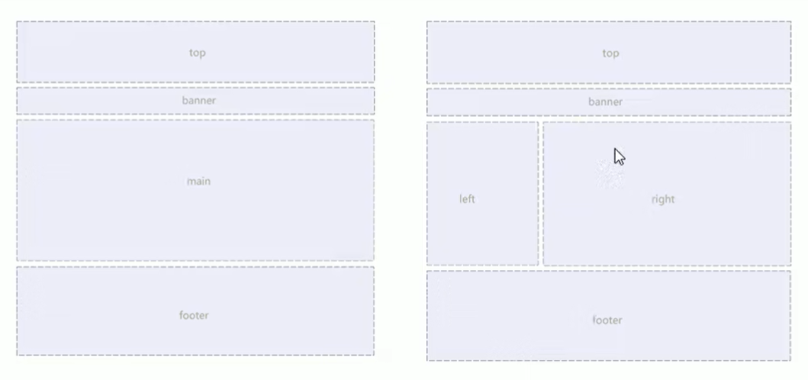
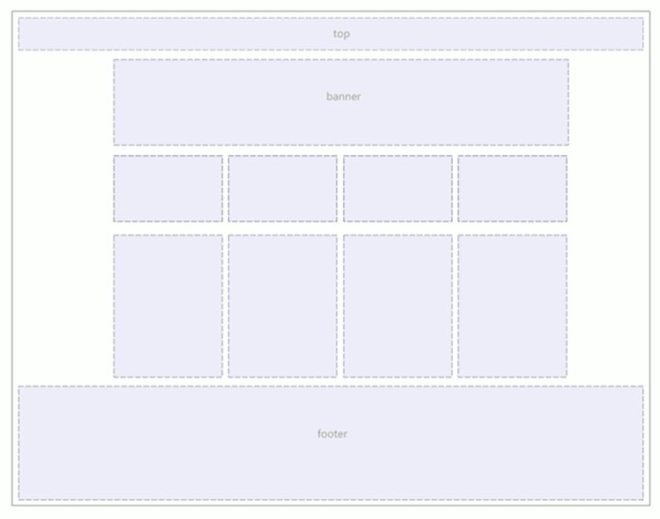
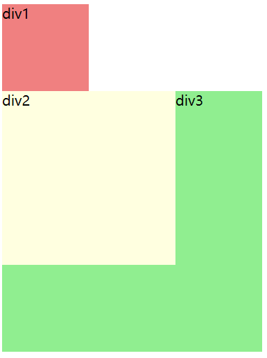
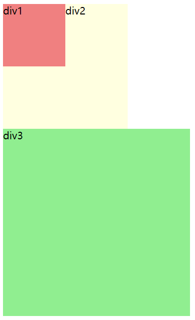

[pink 老师黑马教程](https://www.bilibili.com/video/BV14J4114768?p=8&vd_source=c727c2934b167656e7856cce)

# HTML
HyperText Markup Language 超文本标记语言

*todo*
1. 表单元素都有哪些（HTML5新增了哪些）
2. .innerText 和 .value 的区别
3. form 和 table 有什么区别

## HTML5 新特性

针对以前的不足，增加了一些新的标签、新的表单和新的表单属性等

广义的 HTML5 = HTML5 本身 + CSS3 + JS

这些新特性基本都有 **兼容性问题**，基本都是 IE9+ 才支持

### 新增语义化标签

以前布局，基本都用 div 来做，对于搜索引擎来说都没有语义并不友好

- `<header>`：头部标签
- `<nav>`：导航标签
- `<article>`：内容标签
- `<section>`：定义文档某个区域，可以看做是一个大 div
- `<aside>`：侧边栏标签
- `<footer>`：尾部标签

在 IE9 中，要把这些元素转换为块级元素 `display: block;`

在 **移动端** 更常用


### 新增多媒体标签

#### 视频 video

当前 `<video>` 元素支持三种格式：.mp4 .webm .ogg

所有浏览器支持 mp4 格式，尽量使用 mp4 格式

- `autoplay="autoplay"`：视频就绪自动播放（谷歌浏览器需要添加 muted 来解决自动播放问题）
- `controls="controls"`：显示播放控件
- `width`：设置宽度
- `height`：设置高度
- `loop="loop"`：设置循环播放
- `preload="auto/none"`：是否预加载（如果有 autoplay 就忽略该属性）
- `src=url`：视频地址
- `poster=url`：加载等待的画面图片
- `muted="muted"`：静音播放

```css
<video src="url" controls="controls"></video>
```

#### 音频 audio

所有浏览器支持 mp3 格式

- `controls`：显示控件
- `autoplay`：（谷歌禁用）
- `loop=loop`：设置循环播放
- `src=url`：音频地址
- `muted="muted"`：静音播放
- `preload="auto/metadata/none"`：当网页加载时，音频是否默认被加载以及如何被加载

```css
<audio src="url" controls="controls"></video>
```

### 新增 input 类型

- `type="email"
- `type="url"
- `type="date"
- `type="time"
- `type="month"
- `type="week"
- `type="number"
- `type="tel"
- `type="search"：搜索框
- `type="color"：生成一个颜色选择表单

### 新增表单属性

| 属性 | 值 | 说明 |
| :---: | :---: | :---: |
| `required` | required | 该表单项必填，内容不能为空 |
| `placeholder` | 提示文本 | 提示信息 |
| `autofocus` | autofocus | 自动聚焦属性，页面加载完成自动聚焦到指定表单 |
| `autocomplete` | off/on | 当用户在字段开始键入时，浏览器基于之前键入过的值，应该显示出在字段中填写的选项（就是在搜索时，会提示搜索记录）。默认已经打开，如 `autocomplete="on"`，关闭 `autocomplete="off"`。需要放在表单内，同时加上 name 属性，同时成功提交 |
| `multiple` | multiple | 可以多选文件 |

```css
/* 修改 placeholder 中的字体颜色 */
input::placeholder {
   color: pink;
}
```

# CSS

## Emmet 语法
Emmet 语法的前身是 Zen coding，它使用缩写来提高 html/css 的编写速度，vscode 内部已经集成该语。
1. 快速生成 HTML 结构语法
   1. 直接输入标签名，按 `tab` 或者 `enter` 键，就可以直接生成全部标签名。例：直接输入 div 按回车就可以生成 `<div></div>`
   2. 如果需要生成多个相同标签，可以使用 `*`，注意不能有空格。例：输入 `div*3` 就可以快速生成3个完整 div 标签
   3. 如果有父子级关系的标签，可以用 `>`，不能有空格。例：`ul>li` 就可以直接生成完整的 ul li 结构，也可以输入 `div>span`
   4. 如果有兄弟级关系的标签，可以用 `+`，不能有空格。例：`div+p`
   5. 如果生成带有类名或者 id 名，可以直接写 `.className` 或者 `#idName`。例：输入 `div.box` 就会生成 `<div class="box"></div>`，输入 `ul.li#list` 就会生成 `<ul><li id="list"></li></ul>`
   6. 如果生成的 div 类名是有顺序的，可以用自增符号 `$`，默认顺序从1开始。例：输入 `span.test$*5` 就会得到如下代码
    ```html
    <span class="test1"></span>
    <span class="test2"></span>
    <span class="test3"></span>
    <span class="test4"></span>
    <span class="test5"></span>
    ```
   7. 如果想要在生成的标签内部写内容可以用 `{}` 表示。例：输入 `div{今天天气好晴朗}` 就可以得到 `<div>今天天气好晴朗</div>`；输入 `div{处处好风光}*5` 就可以得到如下代码
    ```html
    <div>处处好风光</div>
    <div>处处好风光</div>
    <div>处处好风光</div>
    <div>处处好风光</div>
    <div>处处好风光</div>
    ```

2. 快速生成 CSS 样式
   
   CSS 基本采取简写形式即可。比如 `w200` 可以生成 `width: 200px`, `lh26` 可以生成 `line-height: 26px`

3. 快速格式化代码
   1. 文件 --> 首选项 --> 设置
   2. 搜索 `format`，选择 `格式化`
   3. 勾选想要的格式化方式

## 常见的网页布局




## 网页布局整体思路
1. 必须确定页面的版心（可视区）
2. 分析页面中的行模块，以及每个行模块中的列模块，也就是页面布局第一准则
3. 一行中的列模块经常采用浮动布局，先确定每个列的大小，之后确定列的位置，也就是页面布局第二准则
4. 制作 HTML 结构。

遵循**先有结构，后有样式**的原则

## CSS属性书写顺序
建议书写顺序如下
1. **布局定位属性**： display / position / float / clear / visibility / overflow (建议 display 第一个写，关系到模式)
2. **自身属性**：width / height / margin / padding / border / background
3. **文本属性**：color / font / text-decoration / text-align / vertical-align / white-space / break-word
4. **其他属性(CSS3)**：content / cursor / border-radius / box-shadow / text-shadow / background:linear-gradient...

## font字体
|  属性   | 作用  |  值 |
|  ----  | ----  |  ---- |
| font-style  | 字体风格 |  italic/normal/oblique/oblique 40deg(倾斜角度)   |
| font-weight  | 字体粗细 |  normal/bold/lighter/bolder/数值100-900(400是normal，700是bold)  |
| font-size  | 字体大小 |  px   |
| line-height  | 行高 |  px   |
| font-family  | 字体 |  Jetbrains Mono/Microsoft YaHei ...   |

**复合写法**
```css
font: font-style font-weight font-size/line-height font-family;
```

## 复合选择器 :star:

### 后代选择器
又称包含选择器，可以选择父元素里面的子元素。**写法是：把外层标签写在前面，内层标签写在后面，中间用空格分隔**。当标签发生嵌套时，内层标签就成为外层标签的后代。

```css
ol li {
   color: pink;
}
.test li {
   color: red;
}
```
```html
<body>
   <ol>
      <li>bbb</li>
      <li>ppp</li>
      <li>mmm</li>
   </ol>
   <ol class="test">
      <li>rrr</li>
      <li>eee</li>
      <li>ddd</li>
   </ol>
</body>

<!-- 第一个有序列表中的字体为粉色，class为test的列表的颜色为红色 -->
```

### 子选择器
又称子元素选择器，只能选择作为某元素的**最近一级**子元素。简单理解就是选亲儿子元素
```css
元素1 > 元素2 { 
   样式声明
}
```
```css
div > a {
      color: red;
}
```
```html
<div>
   <a href="#">我是儿子</a>
   <p>
      <a href="#">我是孙子</a>
   </p>
</div>

<!-- 只有div下面的第一个a中的字体颜色会变成红色-->
```

### 并集选择器
可以选择多组标签，同时为它们定义相同的样式。通常用于集体声明。

各选择器之间通过逗号 `,` 连接而成，格式通常不同标签之间需要换行

```css
div,
p {
   color: red;
}
```

### 伪类选择器
用于向某些选择器添加特殊的效果，比如给链接添加特殊效果，或选择第1个、第n个元素等等

使用冒号 `:` 表示，比如 `:hover` `:fist-child`

伪类选择器有很多，比如链接伪类、结构伪类等。

#### 链接伪类选择器

- `a:link` 选择所有未被访问的链接
- `a:visited` 选择所有已被访问的链接
- `a:hover` 选择鼠标指针位于其上的链接
- `a:active` 选择活动链接（鼠标按下未弹起的链接）

**注意：** 同时写上面四种或多种格式时，顺序不能变，必须按照 lvha 的顺序，否则不生效

因为超链接在浏览器中具有默认样式，所以在实际需求中都需要给链接**单独**指定样式，如果只改包含超链接的 body 或者 div 的样式，超链接的样式是不会生效的

实际开发中，一般都是先给 a 标签设置一个样式，然后再单独设置 :hover 的样式

#### :focus 伪类选择器
用于选取获得焦点的表单元素

**焦点** 就是光标，一般情况下只有 `input` 表单元素才能获取，因此这个选择器主要针对于表单元素

```css
input:focus {
   background-color: yellow;
}
```

## 元素显示模式
就是元素（标签）以什么方式进行显示。比如 div 自己占一行，多个 span 可以共享一行

一般分为 **块元素** 和 **行内元素** 两种类型

- **块元素**
  - h1-h6, p, div, ul, ol, li ...
  - 特点
    - 独占一行
    - 高度、宽度、外边距、内边距都可以控制
    - 宽度默认是父容器款的100%
    - 是一个容器及盒子，里面可以放行内元素或块元素
  - 注意
    - 文字类的元素不能使用块级元素
- **行内元素/内联元素**
  - a, strong, b, em, i, span ...
  - 特点
    - 相邻行内元素在同一行，一行可以显示多个
    - 无法直接设置宽度和高度
    - 默认宽度是它本身内容的宽度
    - 行内元素只能容纳文本或其他行内元素
  - 注意
    - 链接里面不能再放链接
    - 特殊情况 a 中可以放块级元素，但是给 a 转换一下块级模式最安全
- **行内块元素**
  - 在行内元素中有几个特殊的标签：img, input, td, 它们同时具有块元素和行内元素的特点，在有些资料中称它们为行内块元素
  - 特点
    - 和相邻行内/行内块元素在同一行上，但是他们之间会有空白缝隙。一行可以显示多个
    - 默认宽度为它本身内容的宽度
    - 高度、宽度、外边距、内边距都可以控制

### 元素显示模式转换
```css
display: block;
display: inline;
display: inline-block;
```

### 单行文字垂直居中
```css
line-height == height 就可以了
```

行高 = padding-top + 文字高度 + padding-bottom。

如果行高 < 盒子高度，文字会偏上；如果行高 > 盒子高度，文字会偏下

## 背景 background

### background-color
- `transparent` 透明(默认)
- `color`

#### 半透明
CSS3 新属性，IE9+ 版本浏览器才支持
```css
background: rgba(0, 0, 0, 0.3);
/* 0.3 中的 0 可以省略，写为*/
background: rgba(0, 0, 0, .3);
```
a 代表透明度，范围0-1，0 完全透明，1 完全不透明；

### background-image
常用于 logo 或者装饰性图片或者是超大的背景图片，优点是非常便于控制位置，精灵图也是一种应用

- `none`
- `url()`
```css
div {
   /* 千万注意加上 url() */
   background-image: url(images/logo.png);
}
```

### 背景平铺
background-repeat
- `repeat` 平铺(默认)
- `no-repeat` 不平铺
- `repeat-x` 横向平铺
- `repeat-y` 纵向平铺

### 背景图片固定/附着
background-attachment，设置背景图片是否固定或者随着页面的其余部分滚动。可以制作视差滚动的效果
- `scroll` 滚动(默认)
- `fixed` 固定

### 背景图片位置
background-position
```css
background-position: x y;
```
其中 x 和 y 可以使用方位名词（top, bottom, right, left, center）或者精确单位（百分数 or 由浮点数和单位表示服组成的长度值）
- 使用方位名词时，和声明顺序没有关系（center right 和 right center 的效果是一样的）
- 如果参数值使用精确坐标，那么第一个肯定是 x 坐标，第二个肯定是 y 坐标
- 如果只指定了一个参数，那么另一个默认居中对齐
- 可以 20px center 这种混合参数

### 复合写法
```css
background: 颜色 url 平铺 滚动 位置;
```
**实际开发中，更提倡复合写法**

|  属性   | 作用  |  值 |
|  ----  | ----  |  ---- |
| background-color  | 背景颜色 |  颜色值/十六进制/RGB代码   |
| background-image  | 背景图片 |  url()  |
| background-repeat  | 是否平铺 |  repeat/no-repeat/repeat-x/repeat-y   |
| background-attachment  | 是否固定 |  scroll/fixed   |
| background-position  | 图片位置 |  x y   |

## CSS 三大特性

- **层叠性**：相同选择器设置不同的样式时，一个样式会覆盖另一个。遵循的原则是：执行后来声明的样式
- **继承性**：子标签继承父标签的某些样式（text-，font-，line-，这些元素开头的可以继承，以及 color 属性）
  - 行高的继承性：元素行高 = font-size * 数字
  - 高度和宽度不能继承。div 中嵌套的 p 标签会和 div 一样的宽度是因为 p 是块元素会独占一行，宽度是父标签的100%，不是因为继承了父标签的宽度
```css
body {
   font: 14px/1.5 'Jetbrains Mono';
}
div {
   font-size: 18px;
}

/* div是body的子元素，此时div中元素的行高是 18 * 1.5 = 27px */
```
- **优先级**：同一个元素指定多个选择器，就会有优先级的产生
  - 选择器相同：则执行层叠性，也即覆盖
  - 选择器不同，则根据 `选择器权重` 执行。**从高到低**
    - !important
    - 行内样式 style=""
    - ID选择器
    - 类选择器，伪类选择器
    - 元素选择器
    - 继承，*（注意！无论父元素权重多高，子元素继承之后得到的权重都是0，只要再有同样的声明就会覆盖）
  - `权重叠加`：如果是复合选择器，则会有权重叠加，需要计算权重

> Ref: [优先级 from MDN](https://developer.mozilla.org/zh-CN/docs/Web/CSS/Specificity)

## 盒子模型

### border 边框
- border-width
- border-style
- border-color
- 复合形式：1px solid red; 没有顺序
- `border-collapse: collapse;` 相邻边框合并在一起
- **边框会影响 div 实际大小**，div 大小 = 内容 + 上边框 + 下边框

### padding 内边距
- padding-top/bottom/left/right
- `padding: 5px` 上下左右各5px
- `padding: 5px 10px` 上下5px，左右10px
- `padding: 5px 10px 20px` 上5px，左右10px，下20px
- `padding: 5px 10px 20px 30px` 上5右10下20左30，顺时针方向 
- **padding 会影响 div 实际大小**，如果 div 已经有了宽和高，加上 padding 之后会撑大 div。如果没有设置宽和高，则不会改变 div 大小
- 当制作导航栏等字数不一样的盒子时，就可以不给宽度，直接规定 padding，可以更美观

### margin 外边距
用于控制盒子和盒子之间的距离

复合方式写法参考 padding

**外边距可以让块级盒子水平居中**
- 盒子指定宽度 width
- 盒子左右的外边距都设为 `auto`
  - 对于行内元素或者行内块元素来说，将父元素设置为 `text-align: center;` 就可以实现水平居中了

#### 外边距合并
使用 margin 定义块元素的垂直外边距时，可能会出现外边距的合并。

- **相邻块元素垂直外边距的合并：** 当上下相邻的两个块元素（兄弟关系）相遇时，如果上面的元素有 margin-bottom，下面的元素有 margin-top，那么他们的间距不是二者之和，而是二者之间大的那个
- **嵌套块元素垂直外边距的塌陷：** 对于两个嵌套关系（父子关系）的块元素，父元素有上外边距的同时子元素也有上外边距，此时父元素会塌陷较大的外边距值。解决方案如下：
  - 可以为父元素定义边框
  - 可以为父元素定义上内边距
  - 可以为父元素添加 `overflow: hidden;`
  - 浮动、绝对定位... 

### 清除内外边距
浏览器基本上都会给元素添加默认边距，这不利于我们后续开发，所以基本上都会先清楚默认的内外边距
```css
* {
   margin: 0;
   padding: 0;
}
```
行内元素为了照顾兼容性，尽量只设置左右边距，不要设置上下边距。转换为块级和行内块元素就无所谓了

### 圆角边框
```css
border-radius: length   /* length是圆的半径，或者可以写百分比 */
```


若要画一个圆形，就可以设置一个宽高相等的 div，然后 radius = 1/2 height (或者 radius = 50%) 就可以了

**简写形式：左上角 右上角 右下角 左下角**

### 盒子阴影
```css
box-shadow: h-shadow v-shadow blur spread color inset;
```

|  属性   | 作用  |  值 |
|  ----  | ----  |  ---- |
| h-shadow  | **必需**。水平阴影位置。允许负值 |  px   |
| v-shadow  | **必需**。垂直阴影位置。允许负值 |  px  |
| blur  | 可选。模糊距离（是否模糊） |  px   |
| spread  | 可选。阴影尺寸 |  px   |
| color  | 可选。阴影颜色 |  颜色/rgba   |
| inset  | 可选。将外部阴影改为内部阴影 |  -   |

注意：
- 默认的是外阴影（outset），但是不可以写上这个单词，否则将导致阴影无效。
- 盒子阴影不占用空间，不影响其他盒子排列

### 文字阴影
```css
text-shadow: h-shadow v-shadow blur;
```

|  属性   | 作用  |  值 |
|  ----  | ----  |  ---- |
| h-shadow  | **必需**。水平阴影位置。允许负值 |  px   |
| v-shadow  | **必需**。垂直阴影位置。允许负值 |  px  |
| blur  | 可选。模糊距离（是否模糊） |  px   |
| color  | 可选。阴影颜色 |  颜色/rgba   |

## 浮动
```css
float: left/right/none;
```

设置了浮动的元素的最重要特征：
- 脱离标准普通流的控制浮动到指定位置（俗称脱标），**浮动的盒子不再保留原来的位置**
- 如果多个盒子都设置了浮动，则它们会按照属性值**一行内显示并且顶端对齐排列**。如果父级元素宽度不够，那么多出的盒子会另起一行自动对齐
- 浮动元素具有**行内块元素**特性。任何元素都可以浮动，不管原来是什么元素，添加浮动之后都具有行内块元素相似的特性。 
  - 如果块级盒子没有设置宽度，默认宽度和父级一样宽；添加浮动后，它的大小根据内容的宽度来决定
  - 浮动的盒子中无缝隙
  - 行内元素同理

```css
.div1 {
   float: left;
   width: 200px;
   height: 200px;
   background-color: red;
}
.div2 {
   width: 300px;
   height: 300px;
   background-color: blue;
}

/* div1设置浮动之后，不再保留原来的位置，那么div2就会占据div1原来的位置，
   就会变成div2在div1的下层的效果 */
```

```css
.div1 {
   float: left;
   width:200px;
   height:200px;
   background-color: red;
}
.div2 {
   float: left;
   width: 200px;
   height: 300px;
   background-color: blue;
}
.div3 {
   float: left;
   width: 200px;
   height: 200px;
   background-color: yellow;
}

/* 三个盒子并排展示，没有空隙，顶端对齐 */
```

### 浮动布局注意点
1. 浮动布局和标准流的父盒子搭配使用：**先用标准流的父元素排列上下位置，之后内部子元素采取浮动排列左右位置**。符合网页布局第一准则。
2. 一个元素浮动了，理论上其余的兄弟元素也要浮动，以防引起问题。**浮动的盒子只会影响浮动盒子后面的标准流，不会影响前面的标准流**
```css
/* case 1 */
.div1 {
   height: 100px;
   width: 100px;
   background-color: red;
}
.div2 {
   height: 200px;
   width: 200px;
   background-color: yellow;
   float: left;
}
.div3 {
   height: 300px;
   width: 300px;
   background-color: green;
}

/* div1 没有浮动，按照标准流布局，独自占一行 */
```


```css
/* case 2 */
.div1 {
   height: 100px;
   width: 100px;
   background-color: red;
   float: left;
}
.div2 {
   height: 200px;
   width: 200px;
   background-color: yellow;
}
.div3 {
   height: 300px;
   width: 300px;
   background-color: green;
   float: left;
}
```


### 清除浮动
由于父级盒子很多情况下，不方便给高度，那么当子盒子使用浮动后，父盒子的高度就会变成0，也就会影响下面的其他标准流盒子。这时就需要清除浮动。

清除浮动之后，父级会根据浮动的子盒子自动检测高度。父级有了高度，就不会影响下面的标准流了。

```css
选择器 {clear: left/right/both;}

/* 实际工作中，几乎只用 both */
```
清除浮动的策略是：闭合浮动

#### 清除浮动的方法（后面三个重点）
1. 额外标签法：也称为隔墙法，是W3C推荐的做法
   1. 在浮动元素末尾添加一个空标签，必须是**块级元素**
   2. 优点：通俗易懂，书写方便
   3. 缺点：添加许多无意义标签，结构化较差
```html
<!DOCTYPE html>
<html>
  <head>
    <meta charset="UTF-8" />
    <title>demo</title>
  </head>
  <style>
    .container {
      border: 3px solid lightblue;
    }
    .div1 {
      width: 100px;
      height: 100px;
      background-color: lightgreen;
      float: left;
    }
    .div2 {
      width: 150px;
      height: 150px;
      background-color: lightcoral;
      float: left;
    }
    .clear {
      clear: both;
    }
    .footer {
      height: 50px;
      background-color: grey;
    }
  </style>

  <body>
    <div class="container">
      <div class="div1">div1</div>
      <div class="div2">div2</div>
      <!-- 清除浮动 -->
      <div class="clear"></div>
    </div>
    <div class="footer">footer</div>
  </body>
</html>
```

2. 父级添加 `overflow` 属性
   1. 给**父级元素**添加，属性值设置为 `hidden/auto/scroll`
   2. 优点：代码简洁
   3. 缺点：无法显示溢出的部分
```css
/* 其余代码同上 */
.container {
   overflow: hidden;
}
```

3. 父级添加 `after` 伪元素
   1. 优点：没有增加标签，结构更简单
   2. 缺点：照顾低版本浏览器（IE）
```css
.clearfix:after {
   content: "";
   display: block;
   height: 0;
   clear: both;
   visibility: hidden;
}
```
```html
<!-- 在父盒子中添加 -->
<div class="clearfix"></div>
```

4.  父级添加双伪元素
    1. 优点：代码更简洁
    2. 缺点：照顾低版本浏览器 
```css
.clearfix:before,
.clearfix:after {
   content: "";
   display: table;
}
.clearfix:after {
   clear: both;
}
```

## 定位
浮动可以让多个块级盒子在一行没有缝隙排列显示，经常用语横向排列盒子

定位则是可以让盒子自由的在某个盒子内移动位置或者固定在屏幕中的某个位置，并且可以压住其他盒子

**定位 = 定位模式 + 边偏移**

定位模式用于指定一个元素在文档中的定位方式；边偏移则决定了该元素的最终位置

```css
/* 定位模式 */
position: static / relative / absolute / fixed;
/* 边偏移 */
top / bottom / left / right;
```

### 静态定位 static
静态定位是元素的默认定位方式，无定位的意思
- 静态定位按照标准流特性摆放位置，它没有边偏移
- 布局时很少用

### 相对定位 relative
相对定位是元素在移动位置的时候，是相对于它原来的位置来说的
- 移动位置时的参考点是自身原来的位置
- 不脱标，继续保留原来的位置，后面的盒子仍然以标准流的方式对待它，不会像浮动一样飘到上一层
- **最典型的应用就是作为绝对定位的爸爸**

### 绝对定位 absolute
绝对定位是元素在移动位置的时候，是相对于它祖先元素来说的
- **如果没有祖先元素或者祖先元素没有定位，则以浏览器为准定位**
- 如果祖先元素有定位（相对/绝对/固定定位），则以**最近一级的有定位祖先元素**为参考点移动位置
- 绝对定位不再占有原来的位置，**会脱标**，甚至比浮动飘的还高

#### 子绝父相
子级是绝对定位的话，父级要用相对定位
- 子盒子绝对定位，不会占有位置，可以放到父盒子里面的任何一个地方，不会影响其他兄弟盒子
- 父盒子需要加定位限制子级在父盒子内显示
- 父盒子布局时，需要占有位置，因此父级只能是相对定位

总结：因为父级需要占有位置，因此是相对定位；子盒子不需要占有位置，所以是绝对定位。

当然，子绝父相并不是绝对永远不变的。如果父元素不需要占有位置，那么子绝父绝之类的布局也可能使用

### 固定定位 fixed
元素固定于浏览器可视区的位置。主要使用场景：在浏览器页面滚动时元素的位置不会改变
- 以浏览器的可视窗口为参照点移动元素，跟父元素没有关系，不随滚动条滚动
- 固定定位不再占有原来的位置，**脱标**。其实固定定位可以看做是一种特殊的绝对定位

> 固定定位小技巧：固定在版心右侧位置

1. 让固定定位的盒子 `left: 50%`，走到浏览器可视区（版心）的一半位置
2. 让固定定位的盒子 `margin-left: 版心宽度的一半`

### 粘性定位 sticky（了解）
可以被认为是固定定位和相对定位的混合
```css
position: sticky;
top / bottom / left / right
```
- 以浏览器的可视窗口为参照点移动元素
- 占有原来的位置，**不脱标**
- 必须添加 top / bottom / left / right 其中一个才有效
- 跟页面滚动搭配使用。兼容性较差，IE 不支持

### 定位总结
| 定位模式 | 是否脱标 | 移动位置 | 是否常用 |
| :--: | :--: | :--: | :--: |
| static | 否 | 不能使用边偏移 | 很少 | 
| relative | 否（占有位置） | 相对于自身位置移动 | 常用 | 
| absolute | 是（不占有位置） | 带有定位的父级 | 常用 | 
| fixed | 是（不占有位置） | 浏览器可视区 | 常用 | 
| sticky | 否（占有位置） | 浏览器可视区 | 较少 | 

### 定位叠放次序 z-index
在使用定位布局时，可能会出现盒子重叠的情况。此时可以使用 `z-index` 来控制盒子的前后次序
```css
/* 默认是 auto，数字越大，盒子就在越上层。数字不能加单位 */
z-index: 正整数 / 负整数 / 0;
```
如果属性值相同，则按照书写顺序，后面的在上面

**只有有定位的盒子才有 z-index 属性**

### 定位拓展
1. 绝对定位的盒子居中

加了绝对定位的盒子不能通过 `margin: 0 auto;` 水    平居中，但是可以通过下面的计算方法实现水平和垂直居中
```css
/* 让盒子的左侧移动到父元素的水平中心位置 */
left: 50%;  
/* 让盒子再向左移动自身宽度的一半 */
margin-left: -100px;
```

2. 定位特殊特性
   1. 行内元素添加绝对或者固定定位，可以直接设置高度和宽度
   2. 块级元素添加绝对或者固定定位，如果不给宽度和高度，默认大小是内容的大小
   3. 脱标的盒子（浮动、绝对定位）不会触发外边距塌陷

3. 绝对定位/固定定位会完全压住盒子

浮动的元素只会压住它下面标准流的盒子，但是不会压住下面标准流的文字/图片，因为浮动产生的最初目的是为了做文字环绕效果的；但是绝对定位/固定定位会压住下面标准流所有的内容

## 元素的显示和隐藏
### display

- `none` ：隐藏对象
- `block` ：除了转换为块级元素之外，同时还有显示元素的意思。

**display 隐藏元素后，不再占有原来的位置**

### visibility

- `inherit`：继承父元素的可见性
- `visible`：可见
- `hidden`：隐藏
- `collapse`：主要用来隐藏表格的行或列。隐藏的行或列能够被其他内容使用

**visibility 隐藏元素后，继续占有原来的位置**

### overflow

- `visible`：不剪切内容也不添加滚动条。假如显式声明此默认值，对象将被剪切为包含对象的window或frame的大小。并且 clip 属性设置将失效。
- `auto`：此为 body 对象和 textarea 的默认值。在溢出时添加滚动条
- `hidden`：不显示超过对象尺寸的内容
- `scoll`：总是显示滚动条，不溢出时也会显示滚动条

如果有定位的盒子，慎用 `overflow: hidden`，因为它会隐藏多余的部分

## 精灵图

### 为什么需要精灵图
一个网页中往往会应用很多小的背景图像作为修饰，当网页中的图像过多时，服务器就会频繁地接收和发送请求图片，造成服务器请求压力过大，这将大大降低页面的加载速度。

因此，**为了有效地减少服务器接收和发送请求的次数，提高页面的加载速度**，出现了 CSS 精灵技术，也称CSS Sprites。

**核心原理**：将网页中的一些小背景图像整合到一张大图中，这样服务器只需要一次请求就可以了。

### 精灵图的使用
使用精灵图的核心：
1. 精灵技术主要针对于背景图片使用。就是把多个小背景图片整合到一张大图片中
2. 这个大图片也称为 sprites 精灵图或者雪碧图
3. 移动背景图片位置，此时可以使用`background-position`
4. 移动的距离就是这个目标图片的 x 和 y 坐标。注意网页中的坐标有所不同
5. 因为一般情况下都是往上往左移动，所以数值是**负值**
6. 使用精灵图的时候需要精确测量，每个小背景图片的大小和位置

## 字体图标

### 字体图标的产生
字体图标使用场景︰主要用于显示网页中通用、常用的一些小图标。

虽然可以使用精灵图，但是缺点很明显：
1. 图片文件还是比较大的
2. 图片本身放大和缩小会失真
3. 一旦图片制作完毕想要更换非常复杂

此时，有一种技术的出现很好的解决了以上问题，就是字体图标 `iconfont`。字体图标可以为前端工程师提供一种方便高效的图标使用方式，展示的是图标，**本质属于字体**，同样可以设置大小、颜色等等。

### 优点
- 轻量级︰一个图标字体要比一系列的图像要小。一旦字体加载了，图标就会马上渲染出来，减少了服务器请求
- 灵活性︰本质其实是文字，可以很随意的改变颜色、产生阴影、透明效果、旋转等
- 兼容性:几乎支持所有的浏览器
**注意:字体图标不能替代精灵技术，只是对工作中图标部分技术的提升和优化。**

总结：
1. 如果遇到一些结构和样式比较简单的小图标，就用字体图标。
2. 如果遇到一些结构和样式复杂一点的小图片，就用精灵图。

### 使用
1. 下载字体库
   1. https://icomoon.io/
   2. https://www.iconfont.cn/

## 使用CSS绘制三角形

```css
div {
   width: 0;
   height: 0;
   line-height: 0; /* 为了兼容性 */
   font-size: 0;
   border: 10px solid transparent;
   /* 就可以得到一个向上的箭头/三角形 */
   border-bottom-color: coral; 
}
```

## CSS 用户界面样式

所谓的界面样式，就是更改一些用户操作央视，以便提高更好的用户体验

### 鼠标样式 cursor

```css
cursor: default | pointer(小手) | move(移动，4个箭头) | text | not-allowed;
```

### 轮廓线 outline

去掉选中表单时默认的蓝色边框

```css
input { outline: 0 | none; }
```

### 防止拖拽文本域

```css
textarea { resize: none; }
```

## vertical-align 的应用

### 图片、表单和文字对齐

`vertical-align` 经常用于设置图片或者表单（行内块元素）和文字垂直对齐

**只针对于行内元素或者行内块元素有效**

- `baseline`：默认，元素放在父元素的基线上
- `top`：把元素的顶端与行中最高元素的顶端对齐
- `middle`：把元素放在父元素的中部
- `bottom`：把元素顶端与行中最低的元素的顶端对齐


### 解决图片底部默认空白缝隙的问题

bug：给包裹图片的 div 设置 border，图片底侧与 border 之间会有一个空白缝隙，原因是行内块元素会和文字的基线对齐。主要解决方法有两种：

1. 给图片添加 `vertical—align: middle top bottom;`，只要不是基线对齐（提倡使用的）
2. 把图片转换为块级元素 `display: block;`，会影响其他元素布局，不是很推荐

## 溢出的文字省略号显示

### 单行文本

```css
div {
   /* 如果文字显示不开，不换行，在一行展示 */
   white-space: nowrap;
   /* 溢出的部分隐藏 */
   overflow: hidden;
   /* 超出的部分用省略号代替 */
   text-overflow: ellipsis;
}
```

### 多行文本

有较大兼容性问题，适合于 webkit 浏览器或者移动端（移动端大部分是 webkit 内核）

了解即可

更推荐后端来做，因为后端可以设置显示多少个字，操作更简单

```css
div {
   overflow: hidden;
   text-overflow: ellipsis;

   /* 弹性伸缩盒子模型显示 */
   display: -webkit-box;
   /* 限制在一个块元素显示的文本行数 */
   -webkit-line-clamp: 2;
   /* 设置或检索伸缩盒对象的子元素的排列方式 */
   -webkit-box-orient: vertical;
}
```

## 常见布局技巧

### margin 负值巧妙利用

多个并排盒子同时设置边框，之间盒子的边框会进行叠加，宽度会加倍。此时可以通过添加 `margin-left: -1px;` 来解决

**【注意】**
此时如果想要添加其他效果，比如 “鼠标经过边框改变颜色” 等，那么因为设置了 margin 负值，右侧盒子就会盖住左侧盒子，导致效果部分失效。此时可以采取以下两种解决方案：

1. 如果盒子没有定位，则鼠标经过添加 **相对定位** 即可，因为相对定位可以保留位置盖住其他盒子
2. 如果盒子有定位，那么可以通过 `z-index` 提高优先级

### 文字围绕浮动元素巧妙运用


如上图的文字环绕盒子效果，不需要左右两个盒子同时设置浮动再调整位置，只需要把昨天的图片盒子浮动就可以了，因为浮动本来最开始就是为了让文字环绕而出现的，详情参见浮动那章

```css
* {
   margin: 0;
   padding: 0;
}

.box {
   width: 300px;
   height: 70px;
   background-color: lightblue;
}

.pic {
   width: 120px;
   height: 60px;
   float: left;
}

.pic img {
   width: 100%;
}
```

### 行内块元素巧妙运用

淘宝、京东等购物车或者搜索结果下面的页码显示和翻页操作样式，就可以通过行内块元素实现

行内块元素之间天然就带 margin

```css
.box {
   text-align: center;
}

.box a {
   display: inline-block;
   width: 36px;
   height: 36px;
   background-color: #f7f7f7;
   border: 1px solid #ccc;
   text-align: center;
   line-height: 36px;
   text-decoration: none;
   color: #333;
}

/* 注意这里必须要加 .box 否则权重不够 */
.box .prev,
.box .next {
   width: 100px;
   font-size: 13px;
}
```

```html
<body>
   <div class="box">
      <a href="#" class="prev">&lt;&lt; 上一页</a>
      <a href="#">1</a>
      <a href="#">2</a>
      <a href="#">3</a>
      <a href="#" class="next">下一页 &gt;&gt;</a>
   </div>
</body>
```

### CSS 三角强化

实现一个直角不等腰三角形

```css
width: 0;
height: 0;
border-color: transparent red transparent transparent;
border-style: solid;
border-width: 22px 8px 0 0;
```

## CSS 初始化

不同浏览器对有些标签的默认值是不同的，为了消除不同浏览器对 HTML 文本呈现的差异，照顾浏览器的兼容，我们需要对 CSS 初始化

CSS 初始化是指重设浏览器的样式（也称为 CSS reset ）**每个网页都必须首先进行 CSS 初始化**

Unicode 编码字体： 把中文字体的名称用相应的 Unicode 编码来代替，这样就可以有效的避免浏览器解释 CSS 代码时候出现乱码的问题。

比如： 黑体：`\9ED1\4F53` 宋体：`\5B8B\4F53` 微软雅黑：`\5FAE\8F6F196C519ED1`

## CSS3 新特性

### 现状

- CSS3 有兼容性问题，IE9+ 才支持
- 移动端支持优于 PC 端
- 应用相对广泛
- 还在不断改进中...

### 新增选择器

#### 属性选择器

- 可以根据元素的特定属性来选择元素，不需要借助于类或者 id
- 可以选择属性 `=` 某些值的元素 :star:
- 可以选择属性值开头的某些元素
- 可以选择属性值结尾的某些元素
- **权重为 10**

| 选择符 | 说明 |
| :---: | :---: |
| E[attr] | 选择具有 attr 属性的 E 元素 |
| E[attr=val] | 选择具有 attr 属性且属性值为 val 的 E 元素 |
| E[attr^=val] | 匹配具有 attr 属性且值以 val 开头的 E 元素 |
| E[attr$=val] | 匹配具有 attr 属性且值以 val 结尾的 E 元素 |
| E[attr*=val] | 匹配具有 attr 属性且值中包含 val 的 E 元素 |

```html
<style>
   /* 可以选择出带 value 属性的 input */
   input[value] {
      color: pink;
   }
   /* 选择出 type 值为 password 的 input */
   input[type=password] {
      color: lightcoral;
   }
   /* 选择出 div 中 class 以 icon 开头的 */
   div[class^=icon] {
      color: lightblue;
   }

   /* 不会生效，因为类选择器权重是 10，而上面的 div[class^=icon] 的权重是 div 1 + class 10 = 11 */
   .icon {
      color: red;
   }
</style>

<body>
   <input type="text" value="请输入用户名">
   <input type="password">

   <div class="icon1">小图标1</div>
   <div class="icon2">小图标2</div>
   <div class="icon3">小图标3</div>
</body> 
```

:star: **类选择器、属性选择器、伪类选择器，权重都为 10**

#### 结构伪类选择器

主要根据 **文档结构** 来选择元素，常用于选择父元素里面的子元素

| 选择器 | 说法 |
| :---: | :---: |
| E:first-child | 匹配父元素中的第一个子元素 E|
| E:last-child	| 匹配父元素中最后一个 E 元素 |
| E:nth-child(n) | 匹配父元素中的一个（第 n 个）或多个子元素 E |
| E:first-of-type | 指定类型 E 的第一个 |
| E:last-of-type | 指定类型 E 的最后一个 |
| E:nth-of-type(n) | 指定类型 E 的第 n 个 |

对于 `nth-child(n)`  `nth-of-type(n)`
- n 可以是**数字、关键字、公式**
- n 如果是数字，就是选择第 n 个子元素
- n 可以是 `even` `odd` 等关键字
- n 可以是公式（如果是公式，那么从 0 开始计算，但是第 0 个元素或者超出了元素的个数会被忽略）
  - 括号中只能是 n 不可以用其他字母
  - 如果写成 `nth-child(n)` 就等于全选：n 从 0 开始，每次 n++
  - 写成 `nth-child(2n) 就代表选出所有偶数位元素
  - 写成 `nth-child(2n+1)` 就代表选出所有奇数位元素
  - 写成 `nth-child(3n+1)` 就会每 3 个选择一个
  - `n+5` 表示从第 5 个开始（包括第五个）到最后
  - `-n+5` 表示前 5 个（包括第 5 个）

`nth-child(1)` 和 `nth-of-type(1)` 的区别
- `child` 是将所有的元素排序，先找到第 1 个，然后再回去看是什么元素
- `type` 是先将匹配的元素都找到，然后再将匹配到的元素排序，再拿其中的第 1 个

```html
<!DOCTYPE html>
<html lang="en">
  <style>
    * {
      margin: 0;
      padding: 0;
    }
    ul li:first-child {
      color: red;
    }
    ul li:last-child {
      color: yellowgreen;
    }
    ul li:nth-child(2) {
      color: lightblue;
    }
    /* 把偶数位上的元素字体变大 */
    ul li:nth-child(even) { 
      font-size: 25px;
    }
    ul li:nth-child(5n+1) {
      background-color: bisque;
    }

   /* 
      不会生效 
      因为会先将 section 中的所有元素排序，然后找到第一个元素也就是 p，再回去匹配
      因为不是 div 所以相当于这个选择器没有符合条件的元素，所以不会有任何效果
   */
   section div:nth-child(1) {
      font-size: 10px;
   }
   /* type 则是先找到 section 中的所有 div，然后排序并找到第一个，也就是熊大 */
   section div:nth-of-type(1) {
      color: plum;
   }
  </style>

  <body>
    <ul>
      <li>我是第1个孩子</li>
      <li>我是第2个孩子</li>
      <li>我是第3个孩子</li>
    </ul>

    <section>
      <p>光头强</p>
      <div>熊大</div>
      <div>熊二</div>
    </section>
  </body>
</html>
```

#### 伪元素选择器

伪元素选择器可以帮助我们利用 CSS 创建新标签元素，而不需要新建 HTML 标签，从而简化 HTML 结构

- `::before` 在元素内部的前面插入内容
- `::after` 在元素内部的后面插入内容

**注意：**
- before 和 after 创建一个元素，但是属于行内元素，想设置宽高要转成块级元素
- 新创建的这个元素在文档树中是找不到的，所以我们称为伪元素
- 语法：`element::before/after { }`
- before 和 after **必须有 content 属性**
- before 在父元素里面内容的前面创建元素， after 在父元素里面内容的后面插入元素
- 伪元素选择器和标签选择器一样，**权重为 1**

```html
<!-- case 1：伪元素字体图标 -->
<style>
   div {
      /* 伪元素是 div 的子元素，子绝父相 */
      position: relatve;
      width: 200px;
      height: 35px;
      border: 1px solid red;
   }
   div::after {
      position: absolute;
      top: 10px;
      right: 10px;
      /* 记得引入 icomoon */
      content: '\e91e';
      color: red;
      font-size: 18px;
   }
</style>
<body>
   <div></div>
</body>
```

```css
/* case 2：仿元素遮罩层 */
/* 原来的遮罩层 div 就不需要了 */
.tudou::before {
   content: '';
   display: none;
   position: absolute;
   top: 0;
   left: 0;
   width: 100%;
   height: 100%;
   background: rgba(0, 0, 0, .3) url(images/arr.png) no-repeat center;
}
.tudou:hover::before {
   display: block;
}
```

```css
/* case 3：伪元素清除浮动 */
.clearfix::after {
    content: '';
    display: block; 
    height: 0;
    clear: both;
    visibility: hidden;
}
```

```css
/* case 4：双伪元素清除浮动 */
.clearfix::before,
.clearfix::after {
    content: '';
    /* 转换为块级元素并在一行显示 */
    display: table;
}
.clearfix::after {
    clear: both;
}
```

### 盒子模型

CSS3中可以通过 `box-sizing` 来指定盒模型，有2个值：即可指定为 `content-box` 或者 `border-box`，这样我们计算盒子大小的方式就发生了改变

- `box-sizing: content-box;` 盒子大小为 width + padding + border（和之前的计算方式一样
- `box-sizing: border-box;` 盒子大小为 width，padding 和 border 不会撑大盒子（前提是，padding 和 border 不会超过 width 大小） 

### 过渡/渐变 :star:

过渡（transition）是 CSS3 中具有颠覆性的特征之一，可以在不使用 Flash 或者 JS 的情况下，当元素从一种样式变换到另一种样式时为元素添加效果，IE9+

经常和 `:hover` 一起搭配使用

**谁做变化给谁加 transition**

```css
transition: 要过渡的属性 花费时间 运动曲线 何时开始;
```

- **要过渡的属性**：想要变化的 CSS 属性。宽度、高度、背景颜色、内外边距都可以。如果想要所有属性都变化，那就写 `all`。如果是多个属性变化，用逗号隔开
- **花费时间**：单位是秒，比如 0.5s （必须写单位 s）
- **运动曲线**：详细规则参考 MDN
  - ease（默认，可以省略）：逐渐慢下来
  - linear：匀速
  - ease-in：加速
  - ease-out：减速
  - ease-in-out：先加速再减速
- **何时开始**：设置延迟触发事件，默认是 0s（可以省略），单位是秒（必须写单位）

```css
div {
   height: 100px;
   width: 100px;
   background-color: lightblue;
   transition: all 0.5s;
   /* 或者分开写 */
   transition: width 0.5s, height 0.5s;
}
div:hover {
   height: 200px;
   width: 200px;
   background-color: bisque;
}
```

```html
<!-- 进度条案例 -->
<!DOCTYPE html>
<html lang="en">
  <head></head>
  <style>
    * {
      margin: 0;
      padding: 0;
      box-sizing: border-box;
    }
    .bar {
      height: 20px;
      width: 200px;
      border: 1px solid red;
      border-radius: 15px;
    }
    .in {
      height: 100%;
      width: 50%;
      background-color: red;
      border-radius: 15px;
      transition: all 0.5s ease;
    }
    .bar:hover .in {
      width: 100%;
    }
  </style>

  <body>
    <div class="bar">
      <div class="in"></div>
    </div>
  </body>
</html>
```

### 其他特性

#### 图片变模糊

`filter`：CSS 属性，将模糊或颜色偏移等图形效果应用于元素

```css
/* 其他函数参考 MDN */
filter: 函数();

/* blur 模糊处理，数值越大越模糊，注意加单位 */
filter: blur(5px)
```

#### 计算盒子宽度 calc 函数

`calc()` 函数可以在声明 CSS 属性值时执行一些计算，括号里可以使用 + - * / 来计算

```css
width: calc(100% - 80px);
```

### 2D 转换

转换（transform）是 CSS3 中具有颠覆性的特征之一，可以实现元素的 **位移、旋转、缩放** 等效果

#### 位移 translate

改变元素在页面中的位置，类似定位

记得带单位 px

```css
transform: translate(x, y);
/* 或者分开写 */
transform: translateX(n);
transform: translateY(n);

transform: translate(100px, 100px);
```

注意：
- **最大的优点：不会影响其他元素位置**
- 数值可以写百分比，但是是相对于自身元素大小的百分比
- 对行内标签没有效果

```css
/* 水平垂直居中 */
in {
   position: absolute;
   top: 50%;
   left: 50%;
   transform: translate(-50%, -50%);
}
```

#### 旋转 rotate

让元素在二维平面内顺时针旋转或者逆时针旋转

```css
transform: rotate(度数)
```

注意：
- 度数单位是 deg，比如 `rotate(45deg)`
- 角度为正时，顺时针；角度为负时，逆时针
- 默认旋转的中心点是元素的中心点

```css
/* 鼠标 hover 到图片上，图片顺时针旋转 360 度 */
img {
   width: 200px;
   border: 5px solid coral;
   border-radius: 50%;
   transition: all 0.5s;
}
img:hover {
   transform: rotate(360deg);
}
```

设置旋转中心点 `transform-origin: x y;`
- x 和 y 用空格隔开
- x y 默认转换的中心点是元素的中心点（50% 50%）也就是 center center
- 还可以给 x y 设置像素或者方位名词 top/bottom/left/right/center
 
```css
div {
   width: 200px;
   height: 200px;
   background-color: lightblue;
   margin: 100px auto;
   transition: all 1s;
   /* 以左下角的那个点为中心旋转 */
   margin-origin: left bottom;
}
div:hover {
   transform: rotate(360deg);
}
```

#### 缩放 scale

```css
transform: scale(x, y);
```

注意：
- x 和 y 之间用逗号隔开
- 可以配合 `transform-origin` 使用，改变缩放中心。默认是中心点缩放
- x, y 不加单位，是指缩放的倍数。大于 1 表示放大，小于 1 表示缩小
  - `transform: scale(1, 1)` 宽高放大一倍，相当于没有放大
  - `2, 2` 宽高放大 2 倍
  - `2`只写一个参数，第二个参数和第一个参数一样，相当于 `2, 2`
  - `0.5, 0.5` 缩小

#### 2D 转换综合写法

- `transform: translate() rotate() scale()`
- 其顺序会影响转换的效果。（先旋转会改变坐标轴方向）
- 当我们同时有位移和其他属性的时候，记得要将 **位移放到最前**

### CSS3 动画

动画（animation）是 CSS3 中具有颠覆性的特征之一，可通过设置多个节点来精确控制一个或一组动画，常用来实现复杂的动画效果。

相比较过渡，动画可以实现更多变化、更多控制，连续自动播放等效果

1. 定义动画
2. 调用动画

使用 `keyframes` 定义动画（类似定义类选择器）

```css
@keyframes 动画名称 {
   0% {
      width: 100px;
   }
   100% {
      width: 200px;
   }
}
```

- `0%` 是动画的开始，`100%` 是动画的完成。这样的规则就是 **动画序列**
- 在 `@keyframes` 中规定某项 CSS 样式，就能创建由当前样式逐渐改为新样式的动画效果
  - 可以做多个状态的变化，设置 keyframes 不同百分比的关键帧即可
- 动画是使元素从一种样式逐渐变化为另一种样式的效果，可以改变任意多样式任意多的次数
- 用 **百分比** 来规定变化发生的时间。或者用 `from` 和 `to`，等同于 0% 和 100%
  - 百分比必须是整数
  - 百分比是总时间 `animation-duration` 的百分比

| 属性 | 描述 |
| :---: | :---: |
| `keyframes` | 定义动画 |
| `animation` | 所有动画属性的简写属性, 除了 animation-play-state 属性 |      
| `animation-name` | 规定 @keyframes 动画的名称（必需） |
| `animation-duration` | 规定动画完成一个周期所花费的秒或毫秒，默认是 0（必需） |
| `animation-timing-function` | 规定动画的速度曲线，默认是 ease |
| `animation-delay` | 规定动画何时开始，默认是 0 |
| `animation-iteration-count` | 规定动画被播放的次数，默认是 1，还有 infinite |
| `animation-direction` | 规定动画是否在下一周期逆向播放，默认是 normal，alternate 逆播放 |
| `animation-play-state` |	规定动画是否正在运行或暂停，默认是 running，还有 paused |
| `animation-fill-mode`	| 规定动画结束后状态，保持 forwards 回到起始 backwards，默认是 backwards |

#### 动画综合写法

```css
animation: 动画名称 持续时间 运动曲线 何时开始 播放次数 是否反方向 动画起始或者结束的状态;
```

- 简写属性里面不包含 `animation-play-state`
- 暂停动画: `animation-play-state: puased;`
- 经常和鼠标经过等其他配合使用想要动画走回来，而不是直接跳回来: `animation-direction: alternate;`
- 盒子动画结束后，停在结束位置：`animation-fill-mode: forwards;`

```css
@keyframes move {
   from {
      width: 200px;
   }
   to {
      /* 从 200px 到 400px，且颜色会从绿色变为蓝色 */
      width: 400px;
      background-color: lightblue;
   }
}
div {
   width: 200px;
   height: 200px;
   background-color: lightgreen;
   /* 在 1 秒钟之内变化，以 ease 的速度，无限循环，按照 from 到 to 的顺序，当然拆开写也可以 */
   /* 如果循环有限次，那么 forwards 表示循环结束时会停在最后的状态 */
   /* 其他更详细参数参见 MDN */
   animation: move 1s ease infinite alternate forwards;
}
div:hover {
   /* 鼠标经过暂停动画 */
   animation-play-state: paused;
}
```

### 3D 转换

### 浏览器私有前缀

