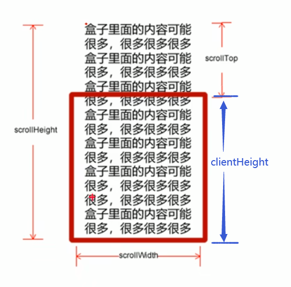
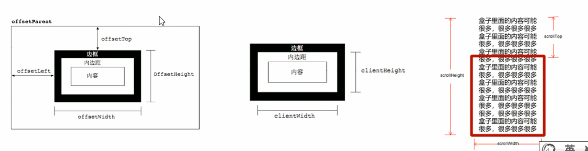

# JavaScript
JS 包括
- ECMAScript：JS 的核心语法（ES 规范，ECMA-262 标准）
- DOM：Document Object Model，文档对象模型，对网页当中的节点进行增删改的过程都是对 DOM 操作的过程。HTML 文档被当做一棵 DOM 树来看待。
- BOM：Browser Object Model，浏览器对象模型。关闭浏览器窗口、打开一个新的浏览器窗口、后退、前进、浏览器地址栏上的地址等进行操作都是 BOM 编程。

## 变量

- 变量只声明不赋值 -- 返回 `undefined`
- 变量不声明不赋值 -- 返回 `error`
- 变量不声明直接复制 -- 返回变量值 （不推荐）
- **不要用 `name` 作为变量名，是 JS 的内置变量，但是 `Name` 可以**

```js
// boolean型参与加法运算
true + 1	// 2
false + 1	// 1
true + null // 1

var v = undefined;
v + 1		// NaN

// 任何数据类型和字符串相加都会变成字符串
v + 'jojo'	// undefinedjojo
var n = null;
n + 'jojo'	//nulljojo
```

- 任何变量，如果不加 `var` 进行定义，那么就是全局的。如果在函数内部用 var 定义一个变量那么它就是局部变量，否则就是全局变量

## 数据类型

- 原始类型：Number、String、Boolean、Undefined、Null
- 引用类型：Object

【注】Undefined 类型只有一个值，就是 undefined；**NaN 属于 Number 类型**

### String 类型

> **str.substr() 和 str.substring() 的区别**

str.substr(startIdx, length)

str.substring(startIdx, endIdx) 且不包含 endIdx

### Object 类型

Object 类是所有类型的超类，自定义的任何类型都默认继承 Object

- 属性：`prototype（常用）` 和 `constructor`

可以通过 `prototype` 属性来给类动态扩展属性以及函数

```js
Student.prototype.getEmail = function() {
    return this.email
}
```

- 函数：`toString()` `valueOf()` `toLocaleString()`

## 数组

### 添加删除数组元素

| 方法名 | 说明 | 返回值 |
| :---: | :---: | :---: |
| push(arg1,...) | 末尾添加一个或多个元素 | 返回新的长度 | 
| pop() | 删除数组最后一个元素，数组长度减 1，无参数，修改了原数组 | 返回所删除元素的值 |
| unshift() | 向数组的开头添加一个或多个元素，修改了原数组	| 返回新的长度 |
| shift() | 删除数组的第一个元素，数组长度减 1，无参数，修改了原数组 | 返回第一个元素的值 |

### 数组排序

| 方法名 | 说明 | 是否修改原数组 |
| :---: | :---: | :---: |
| reverse() | 颠倒数组中的元素顺序，无参数 | 改变原数组，返回新数组 | 
| sort() | 对数组元素进行排序 | 改变原数组，返回新数组 |

**注意：**
sort 方法对数组进行原地排序，但是默认**按照字典序排序**。需要传入一个比较函数 `cmp(a, b)`，然后得到我们需要的排序效果。

```js
let arr = [1, 4, 17, 12, 9];

arr.sort();
console.log(arr); // [ 1, 12, 17, 4, 9 ]

let cmp = (a, b) => a - b;

arr.sort(cmp);
console.log(arr); // [ 1, 4, 9, 12, 17 ]

// 其中，let cmp = (a, b) => a - b; 为升序，b - a 为降序。
```

## 函数
对于 JS 来说，如果定义两个名字相同的函数，那么后声明的函数会覆盖前一个的声明

```js
var test = function() {
    alert("test")
}
var test = function(){
    alert("tettetetetetetetetest")
}
test()  // 弹出tettetetetetetetetest
```

### 回调函数 callback

回调函数的特点是：自己把函数写出来之后，不是由自己负责调用而是由其他程序负责调用该函数

```html
// 将sayHello函数注册到按钮上，等待click事件发生后，该函数被浏览器调用。我们称sayHello函数为回调函数
<input type = "button" onclick = "sayHello" />
```

### eval 函数
> https://developer.mozilla.org/zh-CN/docs/Web/JavaScript/Reference/Global_Objects/eval

`eval` 函数的作用是：将字符串当做一段 JS 代码解释并执行

```js
window.eval("var i = 100;")
alert("i = " + i)   // 结果：弹出 i = 100
```

```js
// java连接数据库，查询数据之后，将返回数据以json字符串返回给浏览器，还不是一个json对象，可以使用eval函数，将json字符串穿换成json对象
var fromJava = "{\"name\": \"zhangsan\", \"pwd\": \"124\"}"
window.eval("var jsonObj = " + fromJava)
alert(jsonObj.name + ", " + jsonObj.pwd)
```

**永远不要使用 eval 函数，存在一个非常好的 eval 替代方法：只需使用 `window.Function`**

## 作用域
通常来说，一段程序代码中所用到的名字并不总是有效和可用的，而限定这个名字的可用性的代码范围就是这个名字的作用域。作用域的使用提高 程序逻辑的局部性，增强了程序的可靠性，减少了名字冲突。

### 全局变量和局部变量的区别
- **全局变量**：在任何一个地方都可以使用，只有在浏览器关闭时才会被销毁，因此比较占内存
- **局部变量**：只在函数内部使用，当其所在的代码块被执行时，会被初始化；当代码块运行结束后，就会被销毁，因此更节省内存空间

### 作用域链

[深入浅出图解作用域链和闭包](https://segmentfault.com/a/1190000019275094)

内部函数访问外部函数的变量，采取链式查找的方式，采用**就近原则**

```js
var f1 = function() {
    var num = 123;
    var f2 = function() {
        console.log(num);
    }
    f2()
}
var num = 456;
f1()
```

## 预解析
JS 代码是由浏览器中的 JS 解析器来执行的。解析器在运行 JS 代码的时候分为两步：预解析和代码执行

其中**预解析**会把 JS 中所有的 var 和 function 提升到当前作用域的最前面。
- 变量提升/变量预解析：把所有的变量声明提升到**当前作用域**的最前面，不提升赋值操作
- 函数提升/函数预解析：把所有的函数声明提升到**当前作用域**的最前面，不调用函数

```js
/* case 1 */
console.log(num)

// 报错：Uncaught ReferenceError: num is not defined
```

```js
/* case 2 */
console.log(num)
var num = 10;

// 输出：undefined

/*
    JS 预解析会将第二行的 var num 提升到当前作用域的最前面，
    但是只提升变量声明，不提升赋值，即相当于下面的代码：
    var num
    console.log(num)
    num = 10
    所以会输出undefined
*/
```

```js
/* case 3 */
f1()
function f1() {
    console.log(11)
}

// 输出：11
```

```js
/* case 4 */
f2()
var f2 = function() {
    console.log(22)
}

// 报错：Uncaught TypeError: f2 is not a function

/*
    JS 预解析会将第二行的 var 提升到当前作用域的最前面，
    但是只提升变量声明，不提升赋值，即相当于下面的代码：
    var f2
    f2()
    f2 = function(){}
    所以会报错
*/
```

### 函数预编译的步骤
函数预编译，发生在函数执行的前一刻。

1. 创建 AO 对象。AO 即 Activation Object 活跃对象，其实就是「执行期上下文」。
2. 找形参和变量声明，将形参名和变量作为 AO 的属性名，值为 undefined。
3. 将实参值和形参统一，实参的值赋给形参。
4. 查找函数声明，函数名作为 AO 对象的属性名，值为整个函数体。

### 一个例子
```js
f1();
console.log(c);
console.log(b);
console.log(a);
function f1() {
    var a = b = c = 9;
    console.log(a);
    console.log(b);
    console.log(c);
// 输出： 9 9 9 9 9 报错：a is not defined
```

注意：
`var a = b = c = 9` 相当于 `var a = 9; b = 9; c = 9;` 也就是 **b 和 c 是全局变量**

如果想要集体声明，正确写法 `var a = 9, b = 9, c = 9` 就相当于 `var a = 9; var b = 9; var c = 9;` 就是三个局部变量了

所以只会报错 `a is not defined`

## 对象

### 创建对象的三种方式

```js
var obj = {
    name: 'wyx',
    age: 1,
    hi: function(){
        console.log('hello world')
    }
}
```

```js
var obj = new Object()
obj.name = 'wyx'
obj.age = 1
obj.hi = function() {
    console.log('hello world')
}
```

```js
function ObjConstructor(name, age)  {
    this.name = name
    this.age = age
}

var wyx = new ObjConstructor('wyx', 1)
```

## 内置对象

### Math

#### Math 常用方法
- `Math.PI` 圆周率
- `Math.floor()` 向下取整
- `Math.ceil()` 向上取整
- `Math.round()` 
- `Math.abs()` 绝对值
- `Math.max()`
- `Math.min()`

#### Math.random()
返回一个位于区间 [0, 1) 之间的伪随机浮点数

获取闭区间 [a, b] 之间的整数
```js
let ran = parseInt(Math.random() * (b - a + 1)) + a;
```

获取 [a, b) 之间的整数
```js
let ran = parseInt(Math.random() * (b - a)) + a;
```

随机点名实现
```js
function getRandom2(a, b) {
return parseInt(Math.random() * (b - a + 1)) + a;
}

let names = new Array('Peter', 'Murphy', 'Jack', 'Darcy', 'Alice');
console.log(names[getRandom2(0, names.length-1)]);
```

### Date

#### 一般格式
```js
let date = new Date();

let date3 = new Date('2019-10-1 10:10:10');
let date4 = new Date('2019/10/1');
```

#### 常用格式
```js
let date = new Date();
console.log(date.getFullYear()); // 2022
console.log(date.getMonth() + 1); // 10，注意得到的月份要加 1
console.log(date.getDate()); // 13
console.log(date.getDay()); // 4 星期四
```

#### 时分秒
```js
function getTime() { {
        return t < 10 ? '0' + t : t;
    }
    [h, m, s] = [che
    let time = new Date();
    let h, m, s;
    [h, m, s] = [time.getHours(), time.getMinutes(), time.getSeconds()]
    function check(t)ck(h), check(m), check(s)];
    return h + ':' + m  + ':' +s;
}
console.log(getTime());
```

#### 时间戳
获取 1971 年 1 月 1 日至今过去的毫秒数

```js
let date = new Date();
console.log(date)
console.log(date.valueOf())
console.log(date.getTime())

let d = +new Date() // 要记住这个
console.log(d)

let date2 = Date.now()
console.log('date2 ==== ' + date2)

/*
Thu Oct 13 2022 16:05:26 GMT+0800 (中国标准时间)
1665648326770
1665648326770
1665648326770
date2 ==== 1665648326770
*/
```

如何制作一个倒计时呢？利用时间戳就可以实现：期望的时间减掉现在的时间就是需要的总毫秒数 time /= 1000 就是秒数

```js
d = parseInt(time / 60 / 60 / 24)   // 计算天数
d = parseInt(time / 60 / 60 % 24)   // 计算小时
d = parseInt(time / 60 % 60)   // 计算分钟
d = parseInt(time % 60)   // 计算当前秒数
```

## DOM
文档对象模型（Document Object Model，简称 DOM )，是 W3C 组织推荐的处理可扩展标记语言（HTML 或者 XML）的标准编程接口。

W3C 已经定义了一系列的 DOM 接口，通过这些 DOM 接口可以改变网页的内容、结构和样式。

DOM 树包括
- 文档：一个页面就是一个文档，DOM中使用 `document` 表示
- 元素：页面中的所有标签都是元素，DOM中使用 `element` 表示
- 节点：网页中的所有内容都是节点（标签、属性、文本、注释等），DOM 中使用 `node` 表示

以上内容都称之为对象

### 使用 DOM 获取元素

- document.getElementById()
- document.getElementsByTagName()
- element.getElementsByTagName()

下面三个方法是 HTML5 新增的方法
- document.getElementsByClassName()
- document.querySelector('选择器')： 只返回第一个
- document.querySelectorAll('选择器')

获取特殊元素
- `document.body` 获取 body 元素
- `document.documentElement` 获取 html 元素

### 改变元素内容

#### innerHTML & innerText

- innerHTML
  - 从起始位置到终止位置的全部内容，包括 html 表现，同时保留空格和换行
  - **W3C 推荐使用**
- innerText
  - 从起始位置到终止位置的内容，但它不识别 html 标签，同时空格和换行也会去掉
  - （存疑？vscode测试也会保留空格和换行）

#### 表单元素
利用DOM 可以操控一下表单元素的属性
- type
- value
- checked
- selected
- disabled

#### 样式属性
通过JS修改元素的大小、颜色、位置等样式
- `element.style` 行内样式操作
- `element.className` 类名操作

```js
var div = document.querySelector('div')

div.onclick = function() {
    // 点击 div 就会改变背景颜色
    this.style.backgroundColor = 'lightcoral'
    // 点击 div 就会修改类名
    this.className = 'header'
}
```
**注意：**
1. JS 中的样式要采用驼峰命名法，如上面例子中的 `backgroundColor`，如果写成 `background-color` 就会报错
2. 在 JS 中通过 `.style` 修改的样式是 **行内样式**，权重很高，会覆盖掉 `<style>` 标签中的样式
3. 如果修改样式较多，可以选择直接修改类类名的方式
4. `class` 是一个保留字，所以使用 `className` 来操作元素类名

### 排他思想
如果有同一组元素，我们想要某一个元素实现某种样式，需要用到循环的排他思想算法：

1. 所有元素全部清除样式（干掉其他人）
2. 给当前元素设置样式（留下我自己）
3. 注意顺序不能颠倒，首先干掉其他人，再设置自己。

```js
 const btns = document.getElementsByTagName('button');
    for (let i = 0; i < btns.length; i++) {
        btns[i].onclick = function () {
            for (let j = 0; j < btns.length; j++) {
                btns[j].style.backgroundColor = '';
            }
            this.style.backgroundColor = 'pink';
        }
    }
``` 

### 表格中的全选功能
```html
<!DOCTYPE html>
<html lang="en">
  <head>
    <meta charset="UTF-8" />
    <meta http-equiv="X-UA-Compatible" content="IE=edge" />
    <meta name="viewport" content="width=device-width, initial-scale=1.0" />
    <title>表格全选</title>
    <link rel="stylesheet" href="../css/style.css" />
  </head>

  <style>
    * {
      margin: 0;
      padding: 0;
    }
    table {
      margin: 0 auto;
      margin-top: 300px;
      text-align: center;
      border-collapse: collapse;
    }
    td {
      border: 2px solid lightblue;
      border-spacing: 0;
      width: 150px;
    }
  </style>

  <body>
    <table class="tab">
      <thead>
        <tr>
          <th>
            <input type="checkbox" class="selectAll" />
            全选
          </th>
          <th>名称</th>
          <th>价格</th>
        </tr>
      </thead>
      <tbody class="tb">
        <tr>
          <td>
            <input type="checkbox" />
          </td>
          <td>apple pencil</td>
          <td>800</td>
        </tr>
        <tr>
          <td>
            <input type="checkbox" />
          </td>
          <td>apple watch</td>
          <td>2000</td>
        </tr>
      </tbody>
    </table>
  </body>

  <script>
    var all = document.querySelector(".selectAll");
    var tabs = document.querySelector(".tb").querySelectorAll("input");

    all.onclick = () => {
      for (var i = 0; i < tabs.length; i++) {
        tabs[i].checked = all.checked;
      }
    };

    for (var i = 0; i < tabs.length; i++) {
      tabs[i].onclick = function () {
        var flag = true;
        for (var i = 0; i < tabs.length; i++) {
          if (!tabs[i].checked) {
            flag = false;
            break;
          }
        }
        all.checked = flag;
      };
    }
  </script>
</html>
```

### 自定义属性
#### 获取属性值
- `element.属性` 主要获取内置属性值
- `element.getAttribute()` 主要用来获得自定义属性

#### 设置属性值
- `element.属性 = xxx`
- `element.setAttribute('属性', '值')` 主要针对自定义属性

#### 通过data规定自定义属性
自定义属性目的：为了保存并使用数据。有些数据可以保存到页面中而不用保存到数据库中

但有些自定义属性容易引起歧义，所以在 H5 中新增了自定义属性

规定使用 `data-` 开头作为属性名并且赋值

```css
<div data-index="1"></div>
```

同时 H5 新增 `element.dataset.index` 或者 `element.dataset['index']` 新增或者获取自定义属性，并且从 IE11 后才开始支持

如果自定义属性中有多个 - 连接的单词，获取时采用驼峰命名法 

#### 移除属性

`element.removeAttribute('属性')`

### 节点操作
 
通过 DOM 方法获取元素，逻辑不强、繁琐

利用节点层级关系获取元素
- 利用父子兄节点关系获取元素
- 逻辑性强，但是兼容性稍差

两种方法都会用到，但是节点操作更简单

#### 什么是节点
网页中的所有内容都是节点（标签、属性、文字、注释等），在 DOM 中，节点使用 node 来表示

DOM 树中的所有节点都可以通过 JS 进行访问，所有节点均可被修改，也可以进行创建或删除

一般，节点至少拥有以下三个属性
- `nodeType` 节点类型
  - 元素节点 nodeType 为 1
  - 属性节点为 2 
  - 文本节点为 3 （包括文字、空格、换行等
- `nodeName` 节点名称
- `nodeValue` 节点值 

#### 节点层级
利用 DOM 树将节点分为不同的层级，常见的是父子兄层级关系

1. 父级节点 `node.parentNode`
   1. 返回离某节点最近的父节点（亲爸爸）
   2. 如果没有父节点返回 null

```html
<!DOCTYPE html>
<html lang="en">
  <head>
    <meta charset="UTF-8" />
  </head>

  <body>
    <div class="first">
      <div class="sec">
        <div class="thr"></div>
      </div>
    </div>
  </body>

  <script>
    var thr = document.querySelector('.thr')
    console.log(thr.parentNode);
  </script>
</html>

<!-- 返回  div.sec -->
```

2. 子节点 `parentNode.childNodes`
   1. 返回包含指定节点的子节点集合，该集合为即时更新的集合
   2.  **注意**：返回值里包含了所有的子节点，包括元素节点，文本节点（空格等）。如果指向获得里面的元素节点，则需要另外处理。**所以一般不提倡使用 childNodes**

3. 子节点 `parentNode.children` （**常用**

```html
<!DOCTYPE html>
<html lang="en">
  <head>
    <meta charset="UTF-8" />
  </head>

  <body>
    <div class="first">
      <ul class="lsit">
        <li></li>
        <li></li>
        <li></li>
        <li></li>
      </ul>
    </div>
  </body>

  <script>
    var ul = document.querySelector('ul');
    console.log(ul.children);
  </script>
</html>

<!-- 返回 HTMLCollection(4) [li, li, li, li] -->
```

4. 获取所有节点的第一个和最后一个
   1. `parentNode.firstChild` 包含所有节点
   2. `parentNode.listChild`

```html
<!DOCTYPE html>
<html lang="en">
  <head>
    <meta charset="UTF-8" />
  </head>

  <body>
    <div class="first">
      <ul class="lsit">
        <li></li>
        <li></li>
        <li></li>
        <li></li>
      </ul>
    </div>
  </body>

  <script>
    var d = document.querySelector('.first');
    console.log(d.firstChild);
  </script>
</html>

<!-- 返回 #text，因为包含所有节点，所以第一个子节点是一个空行，就是一个文本节点 -->
```

5. 获取元素节点中的第一个和最后一个（>=IE9）
   1. `parentNode.firstElementChild`
   2. `parentNode.lastElementChild`

6. 实际开发中
   1. `parentNode.children[0]`
   2.  `parentNode.children[parentNode.children.length - 1]`

7. 兄弟节点
   1. `node.nextSibling` 下一个兄弟节点，包括所有类型节点
   2. `node.previousSibling` 上一个

8. 兄弟元素节点 （>=IE9）
   1. `node.nextElementSibling`
   2. `node.previousElementSibling`

```js
// 如果需要兼容 IE
function getNextElementSibling(node) {
    let n = node;
    while (n = n.nextSibling) {
        if (n.nodeType === 1) {
            return n;
        }
    }
    return null;
}
```

#### 创建和添加节点
- `document.createElement('tagName')` 创建节点
- `parentNode.appendChild(childNode)` 添加节点。若已存在同样的子节点，则在元素后追加

```js
var li = document.createElement('li')
var ul = doucument.querySelector('ul')
ul.appendChild(li)
```

- `node.insertBefore(child, 指定元素)` 添加节点到指定节点的前面

```js
var ins = document.createElement('li')
// 在 ul 的第一个元素前面插入一个 li
ul.insertBefore(ins, ul.children[0])
```

#### 删除节点
`removeChild(childNode)` 会返回删除的节点

#### 复制节点
`node.cloneNode([deep])` 返回调用该方法的节点的一个副本。也称为克隆节点/拷贝节点。其中 node 为被克隆的元素节点。

其中 deep 参数可以选择 true/false，表示是否为深拷贝。

默认为空，也就是false，即浅拷贝

- 深拷贝：同时复制节点本身和里面的子节点
- 浅拷贝：只复制节点本身，不复制子节点

```html
<html>
  <body>
    <ul>
      <li>111</li>
      <li>222</li>
    </ul>
  </body>

  <script>
    var ul = document.querySelector('ul')

    // case 1 浅拷贝
    var lili = ul.children[0].cloneNode()

    // case 2 深拷贝
    var deepli = ul.children[0].cloneNode(true)
  </script>
</html>

<!-- 
  case 1 结果：会多出一个 li，但是不会有里面的数字
  case 2 结果：会复制出一个 li 和 数字加在新的一行
-->
```

#### 三种动态创建元素的区别
- `document.write()` 了解即可
- `element.innerHTML`
- `element.createElement()`

1. `document.write()` 创建元素，是直接将内容写入页面的内容流，但是如果文档流执行完毕，会导致页面全部重绘。即覆盖原本的页面。
2. `innerHTML` 是将内容写入某个 DOM 节点，不会导致页面全部重绘。
3. `innerHTML` 创建多个元素效率更高（前提是不要拼接字符串，而是采取数组形式拼接），结构稍微复杂。
4. `createElement()` 创建多个元素效率稍低一点点，但是结构更清晰。

总结：不同浏览器下，`innerHTML` 效率要比 `creatElement` 高

## 事件

三要素：
- 事件源：事件被触发的对象（按钮）
- 事件类型：如何触发、什么事件（点击按钮）
- 事件处理程序：可通过一个函数赋值的方式实现

### 注册事件/绑定事件

给元素添加事件，就是注册/绑定事件
1. 传统方式：利用 on 开头的事件，比如 onclick
   1. 注册事件的**唯一性**：同一个元素同一个事件只能设置一个处理函数，最 后注册的处理函数将会 覆盖 前面注册的处理函数
2. 方法监听注册方式
   1. W3C 推荐方式
   2. `addEventListener()`
   3. IE9 之前可以用 `attachEvent()` 代替
   4. 同一个元素同一个事件可以注册多个监听器，按注册顺序依次执行

#### 方法监听注册事件

```js
eventTarget.addEventListener(type, listener[, useCapture])
```

`eventTarget.addEventListener()` 方法将指定的监听器注册到 `eventTarget`（目标对象）上，当该对象触发指定的事件时，就会执行事件处理函数。

该方法接收三个参数：
1. `type`：事件类型**字符串**，比如 'click' 、'mouseover'，注意这里不要带 on
2. `listener`：事件处理函数，事件发生时，会调用该监听函数
3. `useCapture`：可选参数，是一个布尔值，默认是 false。学完 DOM 事件流后，我们再进一步学习

### 删除事件/解绑事件

1. 传统方式：`eventTarget.onclick = null`
2. 方法监听注册方式：
   1. `eventTarget.removeEventListener(type, listener[, useCapture])`
   2. `eventTarget.detachEvent(eventNameWithOn, callback)` 为了兼容 IE，不怎么使用

```js
function fn() {
  alert('111111111')
}

// 添加事件
div.addEventListener('click', fn)

// 解绑事件
div.removeEventListener('click', fn)
```

### DOM 事件流

事件流描述的是从页面中接收事件的顺序

事件发生时会在元素节点之间按照特定的顺序传播，这个传播过程就是 DOM 事件流

分为三个阶段
1. 捕获阶段：由网景最早提出，由 DOM 最顶层节点开始，然后逐级向下传播到最具体的元素接收的过程
2. 当前目标阶段
3. 冒泡阶段：IE 最早提出，事件开始时由最具体的元素接收，然后逐级向上传播到 DOM 最顶层节点的过程


#### 注意事项

1. JS 代码中只能执行捕获或者冒泡其中的一个阶段
2. `onclick` 和 `attachEvent` 只能得到冒泡阶段
3. `addEventListener(type, listener[, useCapture])` 第三个参数
   1. true，表示在事件捕获阶段调用事件处理程序
   2. false，表示在事件冒泡阶段调用事件处理程序
4. 实际开发中很少使用事件捕获，更关注事件冒泡
5. 有些事件是没有冒泡的，比如 `onblur` `onfocus` `onmouseenter` `onmouseleave`

```html
<!-- case 1：在捕获阶段调用事件 -->

<!DOCTYPE html>
<html lang="en">
  <head><meta charset="UTF-8" /></head>

  <style>
    * {
      margin: 0;
      padding: 0;
    }
    div {
      margin: 0 auto;
    }
    .father {
      height: 300px;
      width: 300px;
      background-color: pink;
    }
    .son {
      height: 200px;
      width: 200px;
      background-color: lightblue;
    }
  </style>

  <body>
    <div class="father">
      <div class="son">son盒子</div>
    </div>
  </body>

  <script>
    var son = document.querySelector('.son')
    son.addEventListener('click', function() {
      alert('son')
    }, true)

    var father = document.querySelector('.father')
    father.addEventListener('click', function() {
      alert('father')
    }, true)
  </script>
</html>

<!-- 
  点击 son 盒子，会先弹出 father 再弹出 son
  因为设置了事件捕获 true
  会按照 document -> html -> body -> father -> son 的顺序进行捕获 
-->
```

```js
// case 2: 在冒泡阶段调用事件

var son = document.querySelector('.son')
son.addEventListener('click', function() {
  alert('son')
}, false)

var father = document.querySelector('.father')
father.addEventListener('click', function() {
  alert('father')
}, false)

// 点击 son 会先弹出 son 再弹出 father
```

### 事件对象

```js
div.addEventListennr('click', function(event) {
  console.log(event)
})
```

`event` 就是一个事件对象，写到我们侦听函数的小括号里面，当形参来看

事件对象存在的前提是必须要有事件，如果没有 click 等监听事件，那么事件对象也就不存在了。它是系统自动创建的，不需要我们传递参数

事件对象是有关事件的一系列相关数据的集合。比如：
- 和鼠标相关的：鼠标按下的坐标等等
- 和键盘相关的：按下的是哪个键等等

我们可以自己给 `event` 命名，比如可以直接写成 `evt` `e` 都可以

存在兼容性问题。在 IE 6/7/8 版本中必须使用 `window.event` 来获取事件对象 

如果需要考虑兼容性问题，那么可以在使用时写成

```js
e = event || window.event
```

#### 事件对象的常用属性和方法

| 属性/方法 | 说明 |
| :---: | :---: |
| e.target | 返回 **触发** 事件的对象 | 
| e.type | 返回事件类型，比如 click mouseover，不带 on |
| e.preventDefault() | 阻止默认事件/行为 |
| e.stopPropagatin() | 阻止冒泡 |
| --- 以下都是非标准写法 --- | --- 供 IE 6/7/8 --- |
| e.srcElement | 返回触发事件的对象 |
| e.returnValue | 阻止默认事件 |
| e.cancelBubble | 阻止冒泡 |

#### e.target 和 this 的 区别

`e.target` 返回触发事件的对象/元素

`this` 返回绑定事件的对象/元素

```html
<!DOCTYPE html>
<html lang="en">
  <head>
    <meta charset="UTF-8" />
  </head>

  <body>
    <div class="main">
      <ul>
        <li>111</li>
        <li>222</li>
      </ul>
    </div>
  </body>

  <script>
    var ul = document.querySelector('ul')
    ul.addEventListener('click', function(e) {
      console.log('e.target == ' + e.target)
      console.log('this == ' + this)
    })
  </script>
</html>

<!-- 
  e.target == [object HTMLLIElement] 返回 li，点击 li 触发事件
  this == [object HTMLUListElement] 返回 ul，ul 上绑定了事件
-->
```

#### 阻止默认行为

阻止默认行为可以让链接不跳转，或者让提交按钮不提交

```js
var a = document.querySelector('a')
a.addEventListener('click', function(e) {
  e.preventDefault()
})

var input = document.querySelector('input')
input.addEventListener('click', function(e) {
  e.preventDefault()
}) 

// 点击超链接或者提交按钮都不会有相应跳转
```

传统注册方式下，也可以通过 `return false` 来阻止默认行为。但是这样 return 之后的内容就不会再执行了，了解即可

```js
input.onclick = function(e) {
  return false
}
```

#### 阻止事件冒泡

```js
son.addEventListener('click', function(e){
  e.stopPropagation()
})

// 案例见上面 father/son 案例，加入以上代码之后，点击 son 盒子只会弹出 son
```

#### 事件委托/代理/委派

jQuery 中称为事件委派

**原理： 不是每个子节点单读设置事件监听器，而是事件监听器设置在父节点上，然后利用冒泡原理影响设置每个子节点**

比如：给 ul 注册点击事件，然后利用事件对象的 target 来找到当前点击的 li，事件就会冒泡到 ul 上；再由于 ul 上已经有了注册事件，那么就会触发事件监听器。

这样的好处在于只需要操作一次 DOM，提高了程序的性能

```js
var ul = document.querySelector('ul')
ul.addEventListener('click', function() {
  alert('弹弹弹 弹走鱼尾纹')
})

// 点击每个 li 都会有弹框弹出
```

```js
ul.addEventListener('click', function(e) {
  e.target.style.backgroundColor = 'pink'
})

// 可以通过 e.target 操作每个 li
```

### 常用鼠标事件

- `onclick` 鼠标点击左键触发
- `onmouseover` 鼠标经过触发
- `onmouseout` 鼠标离开触发
- `onfocus` 获得焦点触发
- `onblur` 失去焦点触发
- `onmousemove` 鼠标移动触发
- `onmouseup` 鼠标弹起触发
- `onmousedown` 鼠标按下触发

#### mouseenter 和 mouseover 的区别

- `mouseover` 鼠标经过自身盒子会触发，经过子盒子还会触发、
- `mouseenter` 只会经过自身盒子触发，**因为 mouseenter 不会冒泡**
  - 和 `mouseenter` 搭配，鼠标离开 `mouseleave` 同样不会冒泡

#### 禁止鼠标右键菜单

`contextmenu` 主要控制应该何时显示上下文菜单，主要用于程序猿取消默认的上下文菜单

```js
document.addEventListener('contextmenu', function(e) {
  e.preventDefault()
})

// 效果就是：选中文字之后，再鼠标右键，不会出现右键菜单
```

#### 禁止选中文字

```js
document.addEventListener('selectstart', function(e) {
  e.preventDefault()
})

// 效果：无法选中文字
```

#### 鼠标事件对象 MouseEvent

```js
document.addEventListener('click', function(e) {
  console.log(e);
})

// 输出 PointerEvent
```

`PointerEvent` 拓展了 `MouseEvent`，是一类可以被定点设备所触发的 DOM 事件，它们被用来创建一个可以有效掌握各类输入设备 **（鼠标、触控笔和单点或多点的手指触摸）** 的统一的 DOM 事件模型

[Pointer Events from MDN](https://developer.mozilla.org/zh-CN/docs/Web/API/Pointer_events)

| 鼠标事件对象 | 说明 |
| :---: | :---: |
| e.clientX | 返回鼠标相对于浏览器窗口可视区的 X 坐标 | 
| e.clientY | 返回鼠标相对于浏览器窗口可视区的 Y 坐标 |
| e.pageX | 返回鼠标相对于文档页面的 X 坐标，IE9+ 支持，**最常用** |
| e.pageY | 返回鼠标相对于文档页面的 Y 坐标，IE9+ 支持，**最常用** |
| e.screenX | 返回鼠标相对于电脑屏幕的 X 坐标 |
| e.screenY | 返回鼠标相对于电脑屏幕的 Y 坐标 |


### 常用键盘事件

- `onkeyup` 某个键盘按键被松开时触发
- `onkeydown` 某个键盘按键被按下时触发
- `onkeypress` 某个键盘按键被按下时触发，**但是它不识别功能键，比如 ctrl shift 左右箭头等**

三个事件的执行顺序是：keydown --> keypress --> keyup

#### 键盘事件对象 KeyboardEvent

```js
document.addEventListener('keyup', function(e) {
  console.log(e)
})

// 输出 KeyboardEvent
```

可以通过 `e.keyCode` 来获取按下的某个键的 ASCII 值

最新的 MDN 中已经弃用 `keyCode` 转而使用 `code`，
但是在某些浏览器中还支持，所以在使用时需要考虑兼容性问题，同时应该尽量避免使用 `keyCode`

```js
document.addEventListener('keyup', function(e) {
  console.log(e.code)
  console.log(e.key)
})

// 按下 D 会输出 KeyD(不区分大小写)
// 按下 D 会输出 D
```

[KeyboardEvent.keyCode from MDN](https://developer.mozilla.org/zh-CN/docs/Web/API/KeyboardEvent/keyCode)

注意：
- `onkeydown` 和 `onkeyup` 不区分字母大小写，`onkeypress` 区分大小写
- 在实际开发中，更多使用 up 和 down，因为它们能识别包括功能键在内的所有键   
- **`keydown` 和 `keypress` 在文本框中的特点：触发事件的时候，文本还没有落入文本框中，所以在监听文本框时，基本都是用 `keyup`**

## BOM

BOM（Browser Object Model）即浏览器对象模型，它提供了独立于内容而与浏览器窗口进行交互的对象，其核心对象是 `window`

BOM 由一系列相关的对象构成，并且每个对象都提供了很多方法与属性。

BOM  缺乏标准，JavaScript 语法的标准化组织是 ECMA，DOM 的标准化组织是 W3C，BOM 最初是Netscape 浏览器标准的一部分

BOM 比 DOM 更大，它包含 DOM。

### window 对象

浏览器的顶级对象，具有双重角色：
1. 它是 JS 访问浏览器窗口的一个接口
2. 它是一个全局对象。定义在全局作用域中的变量、函数都会变成 `window` 对象的属性和方法

`window` 对象包括：
- document
- location
- navigation
- screen
- history

【注意】声明变量时尽量不要用 name 作为变量名，因为 `window` 下已经有了一个属性叫 `window.name`

### 窗口加载事件

#### load 事件

`window.onload = function() {}`   或者

`window.addEventListener('load', function() {})`

onload 就是窗口/页面加载事件，当文档内容完全加载完成后才会触发该事件（包括图像、脚本文件、CSS 文件等）

有了 `window.onload` 就可以把 JS 代码写到页面元素的上方

注意：
- `window.onload` 传统注册事件方式只能写一次，如果有多个，会以最后一个为准
- 如果使用 `addEventListener` 则没有限制。

```html
<!-- 
  如果按照下面这种将 script 写在 input 前面的写法，那么运行时会报错。
  因为代码是从上往下运行的，当运行到 getElementById 时并找不到 id 为 myBtn 的按钮 
-->
<!-- Uncaught TypeError: Cannot set properties of null (setting 'onclick') -->
<body>
    <script type="text/javascript">
        document.getElementById("myBtn").onclick = function() {
            alert("this is my button.")
        }
    </script>

    <input type="button" value="btn1" id="myBtn" />
</body>
```

想要实现就需要使用 `load` 事件

```html
<body onload="ready()">
    <script type='text/javascript'>
        function ready() {
            document.getElementById("myBtn").onclick = function () {
                alert("this is my button.")
            }
        }
    </script>
    <input type="button" value="btn1" id="myBtn" />
</body>

<!-- 或者 -->

<body>
    <script type='text/javascript'>
        window.onload = function() {
            document.getElementById("myBtn").onclick = function() {
                alert("this is my button...")
            }
        }
    </script>
    <input type="button" value="333333" id="myBtn" />
</body>
```

#### DOMContentLoad 事件

`document.addEventListener('DOMContentLoaded', function() {})`

仅当 DOM 加载完成后就可触发事件，不包括样式表、图片、flash 等（**IE9 以上才支持**），所以加载速度比 `load` 更快

**如果页面的图片很多的话, 从用户访问到 `load` 触发可能需要较长的时间, 交互效果就不能实现，必然影响用户的体验，此时用 `DOMContentLoaded` 事件比较合适**

### 调整窗口大小事件

`window.onresize = function() {}`  或者

`window.addEventListener('resize', function() {})`

`window.onresize` 是调整窗口大小加载事件, 当触发时就调用处理函数

注意：
1. 只要窗口大小发生像素变化，就会触发这个事件
2. 我们经常 **利用这个事件完成响应式布局**
3. `window.innerWidth` 是当前屏幕的宽度

### 定时器

#### setTimeout()

`window.setTimeout(回调函数[, 延迟的毫秒数])`  window 可省略

设置一个定时器，该定时器在到期后执行调用函数

一个页面中经常会用到不同的定时器，提倡给不同的定时器设置不同的名字

#### 停止 setTimeout()

`window.clearTimeout(timeoutID)`  window 可省略

```js
var timer = setTimeout(function() {
  console.log('BOOOOOM')
}, 5000)

clearTimeout(timer) // 清除 timer 定时器
```

#### setInterval()

`window.setInterval(回调函数[, 延迟的毫秒数])`  window 可省略

重复调用一个函数，每隔这个时间，就会调用一次回调函数

一个页面中经常会用到不同的定时器，提倡给不同的定时器设置不同的名字

#### 停止 setInterval()

`window.clearInterval(intervalID)`  window 可省略

### this 指向问题

this 的指向在函数定义时是确定不了的，只有在函数执行的时候才能确定 this 到底指向谁

一般情况下，this 的最终指向是那个调用它的对象

- 全局作用域或者普通函数中 this 的指向是全局对象 window（注意定时器里的 this 指向 window）
- 方法调用中，谁调用这个方法，this 就指向谁
- 构造函数中，this 指向构造函数的实例

### 关于 JS 代码的执行顺序

[javascript 引擎执行的过程的理解--执行阶段，有关宏任务和微任务](https://segmentfault.com/a/1190000018134157)

JS 的一大特点就是 **单线程**，因为 JS 这门脚本语言诞生的使命就是为处理页面中用户的交互，以及操作 DOM。那么当我们操作 DOM 时，不能同时进行，应该先添加再删除等等

但是单线程就会导致 JS 执行时间过长，页面渲染不连贯，加载阻塞的问题

为了解决这个问题，HTML5 提出 Web Worker 标准，允许 JS 脚本创建多个线程，于是 JS 中出现了同步和异步

#### 同步任务

同步任务都在主线程上执行，形成一个执行栈

#### 异步任务

JS 异步是通过回调函数实现的。一般而言，异步任务有以下三种类型：

- 普通事件：如 click resize 等
- 资源加载：load resize 等
- 定时器：setInterval setTimeout 等

异步任务相关的回调函数添加到 **任务队列/消息队列** 中

```js
console.log(1)
setTimeout(function() {
  console.log(3)
}, 0)
console.log(2)

// 结果输出 1 2 3
// 因为 setTimeout 中的 fn 会放到任务队列中去，等到同步任务中的代码执行完成之后才会到任务队列中执行 fn
```

#### 事件循环 event loop

由于主线程不断的重复获得任务、执行任务、再获取任务、再执行任务……这种机制被称为 **事件循环**


### location 对象

`window` 对象给我们提供了一个 `location` 属性用于获取或设置窗体的URL，并且可以用于解析 URL。因为这个属性返回的是一个对象，所以我们将这个属性也称为 `location` 对象

#### URL

统一资源定位符（Uniform Resource Locator，URL）

`protocol://host[:port]/path/[?query]#fragment`

| 组成 | 说明 |
| :---: | :---: |
| protocol | 通信协议，常用 http ftp | 
| host | 主机/域名 `www.baidu.com`  `www.bilibili.com` |
| port | 端口号，可选，省略时使用默认端口，如 http 的默认端口是 80 |
| path | 路径，由零个或多个 / 隔开的字符串，一般用来表示主机上的一个目录或文件地址 |
| query | 参数，以键值对的形式，通过 `&` 符号隔开，如 `name=jojo&age=2` |
| fragment | 片段，# 后面内容常见于链接、锚点 |

#### location 对象属性

| 属性 | 返回值 |
| :---: | :---: |
| location.href | 整个 URL | 
| location.host | 主机/域名 |
| location.port | 端口号，如果未写则返回空字符串 |
| location.pathname | 路径 |
| location.search | 参数 |
| location.hash | 片段 |

#### location 对象方法

| 方法 | 功能 |
| :---: | :---: |
| location.assign() | 和 href 一样，可以跳转页面（也称为重定向页面），记录历史，可以实现后退页面 | 
| location.replace() | 替换当前页面，因为不记录历史，所以不能后退页面 |
| location.reload() | 重新加载页面，相当于刷新按钮或者 f5 如果参数为 true 则相当于 强制刷新 ctrl + f5 |

### navigator 对象

`navigator` 对象包含有关浏览器的信息，它有很多属性，我们最常用的是 `userAgent`，该属性可以返回由客户机发送服务器的 `user-agent` 头部的值

可以通过 `navigator.userAgent.match(regex 正则表达式)` 来判断用户是用手机端还是 PC 端打开页面，再利用 `location.href` 进行跳转

### history 对象

`window` 对象给我们提供了一个 `history` 对象，与浏览器历史记录进行交互。该对象包含用户（在浏览器窗口中)访问过的 URL

| 方法 | 功能 |
| :---: | :---: |
| history.back() | 可以后退 | 
| history.forward() | 前进功能 |
| history.go(参数) | 前进后退功能，如果是 1 表示前进一个页面，如果是 -1 表示后退一个页面 |

history 对象一般在实际开发中用处较少，但是在一些 OA 办公系统中会经常见到

## DOM 和 BOM 的区别

| DOM | BOM |
| :---: | :---: |
| 文档对象模型 | 浏览器对象模型 | 
| 把 **文档** 当做一个对象来看待 | 把 **浏览器** 当做一个对象来看待 |
| DOM 的顶级对象是：`document` | BOM 的顶级对象是：`window` |
| DOM 主要是操作页面元素 | BOM 主要是浏览器窗口交互 |
| DOM 是 W3C 标准规范 | BOM 是浏览器厂商在各自浏览器上定义的，兼容性较差 |

## void 运算符

`void` 运算符对给定的表达式 进行求值，然后**返回 `undefined`**

void 运算符通常只用于获取 undefined 的原始值，一般使用 `void(0)（等同于void 0）`。在上述情况中，也可以使用全局变量 undefined 来代替（假定其仍是默认值）

```html
<!-- 假设现在需要实现一个超链接的效果，点击超链接后弹 出相应内容，但是页面不进行跳转
     必须加上javascript:;，如果不加会默认当成一个路径，则会报错 Cannot GET /html-code/void(0)
     同样，使用 javascript:undefined 是一样的效果
     甚至，使用 js:void(0) 也是一样的效果-->
<body>
    <a href="javascript:void(0)" onclick="alert('ddddddd.......')">这是一个超链接</a>
</body>
```

## 本地存储

随着互联网的快速发展，基于网页的应用越来越普遍，同时也变的越来越复杂，为了满足各种各样的需求，会经 常性在本地存储大量的数据，HTML5 规范提出了相关解决方案

### 本地存储特性

- 数据存储在用户浏览器中
- 设置、读取方便，甚至页面刷新不丢失数据
- 容量较大，`sessionStorage` 约 5M，`localStorage` 约 20M
- 只能存储字符串，可以将对象 `JSON.stringify()` 转为字符串后存储

### sessionStorage

- 生命周期为 **关闭浏览器窗口**
- 在同一个窗口（页面）下数据可以共享
- 以键值对的形式存储使用

#### 相关操作

1. 存储数据 `sessionStorage.setItem(key, value)`
2. 获取数据 `sessionStorage.getItem(key)`
3. 删除数据 `sessionStorage.removeItem(key)`
4. 删除所有数据 `sessionStorage.clear()`

### localStorage

- 生命周期 **永久生效**，除非手动删除否则关闭页面也会存在
- 可以多窗口共享（同一浏览器可以共享）
- 以键值对的形式存储使用

#### 相关操作

1. 存储数据 `localStorage.setItem(key, value)`
2. 获取数据 `localStorage.getItem(key)`
3. 删除数据 `localStorage.removeItem(key)`
4. 删除所有数据 `localStorage.clear()`

## 立即执行函数

不需要调用，立即能够自己执行的函数

```js
(function() {})()

// 或者

(function() {} ());
```

```js
(function() {
  console.log(22222)
})()

// 打开浏览器会直接打印出 22222
```

```js
(function sum(a, b) {
  console.log('a = ' + a + ' b = ' + b + ', sum = ' + (a + b))
})(3, 45)

// 输出 a = 3 b = 45, sum = 48

// 后面的小括号可以看做是在调用前面的函数
// 后面的括号里面的参数就是实参，传递到前面的函数里
```

如果有多个立即执行函数，那么中间一定要用 `;` 隔开，否则会报错

立即执行函数最大的作用就是 **独立创建了一个作用域**，里面所有的变量都是局部变量

## 淘宝 flexible.js 源码分析

### pageshow 事件

下面三种情况都会刷新页面，触发 `load` 事件
1. `a` 标签的超链接
2. F5 或者刷新按钮（强制刷新）
3. 前进后退按钮

但是火狐中有个特点：往返缓存。这个缓存中不仅保存着页面数据，还保存了 DOM 和 JS 的状态。实际上就是将整个页面都保存在了内存里

所以此时后退按钮不能刷新页面，那么就可以使用 `pageshow` 事件来触发。

**这个事件在页面显示时触发，不论页面是否来自缓存**。在重新加载页面中，pageshow 会在 load 事件触发后触发；根据事件对象中的 `persisted` 来判断是否是缓存中的页面触发的 pageshow 事件，**注意这个事件要给 window 添加**

## JS 高级

### 两大编程思想

#### 面向过程

**面向过程** 编程，即 POP（Process Oriented Programming）面向过程就是分析出解决问题所需要的步骤，然后用函数把这些步骤一步一步实现，使用的时候再一个一个的依次调用就可以了

#### 面向对象

**面向对象** 编程，即 OOP（Object Oriented Programming） 面向对象是把事务分解成为一个个对象，然后由对象之间分工与合作

在面向对象程序开发思想中，每—个对象都是功能中心，具有明确分工。 面向对象编程具有灵活、代码可复用、容易维护和开发的优点，更适合多人合作的大型软件项目

面向对象的特征：封装、继承、多态

#### 面向过程和面向对象的对比

- **面向过程**
  - 优点：性能比面向对象高，适合跟硬件联系很紧密的东西，例如单片机就采用的面向过程编程
  - 缺点：没有面向对象易维护、易复用、易扩展
- **面向对象**
  - 优点：易维护、易复用、易扩展，由于面向对象有封装、继承、多态性的特性，可以设计出低耦合的系统，使系统更加灵活、更加易于维护
  - 缺点：性能比面向过程低

#### 面向对象的思维特点

- 抽象出对象共用的属性和行为封装成一个 **类（模板）**
- 对类进行 **实例化**，获取类的对象

### ES6 中的类和对象

对象是一组无序的相关属性和和方法的集合，**在 JS 中万物皆对象**，例如字符串、数值、数组、函数等

ES6 中新增了类的概念，可以使用 `class` 声明一个类

```js
class Person {

}
let person = new Person();
```

#### 构造函数 constructor

`constructor()` 方法是类的构造函数（默认方法）
- 用于传递参数，返回实例对象
- 通过 `new` 命令生成对象实例时，自动调用该方法
- 如果没有显式定义，类内部会自动给我们创建一个 `constructor()`
- 语法规范
  - 创建类时，类名后面不要加小括号；创建实例，类名后面要加小括号
  - **构造函数不需要加 function 关键字**

```js
// 创建一个学生类
class Student {
  constructor(uname, age, major) {
    this.uname = uname;
    this.age = age;
    this.major = major;
  }
}

let wbk = new Student('wbk', 28, 'Economy')
```

#### 类中添加方法

直接在类中写方法名和括号即可

**注意：**
1. 方法之间不能加逗号分隔，会报错
2. 方法不需要添加 function 关键字

```js
class Student {
  constructor(uname, age, major) {
    this.uname = uname;
    this.age = age;
    this.major = major;
  }
  // 类中添加方法
  sing() {
    console.log(this.uname + "会唱歌");
  }
}
```

#### static 静态成员

给成员属性或成员方法添加 `static`，该成员就成为静态成员，**静态成员只能由该类调用**

```js
class Person {
  static eat() {
    console.log('eat');
  }
}
let p = new Person();
Person.eat(); // eat
p.eat(); // 报错
```

#### getter 和 setter

实际上，`getter` 和 `setter` 是 ES5（ES2009）提出的特性，这里不做详细说明，只是配合 class 使用举个例子

当属性拥有 `get/set` 特性时，属性就是访问器属性。代表着在访问属性或者写入属性值时，对返回值做附加的操作。而这个操作就是 `getter/setter` 函数

使用场景： `getter` 是一种语法，这种 get 将对象属性绑定到 **查询该属性时将被调用的函数**。适用于某个需要动态计算的成员属性值的获取。`setter` 则是在修改某一属性时所给出的相关提示

```js
class Test {
    constructor(log) {
        this.log = log;
    }
    get latest() {
        console.log('latest 被调用了');
        return this.log;
    }
    set latest(e) {
        console.log('latest 被修改了');
        this.log.push(e);
    }
}

let test = new Test(['a', 'b', 'c']);
// 每次 log 被修改都会给出提示
test.latest = 'd';
// 每次获取 log 的最后一个元素 latest，都能得到最新数据。
console.log(test.latest);

/**
 * latest 被修改了
 * latest 被调用了
 * ['a', 'b', 'c', 'd']
 * /
```

### 类的继承

子类可以继承父类的属性和方法，使用 `extends` 关键字

```js
class Car extends Vehicle {
  // class body
}
```

### super 关键字

使用 `super` 关键字访问和调用父类上的函数。**可以调用父类的构造函数**，也可以调用父类的普通函数

**注意：子类在构造函数中使用 super，必须放到 this 前面（必须先调用父类的构造方法，再使用子类的构造方法）**

```js
// 调用父类/父对象的构造函数
super([arguments])

// 调用父类/父对象的方法
super.functionOnParent([arguments])
```

```js
class Person {
  constructor (uname, age) {
    this.uname =uname;
    this.age = age;
  }
}
class Student extends Person {
  constructor (uname, age, major) {
    // super 将子类的参数传递给父类构造函数，减少代码量
    super(uname, age);
    // 子类可以有自己独有的属性
    this.major = major;
  }
}
let rick = new Student("Lucy", 28, "SE");
```

#### super 传值问题

```js
// 以下代码，将产生错误
class Father {
  constructor(x, y) {
    this.x = x;
    this.y = y;
  }
  sum() {
    console.log(this.x + this.y);
  }
}
class Son extends Father {
  constructor(x, y) {
    this.x = this.x;
    this.y = this.y;
  }
}
let obj = new Son(10, 20);
obj.sum();

// Uncaught ReferenceError: Must call super constructor in derived class before accessing 'this' or returning from derived constructor
```

解释说明：若子类没有写构造函数，则实例化时默认调用父类的，这时候程序运行无误。若子类写了构造函数，那么子类在调用 sum 方法的时候，参数的值没有传给父类，父类无法调用参数的值，也就无法执行 sum 方法

```js
// 正确写法
class Son extends Father {
  constructor(x, y) {
    super(x, y)
  }
}

// 输出 30
```

#### super 调用父类普通函数

```js
class Parent {
  sayHi() {
    return "Father: hello";
  }
}
class Child extends Parent {
  sayHi() {
    // super 调用父类普通函数
    console.log(super.sayHi());
  }
}
let man = new Child();
man.sayHi(); // Father: hello
```

#### 继承中属性和方法的查找原则

就近原则
- 如果实例化子类输出一个方法，先看子类有没有这个方法，如果有就先执行子类的
- 如果子类里面没有，就去查找父类有没有这个方法，如果有，就执行父类的这个方法（就近原则）

```js
class Parent {
    sayHi() {
        console.log("Father: hello");
    }
}
class Child extends Parent {
    sayHi() {
        console.log("Son: hello");
    }
}
let man = new Child();
man.sayHi(); // Son: hello

// 如果 Child 中没有 sayHi() 方法，那么就会执行 Parent 中的 sayHi() 方法
```

#### super 必须放到子类 this 之前

子类在构造函数中使用 `super`，必须放到 `this` 前面

```js
class Father {
  constructor(x, y) {
    this.x = x;
    this.y = y;
  }
}
class Son extends Father {
  constructor(x, y, z) {
    super(x, y, z);
    this.z = this.z;
  }
}
let obj = new Son(1, 2, 3);
```

### 使用类的注意点

1. ES6 中类没有变量提升，所以必须先定义类，才能通过类实例化对象
2. 类里面的共有属性和方法一定要加 `this` 使用
3. 类里面的 `this` 指向问题：`constructor` 里面的 `this` 指向实例对象, 方法里面的 this 指向这个方法的调用者

```js
let that;
class Star {
  constructor (uname, age) {
    that = this;
    this.uname = uname;
    this.age = age;
    // btn按钮调用sing方法
    this.btn = document.querySelector("button");
    this.btn.onclick = this.sing;
    // constructor 里面的this 指向的是 创建的实例对象
    console.log("constructor: ", this);
  }
  sing() {
    // 这个sing方法里面的 this 指向的是 btn 这个按钮，因为这个按钮调用了这个函数
    console.log("sing:", this); // button
    console.log(that.uname); // that里面存储的是constructor里面的this
  }
  dance() {
    // 这个dance里面的this 指向的是实例对象 ldh 因为ldh 调用了这个函数
    console.log("dance:", this);
  }
}
let rick = new Star("Rick", 20);
rick.dance();
```

## ES6


[ES6从入门到精通系列(全23讲)](https://www.bilibili.com/video/BV1ay4y1r78B?spm_id_from=333.337.search-card.all.click&vd_source=c727c2934b167656e7856cce64cc7eb5)

[阮一峰 -- ES6 入门教程](https://es6.ruanyifeng.com/)

ES5 的先天性不足：比如变量提升、内置对象的方法不灵活、模块化实现不完善

ES6 在 2015 年 6 月正式发布。ES6 既是一个历史名词，也是一个泛指，指代 5.1 版本以后的 JS 下一代标准，涵盖了 ES2015、2016、2017 等，而 ES2015 则是正式名称，特指该年发布的正式版本的语言标准

### ES6 新特性

- let 和 const
- ES6 的模板字符串
- 增强的函数
- 扩展的字符串、对象、数组功能
- 解构赋值
- Symbol
- Map 和 Set
- 迭代器和生成器
- Promise 对象
- Proxy 对象
- async 的用法
- 类 class
- 模块化实现

有些浏览器可能不支持 ES6+，可以使用 **Bable** 进行编译，从而让浏览器获得支持

### let 和 const

[蛋老师讲解 var let const 三者区别](https://www.bilibili.com/video/BV1qk4y1k75W/?spm_id_from=333.337.search-card.all.click)

ES6 以前，JS 没有块级作用域。ES6 新增 let 和 const 之后才有了块级作用域。 块级作用域是指用 `{ }` 包括起来的一段代码，例如 if 、while 等等。 函数作用域就是指变量只在函数内部起作用。

#### let

1. 声明变量，没有变量提升

```js
console.log(a)
let a = 2

// 会报错，因为不存在变量提升
```

2. 是一个块级作用域

```js
console.log(b)  // 报错 not defined
if (1 === 1) {
  console.log(b)  // 报错 connot access 'b' before initialization
  let b = 10
}
console.log(b)  // 报错 not defined
```

3. 不能重复声明，但是可以更改

```js
let a = 1
let a = 333 
console.log(a)

// 报错 Identifier 'a' has already been declared，第二行去掉 let 就可以正常运行
```

#### const

1 2 3 点同 let，此外还有 `const` 一般用来声明常量，一旦被声明无法修改

```js
const MAX = 10
MAX = 20000
console.log(MAX)  // 报错 Assignment to constant variable

// ---------------------- //

const person = {
  name: 'wbk'
}

person.name = 'jojo' // 没有问题

person = {
  name: 'jojo'  // 报错
}
```

一个经典例子

如果不明白需要再参考 **事件循环、闭包、回调函数** 的原理

```js
const arr = []

for (var i = 0; i < 10; i ++) {
  arr[i] = function() {
    return i
  }
}

console.log(arr[5]())

/**
 * 结果会输出 10，并不会输出 5
 * 因为 var 会变量提升，将 var i 提到 for 循环外面，
 * 而 for 里面的 function 是一个回调函数，且 var 又没有形成块级作用域，
 * 所以会等到 for 循环完毕，才会去调用栈里面查找 i 的值，也就是 10
 * 所以等到 arr[5]() 调用的时候就会输出 10
 * 
 * 想要输出 5 就需要将 var 改为 let，此时 i 有自己的作用域
 * /
```

let 和 const 不会污染全局变量

```js
let RegExp = 10
console.log(RegExp) // 输出 10
console.log(window.RegExp)  // 依然输出 ƒ RegExp() { [native code] }
```

**在默认情况下用 const，当你在知道变量值需要被修改的情况下建议使用 let**


### 模板字符串

可以将 HTML 结构放到 tab 键上面的反引号中，在插入变量时使用 `${变量名}`，不再需要拼接字符串了

```js
// 可以在 div 中显示 li
const oBox = document.querySelector('.box');
let id = 1, name = 'jojo';
let htmlStr = `<ul>
  <li>
    <p id=${id}>${name}</p>
  </li>
</ul>`;
oBox.innerHTML = htmlStr;
```

### 强大的函数

#### 参数默认值 

```js
// ES5 中写法
function add(a, b) {
  // 如果 a b 没有赋值，那么设置默认值
  a = a || 10;  
  b = b || 20;
  console.log(a + b);
}
add();
```

如上 ES5 的写法稍显麻烦，所以在 ES6 中可以改为如下的写法

```js
function add(a = 10, b = 30) {
  console.log(a + b)
}
add();

// 以下写法也可以
function add(a, b = 100) {
  console.log(a + b)
}
add(10);

// 结果是 NaN，因为 100 会按顺序赋给第一个参数也就是 a，那么 b 就是 undefined
function add(a = 10, b) {
  console.log(a + b)
}
add(100)
```

同时，默认值也可以是一个函数

```js
function add(a, b = getVal(5)) {
  console.log(a + b)
}
function getVal(val) {
  return val + 10;
}
add(100)  // 输出 115
```

#### 剩余参数

之前我们可以用 `arguments` 来表示函数中的所有参数，在 ES6 中我们可以使用 `...args` 来表示剩余参数，其中 `args` 可以随意起名

arguments 是个伪数组，而 ...args 剩余参数是个真数组，有原型对象

```js
function pick(obj, ...args) {
  // console.log(args) 输出 [“name”, "age"]
  let res = Object.create(null)
  for (let i = 0; i < args.length; i ++) {
    res[args[i]] = obj[args[i]]
  }
  return res;
}

let person = {
  id: '1',
  name: 'jojo',
  age: 2
}

let pData = pick(person, 'name', 'age')
console.log(pData)

// 输出 {name: "jojo", age: 2}
```

#### 扩展运算符

- 剩余运算符：将多个独立的合并到一个数组中
- 扩展运算符：将一个数组分割，并将各个项作为分离的参数传给函数

```js
const arr = [10, 30, 40, 5, 100. 60, 25]
console.log(Math.max(...arr)) // 可以得到最大值 100
```

```js
// ES5 中的写法
const arr = [10, 30, 40, 5, 100. 60, 25]
console.log(Math.max.apply(null, arr))
```

### 箭头函数 :star:

使用 `=>` 来定义，`function() { }` 等于 `() => { }`

```js
let add = (a, b) => {
  return a + b
}

// 如果只有 return 甚至可以省略大括号和 return
let add = (a, b) => a + b
let hello = () => 'hello js'

// 如果返回的是对象的话，就必须加小括号
let getObj = id => ({
  id: id,
  name: 'jojo'
})
console.log(getObj(1))  
```

```js
const fn = (() => {
  // 在立即执行函数中这里必须加上 return，否则就会报错 TypeError: fn is not a function
  return () => 'console.log'
})();
let log = fn();
console.log(log)
```

#### 箭头函数的 this 指向问题

箭头函数中没有 this 绑定问题

ES5 中 this 的指向，取决于调用该函数的上下文对象

```js
// 一个 ES5 中的经典案例
let PageHandler = {
  id: 123,
  init: function() {
    document.addEventListener('click', function(event) {
      // 此时的 this 是 #document
      // console.log(this)
      this.doSomeThings(event.type);
    })
  },
  doSomeThings: function(type) {
    console.log(`事件类型: ${type}, 当前id: ${this.id}`)
  }
  PageHandler.init();
}

// 报错：Uncaught TypeError：this.doSomeThings is not a function

// 此时丢失了原来的 this，在 ES5 中要想解决需要添加 bind
document.addEventListener('click', function(event) {
  this.doSomeThings(event.type)
}.bind(this));
```

但是在 ES6 中只需要把函数改为箭头函数就可以解决这个问题

```js
init: function() {
  document.addEventListener('click', (event) => {
    this.doSomeThings(event.type);
  })
}
```

因为箭头函数没有 this 指向，**箭头函数内部的 this 值只能通过查找作用域链来确定**，所以此时的 this 会向上查找 init 的作用域，就会找到 PageHandler

```js
// 同理，如果 init 也是一个箭头函数，那么也会报错，因为此时的 this 是 Window
init: () => {
  document.addEventListener('click', (event) => {
    this.doSomeThings(event.type);
  })
}
```

#### 使用箭头函数的注意事项

- 箭头函数内部没有 arguments

```js
let getVal = (a, b) => {
  console.log(arguments);
  return a + b;
}
console.log(getVal(1, 3));

// Uncaught ReferenceError: arguments is not defined
```

- 箭头函数不能使用 new 实例化对象（涉及 new 的原理
  - function 也是一个对象，但是箭头函数不是一个对象，其实就是一个表达式语法糖

```js
let Person = () => {

};
// console.log(Person) 中是没有 constructor
let p = new Person();

// Uncaught TypeError: Person is not a constructor
```

### 解构赋值

对赋值运算符的一种扩展，主要针对数组和对象来进行操作，可以让代码书写更简单易读

#### 对象解构

- 对象中的名字必须一致，但是数组可以不一样
  - 可以使用 `:` 来进行重命名

```js
// 完全解构
let person = {
  name: 'jojo',
  age: 2
}

// 如果不写成 rename old 就会赋值失败，输出 undefined
let {name, age} = node

console.log(name, age)  // 输出 jojo 2
```

```js
// 不完全解构，可以忽略某些属性
let obj = {
  a: {
    sub: 'math'
  },
  b: [],
  c: 'calculus'
}

// a 重命名为 t
let {a:t} = obj;
// 输出 {sub: 'math'}
console.log(t)

// 可以使用剩余运算符
let {a, ...res} = obj;
// 输出 {"b": [], "c": "calculus"}
console.log(res);
```

```js
// 可以使用默认值，了解即可
let {a, b = 30} = {a: 20}
console.log(a, b) // 输出 20 30
```

#### 数组解构

```js
// 完全解构
let arr = [1, 2, 3]
let [a, b, c] = arr
console.log(a, b, c) // 输出 1 2 3

// 不完全解构
let [fir, sec] = arr
console.log(fir, sec) // 输出 1 2

// 可以嵌套
let [a, [b], c] = [1, [2], 3]
```

### 扩展的对象功能

#### 直接写入变量和函数作为对象的属性和方法

```js
const name = 'jojo', age = 2;

// 属性名属性值相同可省略，函数可简写
const person = {
  // 等价于 name: name
  name,
  // 等价于 age: age
  age,
  // 等价于 sayName: function() {}
  sayName() {
    console.log(this.name)
  }
}
person.sayName()  // 输出 jojo
```

```js
let get = function (x, y) {
  // 不需要像以前一样写 return {x: x, y: y}
  return {x, y}
}
console.log(get(1, 5))  // 输出 {x: 1, y: 5}
```

```js
const name = 'a'
const obj = {
  isShow: true,
  [name + 'bc']: 123,
  ['f' + name]() {
    console.log(this)
  }
}
console.log(obj)  // {isShow: true, abc: 123, fa: ƒ}
```

#### 对象方法

- `is()`：比较两个值是否严格相等，但是还是使用 `===` 比较多
- `assign()`：主要用于对象的合并（属性是一般值是深拷贝，属性是对象则是浅拷贝 （**存疑  **））
  - `Object.assign(target, obj1, obj2, ...)`：将 obj1 obj2 等等都合并到 target 上
  - 冲突的属性名会进行覆盖

```js
// is 和 === 不同的地方
NaN === NaN // false
is(NaN, NaN)  // true，业务上用比较方便
```

### Symbol 类型

原始数据类型，表示是独一无二的值，用处不多

**最大用途：用来定义对象的私有变量**

```js
const name1 = Symbol('name')
const name2 = Symbol('name')
console.log(name1 === name2)  // false，内存地址不同

let s1 = Symbol('s1')
console.log(s1) // Symbol(s1)

let obj = {
  [s1]: 'wbk',
  s1: 222 // 就是一个属于 obj 自己的普通的属性 s1
}
// obj[s1] = 'wbk'

// 如果用 Symbol 定义对象中的变量，取值时一定要用 [变量名]
console.log(obj[s1])  // wbk
console.log(obj.s1) // 222
```

```js
for(let key in obj) {
  console.log(key)  // 什么也没有，因为 Symbol 并不能被遍历出来
}
Object.getKeys(obj)  // []

/**  --- 获取 Symbol 声明的属性名 ---  */

// 方法一
let s = Object.getOwnPropertySymbols(obj)
console.log(obj[0]) // Symbol(s1)

// 方法二：使用反射拿到
let keys = Reflect.ownKeys(obj)
console.log(keys) // [Symbol(s1)]
```

### Set

### Map

## PC 端网页特效

### 元素偏移量 offset

offset 就是偏移量，我们使用 offset 相关属性可以 **动态地** 获取元素的位置/偏移等。

比如当我们没有设置宽度高度时，或者缩小屏幕时，就可以方便地获取到元素的大小等信息

- 获得元素距离 **带有定位** 父元素的位置
- 获得元素自身的大小（宽度高度）
- 注意：返回的数值都不带单位

| 属性 | 功能 |
| :---: | :---: |
| element.offsetParent | 返回该元素 **带有定位** 的父级元素，如果父级元素都没有定位则返回 body | 
| element.offsetTop | 返回元素相对于 **带有定位** 的父元素上方的偏移 |
| element.offsetLeft | 返回元素相对于 **带有定位** 的父元素左侧的偏移 |
| element.offsetWidth | 返回自身包括 padding、border、内容区的宽度 |
| element.offsetHeight | 返回自身包括 padding、border、内容区的高度 |

#### offset 和 style 的区别

| offset | style |
| :---: | :---: |
| 可以得到任意样式表中的样式值 | 只能得到行内样式表中的样式值 | 
| 获得的数值没有单位 | 获得的是带有单位的字符串 |
| offsetWidth = padding + border + width | style.width 不包含 padding 和 border |
| offsetWidth 等属性是只读属性，只能获取不能赋值 | style.width 是可读写属性，可以获取也可以赋值 |
| 想要 **获取** 元素大小、位置，用 offset 更合适 | 想要给元素 **更改** 值，用 style |

#### 获取鼠标在盒子内的坐标

```js
var box = document.querySelector('.box')
box.addEventListener('mousemove ', function(e) {
  var x = e.pageX - this.offsetLeft
  var y = e.pageY - this.offsetTop
  this.innerHTML = 'x坐标是' + x + 'y坐标是' + y
})

// 首先得到鼠标在页面的坐标，然后得到盒子和页面的距离，然后二者相减
```

### 元素可视区 client

client 的相关属性用来获取元素可视区的相关信息，可以动态地获取某元素的边框大小、元素大小等

| 属性 | 功能 |
| :---: | :---: |
| element.clientTop | 返回元素上边框的大小 |
| element.clientLeft | 返回元素左边框的大小 |
| element.clientWidth | 返回自身包括 padding、内容区的宽度，**不含border**，返回数值不带单位 |
| element.clientHeight | 返回自身包括 padding、内容区的高度，**不含border**，返回数值不带单位 |

### 元素滚动 scroll

scroll 的相关属性可以动态地得到某元素的大小、滚动距离等

| 属性 | 功能 |
| :---: | :---: |
| element.scrollTop | 返回被卷去的上侧距离，返回数值不带单位，**常用** |
| element.scrollLeft | 返回被卷去的左侧距离，返回数值不带单位，**常用** |
| element.scrollWidth | 返回自身实际的宽度，不含 border，返回数值不带单位 |
| element.scrollHeight | 返回自身实际的高度，不含 border，返回数值不带单位 |

#### scroll 事件

如果浏览器的高（或宽)度不足以显示整个页面时，会自动出现滚动条。当滚动条向下滚动时，页面上面被隐藏掉的高度，我们就称为页面被卷去的头部。滚动条在滚动时会触发 scroll 事件。

```js
div.addEventListener('scroll', function() {
  console.log(div.scrollTop)
})
```

### 被卷去的头部

- **页面** 被卷去的头部
  - 如果浏览器的高/宽度不足以显示整个页面时，会自动出现滚动条。当滚动条向下滚动时，页面上面被隐藏掉的高度，我们就称为页面被卷去的头部。
  - `window.pageYOffset`
  - 如果是被卷去的左侧就是 `window.pageXOffset`
- **元素** 被卷去的头部
  - `element.scrollTop`



#### 兼容性问题

需要注意的是，页面被卷去的头部，有兼容性问题，因此被卷去的头部通常有如下几种写法

1. 声明了DTD，使用 `document.documentElement.scrollTop`
2. 未声明DTD，使用 `document.body.scrollTop`
3. 新方法 `window.pageYoffset` 和 `window. pageXoffset`，IE9 开始支持

```js
// 如果必须要考虑兼容性的问题

function getScroll() {
  return {
    left: window.pageXOffset || document.documentElement.scrollLeft || document.body.scrollLeft || 0,
    top: window.pageYOffset || document.documentElement.scrollTop || document.body.scrollTop || 0
  }
}

// 使用时 getScroll().left/top
```

### offset client scroll 区别

| 属性 | 功能 | 常用用法 |
| :---: | :---: | :---: |
| offset | padding + border + 内容 | 用于获取元素位置 |
| client | padding + 内容 | 用于获取元素大小 | 
| scroll | 内容 | 用于获取滚动距离 |

返回的数值均不带单位



### 动画原理

核心原理：通过 `setInterval()` 不断移动盒子

1. 获得盒子当前位置
2. 让盒子在当前位置加上 1 个移动距离
3. 利用定时器不断重复这个操作
4. 结束定时器

**注意此元素需要添加定位，才能使用 `element.style.left`**

```js
function animate(obj, distance) {
  // 防止每一次调用都需要在内存中定义一个新的 time
  // 所以在对象中添加一个 timer 属性就可以了
  obj.timer = setInterval(function() {
    if (obj.offsetLeft == distance) {
      clearInterval(obj.timer)
    }
    // 或者可以写成 div.style.left = left++ + "px"
    obj.style.left = obj.offsetLeft + 1 + 'px'
  }, 50)
}
```

还可以给 function 添加回调函数

```js
function animate(obj, distance, callback) {
  obj.timer = setInterval(function() {
    if (obj.offsetLeft == distance) {
      clearInterval(obj.timer)
      // if (callback) {
      //   callback()
      // }
      callback && callback()  // 作用同上
    }
    obj.style.left = obj.offsetLeft + 1 + 'px'
  }, 50)
}

// 调用
btn.addEventListener("click", function () {
  animate(div, 30, function () {
    alert("sssssssssssssssssssss");
  });
});
```

### 缓动动画效果原理

缓动动画就是让元素运动速度有所变化，最常见的是让速度慢慢停下来

核心算法：`(目标值 - 现在的位置) / 10` 作为每次移动的距离/步长

注意：步长值需要取整，因为如果不取整，那么其实永远也达不到设定的值

这时候需要 **向上** 取整。因为如果最后只剩 0.9 再向下取整的话就是 0，也不会到达设定值；同理，当步长是负数时，就需要 **向下** 取整

```js
var step = (distance - obj.offsetLeft) / 10
step = step > 0 ? Math.ceil(step) : Math.floor(step)
``` 

### 节流阀 / 互斥锁

可以防止轮播图按钮连续点击造成播放过快

效果：当上一个函数动画内容执行完毕，再去执行下一个函数动画，让事件无法连续触发

核心实现思路：利用回调函数，添加一个变量来控制，锁住函数和解锁函数

```js
var flag = true
if (flag) {
  flag = false
  do something  // 关闭水龙头
}

// 回调函数动画执行完毕
flag = true // 打开水龙头
```

### 返回顶部

滚动窗口至文档中的特定位置

```js
window.scroll(x, y)
```

**x 和 y 不需要加单位**

#### 带有动画的返回顶部

将 `animate.js` 中所有与 left 相关的值改为和页面垂直滚动距离相关的值就可以了

页面滚动了多少，可以通过 `window.pageYOffset` 得到

最后再使用 `window.scroll(x, y)` 实现页面滚动

```js
// animate.js 函数中加上
window.scroll(0, window.pageYOffset + step)

// 调用
goback.addEventListener('click', function() {
  animate(window, 0)  
})
```

## 移动端网页特效

### 触屏事件

移动端浏览器兼容性较好，不需要考虑以前 JS 的兼容问题，可以放心的使用原生 JS 书写效果

移动端也有自己独特的地方，比如 **触屏事件（也叫触摸事件) touch**，Android 和 iOS 都有

`touch` 对象代表一个触摸点。触摸点可能是一根手指，也可能是一根触摸笔。触屏事件可响应用户手指（或触控 笔）对屏幕或者触控板操作

常见的触屏事件如下：

| 触屏 | touch 事件说明 |
| :---: | :---: |
| touchstart | 手指触摸到一个 DOM 元素时触发 |
| touchmove	| 手指在一个 DOM 元素上滑动时触发 |
| touchend | 手指从一个 DOM 元素上移开时触发 |

### 触摸事件对象 TouchEvent

`TouchEvent` 是一类描述手指在触摸平面（触摸屏、触摸板等）的状态变化的事件。这类事件用于描述一个或多个触点，使开发者可以检测触点的移动，触点的增加和减少，等等

`touchstart`、`touchmove`、`touchend` 三个事件都会各自有事件对象。

触摸事件对象我们重点看三个常见对象列表

| 触摸列表 | 说明 |
| :---: | :---: |
| touches | 正在触摸屏幕的所有手指的列表 |
| targetTouches	| 正在触摸当前 DOM 元素的手指列表 |
| changedTouches | 手指状态发生了改变的列表，从无到有，从有到无变化 |

当手指离开屏幕的时候，就没有 touches 和  targetTouches 列表，但是会有 changedTouches

`targetTouches[0]` 可以得到正在触摸 DOM 元素的第一个手指的相关信息，比如：手指的坐标等

平时我们都是给元素注册触摸事件，所以**重点记住 `targetTocuhes`**

### 移动端拖动元素

`touchstart`、`touchmove`、`touchend` 可以实现拖动元素

拖动元素需要当前手指的坐标值我们可以使用 `targetTouches[0]` 里面的 `pageX` 和 `pageY`

移动端拖动的原理：盒子的位置 = 盒子原来的位置 + 手指移动的距离

手指移动的距离 = 手指滑动中的位置 - 手指刚开始触摸的位置

**拖动元素三步曲**

1. 触摸元素 `touchstart`：获取手指初始坐标，同时获得盒子原来的位置
2. 移动手指 `touchmove`：计算手指的滑动距离，并且移动盒子
3. 离开手指 `touchend`

注意：手指移动也会触发滚动屏幕所以这里要阻止默认的屏幕滚动 `e.preventDefault()`

```js
var div = document.querySelector("div");
var startX = 0; // 手指初始坐标
var startY = 0;
var x = 0; // 盒子原来的位置
var y = 0;

div.addEventListener("touchstart", function (e) {
  startX = e.targetTouches[0].pageX;
  startY = e.targetTouches[0].pageY;
  x = this.offsetLeft;
  y = this.offsetTop;
});

div.addEventListener("touchmove", function (e) {
  // 计算手指的移动距离
  var moveX = e.targetTouches[0].pageX - startX;
  var moveY = e.targetTouches[0].pageY - startY;
  // 移动盒子
  div.style.left = x + moveX + "px";
  div.style.top = y + moveY + "px";
  e.preventDefault();
});
```

### 移动端常见特效

#### classList

返回元素的类名。HTML5 新增的一个属性，IE10 以上版本支持。该属性用于在元素中添加，移除及切换 CSS 类。有以下方法:

- `focus.classList.add('current')` 添加类，不会覆盖之前的类名
- `focus.classList.remove('current')` 移除类
- `focus.classList.toggle('current')` 切换类

注意以上方法里，所有类名都不带 `.`

#### click 延时解决方案

移动端 `click` 事件会有 300ms 的延时，原因是移动端屏幕双击会缩放（double tap to zoom）页面。 解决方案：

1. **禁用缩放**: 浏览器禁用默认的双击缩放行为并且去掉 300ms 的点击延迟。
```html
<meta name="viewport" content="user-scalable=no">
```
2. **利用 `touch` 事件自己封装这个事件解决延迟**
   1. 原理
      1. 当我们手指触摸屏幕，记录当前触摸时间
      2. 当我们手指离开屏幕，用离开的时间减去触摸的时间
      3. 如果时间小于 150ms，并且没有滑动过屏幕，那么就定义为点击
```js
//封装 tap，解决 click 300ms 延时
function tap(obj, callback) {
  var isMove = false;
  var startTime = 0; // 记录触摸时候的时间变量
  obj.addEventListener('touchstart', function(e) {
    startTime = Date.now(); // 记录触摸时间
  });
  obj.addEventListener('touchmove', function(e) {
    isMove = true; // 看看是否有滑动，有滑动算拖拽，不算点击
  });
  obj.addEventListener('touchend', function(e) {
    // 如果手指触摸和离开时间小于 150ms 算点击
    if (!isMove && (Date.now() - startTime) < 150) { 
      callback && callback(); // 执行回调函数
    }
    isMove = false; // 取反重置
    startTime = 0;
  });
}
//调用
tap(div, function() { // 执行代码});
```
3. **使用插件 fastclick**
   1. 官网：https://github.com/ftlabs/fastclick
   2. 使用：
      1. 引入
      2. 按照文档说明使用
      3. 例如，在原生 JS 中：
```js
if ('addEventListener' in document) {
  document.addEventListener('DOMContentLoaded', function() {
    FastClick.attach(document.body);
  }, false);
}
```

### 常用插件

1. [Swiper](https://www.swiper.com.cn/)
2. [SuperSlide](http://www.superslide2.com/)
3. [iscroll](https://github.com/cubiq/iscroll)
4. [移动端视频插件 zyMedia](https://github.com/ireaderlab/zyMedia)

## JavaScript 库

JavaScript 库：即 library，是一个封装好的特定的集合(方法和函数)。从封装一大堆函数的角度理解库，就是在这个库中，封装了很多预先定义好的函数在里面，比如动画 animate、hide、show，比如获取元素等

简单理解：就是一个 JS 文件，里面对我们原生 JS 代码进行了封装，存放到里面。这样我们可以快速高效的使用这些封装好的功能了

比如 `jQuery`，就是为了快速方便的操作 DOM，里面基本都是函数(方法）

常见的 JavaScript 库：

- jQuery
- Prototype
- YuI
- Dojo
- Ext JS
- 移动端的zepto

这些库都是对原生 JavaScript 的封装，内部都是用 JavaScript 实现的

## 数据可视化

数据可视化可以将数据从冰冷的数字转换成图形，解释蕴含在数据中的规律和道理

目的：借助于图形化手段，清晰有效地传达与沟通信息，让数据更加直观，数据特点更加突出

场景：通用报表、移动端图表、大屏可视化、图编辑&图分析、地理可视化

### 常见的数据可视化库

- D3.js：目前 Web 端评价最高的 JS 可视化工具库（入手难）
- ECharts.js：百度出品的一个开源 JS 数据可视化库
- Highcharts.js：国外的前端数据可视化库，非商用免费，被许多国外大公司所使用
- AntV：蚂蚁金服全新一代数据可视化解决方案
- ……

## ECharts

ECharts 是一个使用 JS 实现的开源可视化库，可以流畅的运行在 PC 和移动设备上，兼容当前绝大部分浏览器，底层依赖矢量图形库 ZRender，提供直观、交互丰富、可高度个性化定制的数据可视化图表

- [ ] pink 老师 JS 教程 P446-473

## 有哪些方法可以通过浏览器向服务器发请求？

1. 直接在浏览器地址栏输入 URL 然后回车
2. 表单 form 的提交 form.submit
3. 超链接
4. document.location (.href可省略)
5. window.location.href (.href可省略)
6. window.open("url")

以上所有的请求方式均可以携带数据给服务器，但只有表单提交的数据是动态的

## JSON

JavaScript Object Notation(JavaScript对象标记)

- 一种标准的轻量级数据交换格式。体积小，易解析。
- 在实际开发中有两种数据交换格式：JSON 和 XML。XML 体积较大解析麻烦，但其优点是语法严谨。