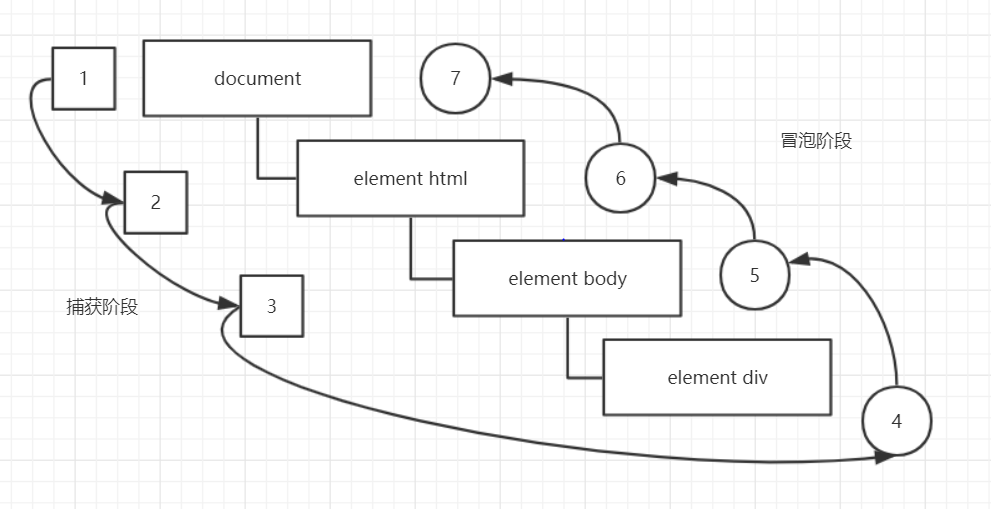
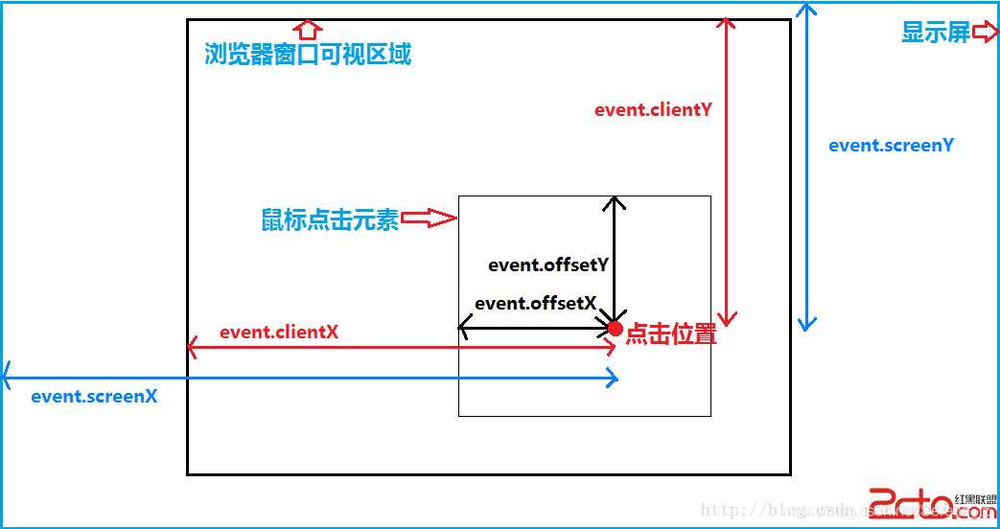
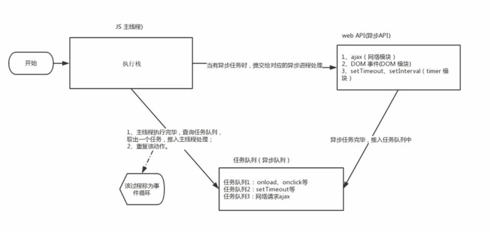

# JavaScript
JS 包括
- ECMAScript：JS 的核心语法（ES 规范，ECMA-262 标准）
- DOM：Document Object Model，文档对象模型，对网页当中的节点进行增删改的过程都是对 DOM 操作的过程。HTML 文档被当做一棵 DOM 树来看待。
- BOM：Browser Object Model，浏览器对象模型。关闭浏览器窗口、打开一个新的浏览器窗口、后退、前进、浏览器地址栏上的地址等进行操作都是 BOM 编程。

## 变量

- 变量只声明不赋值 -- 返回 `undefined`
- 变量不声明不赋值 -- 返回 `error`
- 变量不声明直接复制 -- 返回变量值 （不推荐）
- **不要用 `name` 作为变量名，是 JS 的内置变量，但是 `Name` 可以**

```js
// boolean型参与加法运算
true + 1	// 2
false + 1	// 1
true + null // 1

var v = undefined;
v + 1		// NaN

// 任何数据类型和字符串相加都会变成字符串
v + 'jojo'	// undefinedjojo
var n = null;
n + 'jojo'	//nulljojo
```

- 任何变量，如果不加 `var` 进行定义，那么就是全局的。如果在函数内部用 var 定义一个变量那么它就是局部变量，否则就是全局变量

## 数据类型

- 原始类型：Number、String、Boolean、Undefined、Null
- 引用类型：Object

【注】Undefined 类型只有一个值，就是 undefined；**NaN 属于 Number 类型**

### String 类型

> **str.substr() 和 str.substring() 的区别**

str.substr(startIdx, length)

str.substring(startIdx, endIdx) 且不包含 endIdx

### Object 类型

Object 类是所有类型的超类，自定义的任何类型都默认继承 Object

- 属性：`prototype（常用）` 和 `constructor`

可以通过 `prototype` 属性来给类动态扩展属性以及函数

```js
Student.prototype.getEmail = function() {
    return this.email
}
```

- 函数：`toString()` `valueOf()` `toLocaleString()`

## 数组

### 添加删除数组元素

| 方法名 | 说明 | 返回值 |
| :---: | :---: | :---: |
| push(arg1,...) | 末尾添加一个或多个元素 | 返回新的长度 | 
| pop() | 删除数组最后一个元素，数组长度减 1，无参数，修改了原数组 | 返回所删除元素的值 |
| unshift() | 向数组的开头添加一个或多个元素，修改了原数组	| 返回新的长度 |
| shift() | 删除数组的第一个元素，数组长度减 1，无参数，修改了原数组 | 返回第一个元素的值 |

### 数组排序

| 方法名 | 说明 | 是否修改原数组 |
| :---: | :---: | :---: |
| reverse() | 颠倒数组中的元素顺序，无参数 | 改变原数组，返回新数组 | 
| sort() | 对数组元素进行排序 | 改变原数组，返回新数组 |

**注意：**
sort 方法对数组进行原地排序，但是默认**按照字典序排序**。需要传入一个比较函数 `cmp(a, b)`，然后得到我们需要的排序效果。

```js
let arr = [1, 4, 17, 12, 9];

arr.sort();
console.log(arr); // [ 1, 12, 17, 4, 9 ]

let cmp = (a, b) => a - b;

arr.sort(cmp);
console.log(arr); // [ 1, 4, 9, 12, 17 ]

// 其中，let cmp = (a, b) => a - b; 为升序，b - a 为降序。
```

## 函数
对于 JS 来说，如果定义两个名字相同的函数，那么后声明的函数会覆盖前一个的声明

```js
var test = function() {
    alert("test")
}
var test = function(){
    alert("tettetetetetetetetest")
}
test()  // 弹出tettetetetetetetetest
```

### 回调函数 callback

回调函数的特点是：自己把函数写出来之后，不是由自己负责调用而是由其他程序负责调用该函数

```html
// 将sayHello函数注册到按钮上，等待click事件发生后，该函数被浏览器调用。我们称sayHello函数为回调函数
<input type = "button" onclick = "sayHello" />
```

### eval 函数
> https://developer.mozilla.org/zh-CN/docs/Web/JavaScript/Reference/Global_Objects/eval

`eval` 函数的作用是：将字符串当做一段 JS 代码解释并执行

```js
window.eval("var i = 100;")
alert("i = " + i)   // 结果：弹出 i = 100
```

```js
// java连接数据库，查询数据之后，将返回数据以json字符串返回给浏览器，还不是一个json对象，可以使用eval函数，将json字符串穿换成json对象
var fromJava = "{\"name\": \"zhangsan\", \"pwd\": \"124\"}"
window.eval("var jsonObj = " + fromJava)
alert(jsonObj.name + ", " + jsonObj.pwd)
```

**永远不要使用 eval 函数，存在一个非常好的 eval 替代方法：只需使用 `window.Function`**

## 作用域
通常来说，一段程序代码中所用到的名字并不总是有效和可用的，而限定这个名字的可用性的代码范围就是这个名字的作用域。作用域的使用提高 程序逻辑的局部性，增强了程序的可靠性，减少了名字冲突。

### 全局变量和局部变量的区别
- **全局变量**：在任何一个地方都可以使用，只有在浏览器关闭时才会被销毁，因此比较占内存
- **局部变量**：只在函数内部使用，当其所在的代码块被执行时，会被初始化；当代码块运行结束后，就会被销毁，因此更节省内存空间

### 作用域链

[深入浅出图解作用域链和闭包](https://segmentfault.com/a/1190000019275094)

内部函数访问外部函数的变量，采取链式查找的方式，采用**就近原则**

```js
var f1 = function() {
    var num = 123;
    var f2 = function() {
        console.log(num);
    }
    f2()
}
var num = 456;
f1()
```

## 预解析
JS 代码是由浏览器中的 JS 解析器来执行的。解析器在运行 JS 代码的时候分为两步：预解析和代码执行

其中**预解析**会把 JS 中所有的 var 和 function 提升到当前作用域的最前面。
- 变量提升/变量预解析：把所有的变量声明提升到**当前作用域**的最前面，不提升赋值操作
- 函数提升/函数预解析：把所有的函数声明提升到**当前作用域**的最前面，不调用函数

```js
/* case 1 */
console.log(num)

// 报错：Uncaught ReferenceError: num is not defined
```

```js
/* case 2 */
console.log(num)
var num = 10;

// 输出：undefined

/*
    JS 预解析会将第二行的 var num 提升到当前作用域的最前面，
    但是只提升变量声明，不提升赋值，即相当于下面的代码：
    var num
    console.log(num)
    num = 10
    所以会输出undefined
*/
```

```js
/* case 3 */
f1()
function f1() {
    console.log(11)
}

// 输出：11
```

```js
/* case 4 */
f2()
var f2 = function() {
    console.log(22)
}

// 报错：Uncaught TypeError: f2 is not a function

/*
    JS 预解析会将第二行的 var 提升到当前作用域的最前面，
    但是只提升变量声明，不提升赋值，即相当于下面的代码：
    var f2
    f2()
    f2 = function(){}
    所以会报错
*/
```

### 函数预编译的步骤
函数预编译，发生在函数执行的前一刻。

1. 创建 AO 对象。AO 即 Activation Object 活跃对象，其实就是「执行期上下文」。
2. 找形参和变量声明，将形参名和变量作为 AO 的属性名，值为 undefined。
3. 将实参值和形参统一，实参的值赋给形参。
4. 查找函数声明，函数名作为 AO 对象的属性名，值为整个函数体。

### 一个例子
```js
f1();
console.log(c);
console.log(b);
console.log(a);
function f1() {
    var a = b = c = 9;
    console.log(a);
    console.log(b);
    console.log(c);
// 输出： 9 9 9 9 9 报错：a is not defined
```

注意：
`var a = b = c = 9` 相当于 `var a = 9; b = 9; c = 9;` 也就是 **b 和 c 是全局变量**

如果想要集体声明，正确写法 `var a = 9, b = 9, c = 9` 就相当于 `var a = 9; var b = 9; var c = 9;` 就是三个局部变量了

所以只会报错 `a is not defined`

## 对象

### 创建对象的三种方式

```js
var obj = {
    name: 'wyx',
    age: 1,
    hi: function(){
        console.log('hello world')
    }
}
```

```js
var obj = new Object()
obj.name = 'wyx'
obj.age = 1
obj.hi = function() {
    console.log('hello world')
}
```

```js
function ObjConstructor(name, age)  {
    this.name = name
    this.age = age
}

var wyx = new ObjConstructor('wyx', 1)
```

## 内置对象

### Math

#### Math 常用方法
- `Math.PI` 圆周率
- `Math.floor()` 向下取整
- `Math.ceil()` 向上取整
- `Math.round()` 
- `Math.abs()` 绝对值
- `Math.max()`
- `Math.min()`

#### Math.random()
返回一个位于区间 [0, 1) 之间的伪随机浮点数

获取闭区间 [a, b] 之间的整数
```js
let ran = parseInt(Math.random() * (b - a + 1)) + a;
```

获取 [a, b) 之间的整数
```js
let ran = parseInt(Math.random() * (b - a)) + a;
```

随机点名实现
```js
function getRandom2(a, b) {
return parseInt(Math.random() * (b - a + 1)) + a;
}

let names = new Array('Peter', 'Murphy', 'Jack', 'Darcy', 'Alice');
console.log(names[getRandom2(0, names.length-1)]);
```

### Date

#### 一般格式
```js
let date = new Date();

let date3 = new Date('2019-10-1 10:10:10');
let date4 = new Date('2019/10/1');
```

#### 常用格式
```js
let date = new Date();
console.log(date.getFullYear()); // 2022
console.log(date.getMonth() + 1); // 10，注意得到的月份要加 1
console.log(date.getDate()); // 13
console.log(date.getDay()); // 4 星期四
```

#### 时分秒
```js
function getTime() { {
        return t < 10 ? '0' + t : t;
    }
    [h, m, s] = [che
    let time = new Date();
    let h, m, s;
    [h, m, s] = [time.getHours(), time.getMinutes(), time.getSeconds()]
    function check(t)ck(h), check(m), check(s)];
    return h + ':' + m  + ':' +s;
}
console.log(getTime());
```

#### 时间戳
获取 1971 年 1 月 1 日至今过去的毫秒数

```js
let date = new Date();
console.log(date)
console.log(date.valueOf())
console.log(date.getTime())

let d = +new Date() // 要记住这个
console.log(d)

let date2 = Date.now()
console.log('date2 ==== ' + date2)

/*
Thu Oct 13 2022 16:05:26 GMT+0800 (中国标准时间)
1665648326770
1665648326770
1665648326770
date2 ==== 1665648326770
*/
```

如何制作一个倒计时呢？利用时间戳就可以实现：期望的时间减掉现在的时间就是需要的总毫秒数 time /= 1000 就是秒数

```js
d = parseInt(time / 60 / 60 / 24)   // 计算天数
d = parseInt(time / 60 / 60 % 24)   // 计算小时
d = parseInt(time / 60 % 60)   // 计算分钟
d = parseInt(time % 60)   // 计算当前秒数
```

## DOM
文档对象模型（Document Object Model，简称 DOM )，是 W3C 组织推荐的处理可扩展标记语言（HTML 或者 XML）的标准编程接口。

W3C 已经定义了一系列的 DOM 接口，通过这些 DOM 接口可以改变网页的内容、结构和样式。

DOM 树包括
- 文档：一个页面就是一个文档，DOM中使用 `document` 表示
- 元素：页面中的所有标签都是元素，DOM中使用 `element` 表示
- 节点：网页中的所有内容都是节点（标签、属性、文本、注释等），DOM 中使用 `node` 表示

以上内容都称之为对象

### 使用 DOM 获取元素

- document.getElementById()
- document.getElementsByTagName()
- element.getElementsByTagName()

下面三个方法是 HTML5 新增的方法
- document.getElementsByClassName()
- document.querySelector('选择器')： 只返回第一个
- document.querySelectorAll('选择器')

获取特殊元素
- `document.body` 获取 body 元素
- `document.documentElement` 获取 html 元素

### 改变元素内容

#### innerHTML & innerText

- innerHTML
  - 从起始位置到终止位置的全部内容，包括 html 表现，同时保留空格和换行
  - **W3C 推荐使用**
- innerText
  - 从起始位置到终止位置的内容，但它不识别 html 标签，同时空格和换行也会去掉
  - （存疑？vscode测试也会保留空格和换行）

#### 表单元素
利用DOM 可以操控一下表单元素的属性
- type
- value
- checked
- selected
- disabled

#### 样式属性
通过JS修改元素的大小、颜色、位置等样式
- `element.style` 行内样式操作
- `element.className` 类名操作

```js
var div = document.querySelector('div')

div.onclick = function() {
    // 点击 div 就会改变背景颜色
    this.style.backgroundColor = 'lightcoral'
    // 点击 div 就会修改类名
    this.className = 'header'
}
```
**注意：**
1. JS 中的样式要采用驼峰命名法，如上面例子中的 `backgroundColor`，如果写成 `background-color` 就会报错
2. 在 JS 中通过 `.style` 修改的样式是 **行内样式**，权重很高，会覆盖掉 `<style>` 标签中的样式
3. 如果修改样式较多，可以选择直接修改类类名的方式
4. `class` 是一个保留字，所以使用 `className` 来操作元素类名

### 排他思想
如果有同一组元素，我们想要某一个元素实现某种样式，需要用到循环的排他思想算法：

1. 所有元素全部清除样式（干掉其他人）
2. 给当前元素设置样式（留下我自己）
3. 注意顺序不能颠倒，首先干掉其他人，再设置自己。

```js
 const btns = document.getElementsByTagName('button');
    for (let i = 0; i < btns.length; i++) {
        btns[i].onclick = function () {
            for (let j = 0; j < btns.length; j++) {
                btns[j].style.backgroundColor = '';
            }
            this.style.backgroundColor = 'pink';
        }
    }
``` 

### 表格中的全选功能
```html
<!DOCTYPE html>
<html lang="en">
  <head>
    <meta charset="UTF-8" />
    <meta http-equiv="X-UA-Compatible" content="IE=edge" />
    <meta name="viewport" content="width=device-width, initial-scale=1.0" />
    <title>表格全选</title>
    <link rel="stylesheet" href="../css/style.css" />
  </head>

  <style>
    * {
      margin: 0;
      padding: 0;
    }
    table {
      margin: 0 auto;
      margin-top: 300px;
      text-align: center;
      border-collapse: collapse;
    }
    td {
      border: 2px solid lightblue;
      border-spacing: 0;
      width: 150px;
    }
  </style>

  <body>
    <table class="tab">
      <thead>
        <tr>
          <th>
            <input type="checkbox" class="selectAll" />
            全选
          </th>
          <th>名称</th>
          <th>价格</th>
        </tr>
      </thead>
      <tbody class="tb">
        <tr>
          <td>
            <input type="checkbox" />
          </td>
          <td>apple pencil</td>
          <td>800</td>
        </tr>
        <tr>
          <td>
            <input type="checkbox" />
          </td>
          <td>apple watch</td>
          <td>2000</td>
        </tr>
      </tbody>
    </table>
  </body>

  <script>
    var all = document.querySelector(".selectAll");
    var tabs = document.querySelector(".tb").querySelectorAll("input");

    all.onclick = () => {
      for (var i = 0; i < tabs.length; i++) {
        tabs[i].checked = all.checked;
      }
    };

    for (var i = 0; i < tabs.length; i++) {
      tabs[i].onclick = function () {
        var flag = true;
        for (var i = 0; i < tabs.length; i++) {
          if (!tabs[i].checked) {
            flag = false;
            break;
          }
        }
        all.checked = flag;
      };
    }
  </script>
</html>
```

### 自定义属性
#### 获取属性值
- `element.属性` 主要获取内置属性值
- `element.getAttribute()` 主要用来获得自定义属性

#### 设置属性值
- `element.属性 = xxx`
- `element.setAttribute('属性', '值')` 主要针对自定义属性

#### 通过data规定自定义属性
自定义属性目的：为了保存并使用数据。有些数据可以保存到页面中而不用保存到数据库中

但有些自定义属性容易引起歧义，所以在 H5 中新增了自定义属性

规定使用 `data-` 开头作为属性名并且赋值

```css
<div data-index="1"></div>
```

同时 H5 新增 `element.dataset.index` 或者 `element.dataset['index']` 新增或者获取自定义属性，并且从 IE11 后才开始支持

如果自定义属性中有多个 - 连接的单词，获取时采用驼峰命名法 

#### 移除属性

`element.removeAttribute('属性')`

### 节点操作
 
通过 DOM 方法获取元素，逻辑不强、繁琐

利用节点层级关系获取元素
- 利用父子兄节点关系获取元素
- 逻辑性强，但是兼容性稍差

两种方法都会用到，但是节点操作更简单

#### 什么是节点
网页中的所有内容都是节点（标签、属性、文字、注释等），在 DOM 中，节点使用 node 来表示

DOM 树中的所有节点都可以通过 JS 进行访问，所有节点均可被修改，也可以进行创建或删除

一般，节点至少拥有以下三个属性
- `nodeType` 节点类型
  - 元素节点 nodeType 为 1
  - 属性节点为 2 
  - 文本节点为 3 （包括文字、空格、换行等
- `nodeName` 节点名称
- `nodeValue` 节点值 

#### 节点层级
利用 DOM 树将节点分为不同的层级，常见的是父子兄层级关系

1. 父级节点 `node.parentNode`
   1. 返回离某节点最近的父节点（亲爸爸）
   2. 如果没有父节点返回 null

```html
<!DOCTYPE html>
<html lang="en">
  <head>
    <meta charset="UTF-8" />
  </head>

  <body>
    <div class="first">
      <div class="sec">
        <div class="thr"></div>
      </div>
    </div>
  </body>

  <script>
    var thr = document.querySelector('.thr')
    console.log(thr.parentNode);
  </script>
</html>

<!-- 返回  div.sec -->
```

2. 子节点 `parentNode.childNodes`
   1. 返回包含指定节点的子节点集合，该集合为即时更新的集合
   2.  **注意**：返回值里包含了所有的子节点，包括元素节点，文本节点（空格等）。如果指向获得里面的元素节点，则需要另外处理。**所以一般不提倡使用 childNodes**

3. 子节点 `parentNode.children` （**常用**

```html
<!DOCTYPE html>
<html lang="en">
  <head>
    <meta charset="UTF-8" />
  </head>

  <body>
    <div class="first">
      <ul class="lsit">
        <li></li>
        <li></li>
        <li></li>
        <li></li>
      </ul>
    </div>
  </body>

  <script>
    var ul = document.querySelector('ul');
    console.log(ul.children);
  </script>
</html>

<!-- 返回 HTMLCollection(4) [li, li, li, li] -->
```

4. 获取所有节点的第一个和最后一个
   1. `parentNode.firstChild` 包含所有节点
   2. `parentNode.listChild`

```html
<!DOCTYPE html>
<html lang="en">
  <head>
    <meta charset="UTF-8" />
  </head>

  <body>
    <div class="first">
      <ul class="lsit">
        <li></li>
        <li></li>
        <li></li>
        <li></li>
      </ul>
    </div>
  </body>

  <script>
    var d = document.querySelector('.first');
    console.log(d.firstChild);
  </script>
</html>

<!-- 返回 #text，因为包含所有节点，所以第一个子节点是一个空行，就是一个文本节点 -->
```

5. 获取元素节点中的第一个和最后一个（>=IE9）
   1. `parentNode.firstElementChild`
   2. `parentNode.lastElementChild`

6. 实际开发中
   1. `parentNode.children[0]`
   2.  `parentNode.children[parentNode.children.length - 1]`

7. 兄弟节点
   1. `node.nextSibling` 下一个兄弟节点，包括所有类型节点
   2. `node.previousSibling` 上一个

8. 兄弟元素节点 （>=IE9）
   1. `node.nextElementSibling`
   2. `node.previousElementSibling`

```js
// 如果需要兼容 IE
function getNextElementSibling(node) {
    let n = node;
    while (n = n.nextSibling) {
        if (n.nodeType === 1) {
            return n;
        }
    }
    return null;
}
```

#### 创建和添加节点
- `document.createElement('tagName')` 创建节点
- `parentNode.appendChild(childNode)` 添加节点。若已存在同样的子节点，则在元素后追加

```js
var li = document.createElement('li')
var ul = doucument.querySelector('ul')
ul.appendChild(li)
```

- `node.insertBefore(child, 指定元素)` 添加节点到指定节点的前面

```js
var ins = document.createElement('li')
// 在 ul 的第一个元素前面插入一个 li
ul.insertBefore(ins, ul.children[0])
```

#### 删除节点
`removeChild(childNode)` 会返回删除的节点

#### 复制节点
`node.cloneNode([deep])` 返回调用该方法的节点的一个副本。也称为克隆节点/拷贝节点。其中 node 为被克隆的元素节点。

其中 deep 参数可以选择 true/false，表示是否为深拷贝。

默认为空，也就是false，即浅拷贝

- 深拷贝：同时复制节点本身和里面的子节点
- 浅拷贝：只复制节点本身，不复制子节点

```html
<html>
  <body>
    <ul>
      <li>111</li>
      <li>222</li>
    </ul>
  </body>

  <script>
    var ul = document.querySelector('ul')

    // case 1 浅拷贝
    var lili = ul.children[0].cloneNode()

    // case 2 深拷贝
    var deepli = ul.children[0].cloneNode(true)
  </script>
</html>

<!-- 
  case 1 结果：会多出一个 li，但是不会有里面的数字
  case 2 结果：会复制出一个 li 和 数字加在新的一行
-->
```

#### 三种动态创建元素的区别
- `document.write()` 了解即可
- `element.innerHTML`
- `element.createElement()`

1. `document.write()` 创建元素，是直接将内容写入页面的内容流，但是如果文档流执行完毕，会导致页面全部重绘。即覆盖原本的页面。
2. `innerHTML` 是将内容写入某个 DOM 节点，不会导致页面全部重绘。
3. `innerHTML` 创建多个元素效率更高（前提是不要拼接字符串，而是采取数组形式拼接），结构稍微复杂。
4. `createElement()` 创建多个元素效率稍低一点点，但是结构更清晰。

总结：不同浏览器下，`innerHTML` 效率要比 `creatElement` 高

## 事件

三要素：
- 事件源：事件被触发的对象（按钮）
- 事件类型：如何触发、什么事件（点击按钮）
- 事件处理程序：可通过一个函数赋值的方式实现

### 注册事件/绑定事件

给元素添加事件，就是注册/绑定事件
1. 传统方式：利用 on 开头的事件，比如 onclick
   1. 注册事件的**唯一性**：同一个元素同一个事件只能设置一个处理函数，最 后注册的处理函数将会 覆盖 前面注册的处理函数
2. 方法监听注册方式
   1. W3C 推荐方式
   2. `addEventListener()`
   3. IE9 之前可以用 `attachEvent()` 代替
   4. 同一个元素同一个事件可以注册多个监听器，按注册顺序依次执行

#### 方法监听注册事件

```js
eventTarget.addEventListener(type, listener[, useCapture])
```

`eventTarget.addEventListener()` 方法将指定的监听器注册到 `eventTarget`（目标对象）上，当该对象触发指定的事件时，就会执行事件处理函数。

该方法接收三个参数：
1. `type`：事件类型**字符串**，比如 'click' 、'mouseover'，注意这里不要带 on
2. `listener`：事件处理函数，事件发生时，会调用该监听函数
3. `useCapture`：可选参数，是一个布尔值，默认是 false。学完 DOM 事件流后，我们再进一步学习

### 删除事件/解绑事件

1. 传统方式：`eventTarget.onclick = null`
2. 方法监听注册方式：
   1. `eventTarget.removeEventListener(type, listener[, useCapture])`
   2. `eventTarget.detachEvent(eventNameWithOn, callback)` 为了兼容 IE，不怎么使用

```js
function fn() {
  alert('111111111')
}

// 添加事件
div.addEventListener('click', fn)

// 解绑事件
div.removeEventListener('click', fn)
```

### DOM 事件流

事件流描述的是从页面中接收事件的顺序

事件发生时会在元素节点之间按照特定的顺序传播，这个传播过程就是 DOM 事件流

分为三个阶段
1. 捕获阶段：由网景最早提出，由 DOM 最顶层节点开始，然后逐级向下传播到最具体的元素接收的过程
2. 当前目标阶段
3. 冒泡阶段：IE 最早提出，事件开始时由最具体的元素接收，然后逐级向上传播到 DOM 最顶层节点的过程



#### 注意事项

1. JS 代码中只能执行捕获或者冒泡其中的一个阶段
2. `onclick` 和 `attachEvent` 只能得到冒泡阶段
3. `addEventListener(type, listener[, useCapture])` 第三个参数
   1. true，表示在事件捕获阶段调用事件处理程序
   2. false，表示在事件冒泡阶段调用事件处理程序
4. 实际开发中很少使用事件捕获，更关注事件冒泡
5. 有些事件是没有冒泡的，比如 `onblur` `onfocus` `onmouseenter` `onmouseleave`

```html
<!-- case 1：在捕获阶段调用事件 -->

<!DOCTYPE html>
<html lang="en">
  <head><meta charset="UTF-8" /></head>

  <style>
    * {
      margin: 0;
      padding: 0;
    }
    div {
      margin: 0 auto;
    }
    .father {
      height: 300px;
      width: 300px;
      background-color: pink;
    }
    .son {
      height: 200px;
      width: 200px;
      background-color: lightblue;
    }
  </style>

  <body>
    <div class="father">
      <div class="son">son盒子</div>
    </div>
  </body>

  <script>
    var son = document.querySelector('.son')
    son.addEventListener('click', function() {
      alert('son')
    }, true)

    var father = document.querySelector('.father')
    father.addEventListener('click', function() {
      alert('father')
    }, true)
  </script>
</html>

<!-- 
  点击 son 盒子，会先弹出 father 再弹出 son
  因为设置了事件捕获 true
  会按照 document -> html -> body -> father -> son 的顺序进行捕获 
-->
```

```js
// case 2: 在冒泡阶段调用事件

var son = document.querySelector('.son')
son.addEventListener('click', function() {
  alert('son')
}, false)

var father = document.querySelector('.father')
father.addEventListener('click', function() {
  alert('father')
}, false)

// 点击 son 会先弹出 son 再弹出 father
```

### 事件对象

```js
div.addEventListennr('click', function(event) {
  console.log(event)
})
```

`event` 就是一个事件对象，写到我们侦听函数的小括号里面，当形参来看

事件对象存在的前提是必须要有事件，如果没有 click 等监听事件，那么事件对象也就不存在了。它是系统自动创建的，不需要我们传递参数

事件对象是有关事件的一系列相关数据的集合。比如：
- 和鼠标相关的：鼠标按下的坐标等等
- 和键盘相关的：按下的是哪个键等等

我们可以自己给 `event` 命名，比如可以直接写成 `evt` `e` 都可以

存在兼容性问题。在 IE 6/7/8 版本中必须使用 `window.event` 来获取事件对象 

如果需要考虑兼容性问题，那么可以在使用时写成

```js
e = event || window.event
```

#### 事件对象的常用属性和方法

| 属性/方法 | 说明 |
| :---: | :---: |
| e.target | 返回 **触发** 事件的对象 | 
| e.type | 返回事件类型，比如 click mouseover，不带 on |
| e.preventDefault() | 阻止默认事件/行为 |
| e.stopPropagatin() | 阻止冒泡 |
| --- 以下都是非标准写法 --- | --- 供 IE 6/7/8 --- |
| e.srcElement | 返回触发事件的对象 |
| e.returnValue | 阻止默认事件 |
| e.cancelBubble | 阻止冒泡 |

#### e.target 和 this 的 区别

`e.target` 返回触发事件的对象/元素

`this` 返回绑定事件的对象/元素

```html
<!DOCTYPE html>
<html lang="en">
  <head>
    <meta charset="UTF-8" />
  </head>

  <body>
    <div class="main">
      <ul>
        <li>111</li>
        <li>222</li>
      </ul>
    </div>
  </body>

  <script>
    var ul = document.querySelector('ul')
    ul.addEventListener('click', function(e) {
      console.log('e.target == ' + e.target)
      console.log('this == ' + this)
    })
  </script>
</html>

<!-- 
  e.target == [object HTMLLIElement] 返回 li，点击 li 触发事件
  this == [object HTMLUListElement] 返回 ul，ul 上绑定了事件
-->
```

#### 阻止默认行为

阻止默认行为可以让链接不跳转，或者让提交按钮不提交

```js
var a = document.querySelector('a')
a.addEventListener('click', function(e) {
  e.preventDefault()
})

var input = document.querySelector('input')
input.addEventListener('click', function(e) {
  e.preventDefault()
}) 

// 点击超链接或者提交按钮都不会有相应跳转
```

传统注册方式下，也可以通过 `return false` 来阻止默认行为。但是这样 return 之后的内容就不会再执行了，了解即可

```js
input.onclick = function(e) {
  return false
}
```

#### 阻止事件冒泡

```js
son.addEventListener('click', function(e){
  e.stopPropagation()
})

// 案例见上面 father/son 案例，加入以上代码之后，点击 son 盒子只会弹出 son
```

#### 事件委托/代理/委派

jQuery 中称为事件委派

**原理： 不是每个子节点单读设置事件监听器，而是事件监听器设置在父节点上，然后利用冒泡原理影响设置每个子节点**

比如：给 ul 注册点击事件，然后利用事件对象的 target 来找到当前点击的 li，事件就会冒泡到 ul 上；再由于 ul 上已经有了注册事件，那么就会触发事件监听器。

这样的好处在于只需要操作一次 DOM，提高了程序的性能

```js
var ul = document.querySelector('ul')
ul.addEventListener('click', function() {
  alert('弹弹弹 弹走鱼尾纹')
})

// 点击每个 li 都会有弹框弹出
```

```js
ul.addEventListener('click', function(e) {
  e.target.style.backgroundColor = 'pink'
})

// 可以通过 e.target 操作每个 li
```

### 常用鼠标事件

- `onclick` 鼠标点击左键触发
- `onmouseover` 鼠标经过触发
- `onmouseout` 鼠标离开触发
- `onfocus` 获得焦点触发
- `onblur` 失去焦点触发
- `onmousemove` 鼠标移动触发
- `onmouseup` 鼠标弹起触发
- `onmousedown` 鼠标按下触发

#### 禁止鼠标右键菜单

`contextmenu` 主要控制应该何时显示上下文菜单，主要用于程序猿取消默认的上下文菜单

```js
document.addEventListener('contextmenu', function(e) {
  e.preventDefault()
})

// 效果就是：选中文字之后，再鼠标右键，不会出现右键菜单
```

#### 禁止选中文字

```js
document.addEventListener('selectstart', function(e) {
  e.preventDefault()
})

// 效果：无法选中文字
```

#### 鼠标事件对象 MouseEvent

```js
document.addEventListener('click', function(e) {
  console.log(e);
})

// 输出 PointerEvent
```

`PointerEvent` 拓展了 `MouseEvent`，是一类可以被定点设备所触发的 DOM 事件，它们被用来创建一个可以有效掌握各类输入设备 **（鼠标、触控笔和单点或多点的手指触摸）** 的统一的 DOM 事件模型

[Pointer Events from MDN](https://developer.mozilla.org/zh-CN/docs/Web/API/Pointer_events)

| 鼠标事件对象 | 说明 |
| :---: | :---: |
| e.clientX | 返回鼠标相对于浏览器窗口可视区的 X 坐标 | 
| e.clientY | 返回鼠标相对于浏览器窗口可视区的 Y 坐标 |
| e.pageX | 返回鼠标相对于文档页面的 X 坐标，IE9+ 支持，**最常用** |
| e.pageY | 返回鼠标相对于文档页面的 Y 坐标，IE9+ 支持，**最常用** |
| e.screenX | 返回鼠标相对于电脑屏幕的 X 坐标 |
| e.screenY | 返回鼠标相对于电脑屏幕的 Y 坐标 |




### 常用键盘事件

- `onkeyup` 某个键盘按键被松开时触发
- `onkeydown` 某个键盘按键被按下时触发
- `onkeypress` 某个键盘按键被按下时触发，**但是它不识别功能键，比如 ctrl shift 左右箭头等**

三个事件的执行顺序是：keydown --> keypress --> keyup

#### 键盘事件对象 KeyboardEvent

```js
document.addEventListener('keyup', function(e) {
  console.log(e)
})

// 输出 KeyboardEvent
```

可以通过 `e.keyCode` 来获取按下的某个键的 ASCII 值

最新的 MDN 中已经弃用 `keyCode` 转而使用 `code`，
但是在某些浏览器中还支持，所以在使用时需要考虑兼容性问题，同时应该尽量避免使用 `keyCode`

```js
document.addEventListener('keyup', function(e) {
  console.log(e.code)
  console.log(e.key)
})

// 按下 D 会输出 KeyD(不区分大小写)
// 按下 D 会输出 D
```

[KeyboardEvent.keyCode from MDN](https://developer.mozilla.org/zh-CN/docs/Web/API/KeyboardEvent/keyCode)

注意：
- `onkeydown` 和 `onkeyup` 不区分字母大小写，`onkeypress` 区分大小写
- 在实际开发中，更多使用 up 和 down，因为它们能识别包括功能键在内的所有键   
- **`keydown` 和 `keypress` 在文本框中的特点：触发事件的时候，文本还没有落入文本框中，所以在监听文本框时，基本都是用 `keyup`**

## BOM

BOM（Browser Object Model）即浏览器对象模型，它提供了独立于内容而与浏览器窗口进行交互的对象，其核心对象是 `window`

BOM 由一系列相关的对象构成，并且每个对象都提供了很多方法与属性。

BOM  缺乏标准，JavaScript 语法的标准化组织是 ECMA，DOM 的标准化组织是 W3C，BOM 最初是Netscape 浏览器标准的一部分

BOM 比 DOM 更大，它包含 DOM。

### window 对象

浏览器的顶级对象，具有双重角色：
1. 它是 JS 访问浏览器窗口的一个接口
2. 它是一个全局对象。定义在全局作用域中的变量、函数都会变成 `window` 对象的属性和方法

`window` 对象包括：
- document
- location
- navigation
- screen
- history

【注意】声明变量时尽量不要用 name 作为变量名，因为 `window` 下已经有了一个属性叫 `window.name`

### 窗口加载事件

#### load 事件

`window.onload = function() {}`   或者

`window.addEventListener('load', function() {})`

onload 就是窗口/页面加载事件，当文档内容完全加载完成后才会触发该事件（包括图像、脚本文件、CSS 文件等）

有了 `window.onload` 就可以把 JS 代码写到页面元素的上方

注意：
- `window.onload` 传统注册事件方式只能写一次，如果有多个，会以最后一个为准
- 如果使用 `addEventListener` 则没有限制。

```html
<!-- 
  如果按照下面这种将 script 写在 input 前面的写法，那么运行时会报错。
  因为代码是从上往下运行的，当运行到 getElementById 时并找不到 id 为 myBtn 的按钮 
-->
<!-- Uncaught TypeError: Cannot set properties of null (setting 'onclick') -->
<body>
    <script type="text/javascript">
        document.getElementById("myBtn").onclick = function() {
            alert("this is my button.")
        }
    </script>

    <input type="button" value="btn1" id="myBtn" />
</body>
```

想要实现就需要使用 `load` 事件

```html
<body onload="ready()">
    <script type='text/javascript'>
        function ready() {
            document.getElementById("myBtn").onclick = function () {
                alert("this is my button.")
            }
        }
    </script>
    <input type="button" value="btn1" id="myBtn" />
</body>

<!-- 或者 -->

<body>
    <script type='text/javascript'>
        window.onload = function() {
            document.getElementById("myBtn").onclick = function() {
                alert("this is my button...")
            }
        }
    </script>
    <input type="button" value="333333" id="myBtn" />
</body>
```

#### DOMContentLoad 事件

`document.addEventListener('DOMContentLoaded', function() {})`

仅当 DOM 加载完成后就可触发事件，不包括样式表、图片、flash 等（**IE9 以上才支持**），所以加载速度比 `load` 更快

**如果页面的图片很多的话, 从用户访问到 `load` 触发可能需要较长的时间, 交互效果就不能实现，必然影响用户的体验，此时用 `DOMContentLoaded` 事件比较合适**

### 调整窗口大小事件

`window.onresize = function() {}`  或者

`window.addEventListener('resize', function() {})`

`window.onresize` 是调整窗口大小加载事件, 当触发时就调用处理函数

注意：
1. 只要窗口大小发生像素变化，就会触发这个事件
2. 我们经常 **利用这个事件完成响应式布局**
3. `window.innerWidth` 是当前屏幕的宽度

### 定时器

#### setTimeout()

`window.setTimeout(回调函数[, 延迟的毫秒数])`  window 可省略

设置一个定时器，该定时器在到期后执行调用函数

一个页面中经常会用到不同的定时器，提倡给不同的定时器设置不同的名字

#### 停止 setTimeout()

`window.clearTimeout(timeoutID)`  window 可省略

```js
var timer = setTimeout(function() {
  console.log('BOOOOOM')
}, 5000)

clearTimeout(timer) // 清除 timer 定时器
```

#### setInterval()

`window.setInterval(回调函数[, 延迟的毫秒数])`  window 可省略

重复调用一个函数，每隔这个时间，就会调用一次回调函数

一个页面中经常会用到不同的定时器，提倡给不同的定时器设置不同的名字

#### 停止 setInterval()

`window.clearInterval(intervalID)`  window 可省略

### this 指向问题

this 的指向在函数定义时是确定不了的，只有在函数执行的时候才能确定 this 到底指向谁

一般情况下，this 的最终指向是那个调用它的对象

- 全局作用域或者普通函数中 this 的指向是全局对象 window（注意定时器里的 this 指向 window）
- 方法调用中，谁调用这个方法，this 就指向谁
- 构造函数中，this 指向构造函数的实例

### 关于 JS 代码的执行顺序

[javascript 引擎执行的过程的理解--执行阶段，有关宏任务和微任务](https://segmentfault.com/a/1190000018134157)

JS 的一大特点就是 **单线程**，因为 JS 这门脚本语言诞生的使命就是为处理页面中用户的交互，以及操作 DOM。那么当我们操作 DOM 时，不能同时进行，应该先添加再删除等等

但是单线程就会导致 JS 执行时间过长，页面渲染不连贯，加载阻塞的问题

为了解决这个问题，HTML5 提出 Web Worker 标准，允许 JS 脚本创建多个线程，于是 JS 中出现了同步和异步

#### 同步任务

同步任务都在主线程上执行，形成一个执行栈

#### 异步任务

JS 异步是通过回调函数实现的。一般而言，异步任务有以下三种类型：

- 普通事件：如 click resize 等
- 资源加载：load resize 等
- 定时器：setInterval setTimeout 等

异步任务相关的回调函数添加到 **任务队列/消息队列** 中

```js
console.log(1)
setTimeout(function() {
  console.log(3)
}, 0)
console.log(2)

// 结果输出 1 2 3
// 因为 setTimeout 中的 fn 会放到任务队列中去，等到同步任务中的代码执行完成之后才会到任务队列中执行 fn
```

#### 事件循环 event loop

由于主线程不断的重复获得任务、执行任务、再获取任务、再执行任务……这种机制被称为 **事件循环**



### location 对象

`window` 对象给我们提供了一个 `location` 属性用于获取或设置窗体的URL，并且可以用于解析 URL。因为这个属性返回的是一个对象，所以我们将这个属性也称为 `location` 对象

#### URL

统一资源定位符（Uniform Resource Locator，URL）

`protocol://host[:port]/path/[?query]#fragment`

| 组成 | 说明 |
| :---: | :---: |
| protocol | 通信协议，常用 http ftp | 
| host | 主机/域名 `www.baidu.com`  `www.bilibili.com` |
| port | 端口号，可选，省略时使用默认端口，如 http 的默认端口是 80 |
| path | 路径，由零个或多个 / 隔开的字符串，一般用来表示主机上的一个目录或文件地址 |
| query | 参数，以键值对的形式，通过 `&` 符号隔开，如 `name=jojo&age=2` |
| fragment | 片段，# 后面内容常见于链接、锚点 |

#### location 对象属性

| 属性 | 返回值 |
| :---: | :---: |
| location.href | 整个 URL | 
| location.host | 主机/域名 |
| location.port | 端口号，如果未写则返回空字符串 |
| location.pathname | 路径 |
| location.search | 参数 |
| location.hash | 片段 |

#### location 对象方法

| 方法 | 功能 |
| :---: | :---: |
| location.assign() | 和 href 一样，可以跳转页面（也称为重定向页面），记录历史，可以实现后退页面 | 
| location.replace() | 替换当前页面，因为不记录历史，所以不能后退页面 |
| location.reload() | 重新加载页面，相当于刷新按钮或者 f5 如果参数为 true 则相当于 强制刷新 ctrl + f5 |

### navigator 对象

`navigator` 对象包含有关浏览器的信息，它有很多属性，我们最常用的是 `userAgent`，该属性可以返回由客户机发送服务器的 `user-agent` 头部的值

可以通过 `navigator.userAgent.match(regex 正则表达式)` 来判断用户是用手机端还是 PC 端打开页面，再利用 `location.href` 进行跳转

### history 对象

`window` 对象给我们提供了一个 `history` 对象，与浏览器历史记录进行交互。该对象包含用户（在浏览器窗口中)访问过的 URL

| 方法 | 功能 |
| :---: | :---: |
| history.back() | 可以后退 | 
| history.forward() | 前进功能 |
| history.go(参数) | 前进后退功能，如果是 1 表示前进一个页面，如果是 -1 表示后退一个页面 |

history 对象一般在实际开发中用处较少，但是在一些 OA 办公系统中会经常见到

## DOM 和 BOM 的区别

| DOM | BOM |
| :---: | :---: |
| 文档对象模型 | 浏览器对象模型 | 
| 把 **文档** 当做一个对象来看待 | 把 **浏览器** 当做一个对象来看待 |
| DOM 的顶级对象是：`document` | BOM 的顶级对象是：`window` |
| DOM 主要是操作页面元素 | BOM 主要是浏览器窗口交互 |
| DOM 是 W3C 标准规范 | BOM 是浏览器厂商在各自浏览器上定义的，兼容性较差 |

`void` 运算符对给定的表达式 进行求值，然后**返回 `undefined`**

void 运算符通常只用于获取 undefined 的原始值，一般使用 `void(0)（等同于void 0）`。在上述情况中，也可以使用全局变量 undefined 来代替（假定其仍是默认值）

```html
<!-- 假设现在需要实现一个超链接的效果，点击超链接后弹 出相应内容，但是页面不进行跳转
     必须加上javascript:;，如果不 加会默认当成一个路径，则会报错 Cannot GET /html-code/void(0)
     同样，使用 javascript:undefined 是一样的效果
     甚至，使用 js:void(0) 也是一样的效果-->
<body>
    <a href="javascript:void(0)" onclick="alert('ddddddd.......')">这是一个超链接</a>
</body>
```

## 有哪些方法可以通过浏览器向服务器发请求？

1. 直接在浏览器地址栏输入 URL 然后回车
2. 表单 form 的提交 form.submit
3. 超链接
4. document.location (.href可省略)
5. window.location.href (.href可省略)
6. window.open("url")

以上所有的请求方式均可以携带数据给服务器，但只有表单提交的数据是动态的

## JSON

JavaScript Object Notation(JavaScript对象标记)

- 一种标准的轻量级数据交换格式。体积小，易解析。
- 在实际开发中有两种数据交换格式：JSON 和 XML。XML 体积较大解析麻烦，但其优点是语法严谨。

## ES6

[ES6从入门到精通系列(全23讲)](https://www.bilibili.com/video/BV1ay4y1r78B?spm_id_from=333.337.search-card.all.click&vd_source=c727c2934b167656e7856cce64cc7eb5)

## var let const 区别

 [蛋老师讲解三者区别](https://www.bilibili.com/video/BV1qk4y1k75W/?spm_id_from=333.337.search-card.all.click)

ES6 以前，JS 没有块级作用域。ES6 新增 let 和 const 之后才有了块级作用域。 块级作用域是指用 {} 包括起来的一段代码，例如 if 、while 等等。 函数作用域就是指变量只在函数内部起作用。
