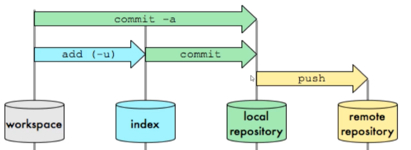
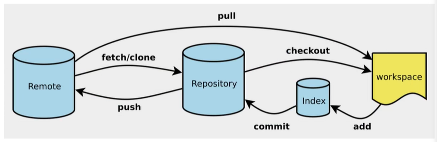

# Linux

## 常用 Linux 命令


> **为什么新建文件是 `touch` 而不是 `create` 或者其他命令？**
>
> ​	touch 的作用本来就不是创建文件，而是将指定文件的修改时间设置为当前时间（改变时间戳）。就是假装”碰“（touch）了一下这个文件，假装文件被”修改“了，于是文件的修改时间就被设置为当前时间。
>
> ​	这带来了一个副作用，就是当 touch 一个不存在的文件的时候，它会创建这个文件。然后，由于 touch已经可以完成创建文件的功能了，就不再需要一个单独的 create 了


# Git 

## Git配置

查看所有配置 `git config -l` 

所有的配置文件都在本地

- `git config --system --list` 查看系统配置	Git/etc/gitconfig


- `git conig --global --list` 查看当前用户(全局)配置	C:/user/administrator(当前用户名)/.gitconfig


配置用户名和邮箱

```shell
git config --global user.name "trealsurey"
git config --global user.email "trealsurey@gmail.com"
```


## Git 基本理论

Git在本地有三个工作区域：工作目录（Working Directory）、暂存区（Stage/Index，其实是个文件）、资源库（Repository 或 Git Directory）。如果在加上远程的 Git 仓库（Remote Directory）就可以分为四个工作区域。文件在这四个区域之间的转换关系如下：


- Workspace：工作区，平时存放项目代码的地方
- Index / Stage：暂存区，用于临时存放自己的改动，其实只是一个文件，保存即将提交到文件列表信息
- Repository：仓库区（本地仓库），安全存放数据的位置，这里面有你提交的所有版本的数据。其中 HEAD 指向最新放入仓库的版本
- Remote：远程仓库，托管代码的服务器

 ### 工作流程

- 在工作目录中添加、修改文件；
- 将需要进行版本管理的文件放入暂存区域； `git add .` 
- 将暂存区域的文件提交到 git 仓库  `git commit` 

因此，Git 管理的文件有三种状态：已修改（modified）已暂存（staged）已提交（committed）






## 项目搭建

- 在想要管理（上传）的目录下 `git init` 就会出现 .git 文件夹，就可以进行操作

- 在想要保存的目录下 `git clone [url]` 就可以将远程仓库的内容保存到本地


## Git 文件操作

### 文件状态

- Untracked：未跟踪。此文件在文件夹中，并没有加入到 git 库，不参与版本控制

  - 通过 ` git add ` 状态变为 staged
- Unmodified：文件已入库但未修改，即版本库中的文件快照内容与文件夹中完全一致。该类型文件有两种去处：

  - 如果被修改则变为 modified
  - 如果使用 `git rm` 移除版本库则成为 unchecked
- Modified：文件已修改。仅仅是修改，并没有进行其它的操作。该类文件也有两个去处：
  - 通过 `git add` 可进入暂存 staged 状态
  - 使用 `git checkout` 则丢弃修改，返回到 unmodified 状态
    - `git checkout` 就是从库中取出文件，覆盖当前修改
- Staged：暂存状态。
  - 执行 `git commit` 将修改同步到库中，此时库中的文件和本地文件又变为一致，文件为 unmodified 状态
  - 执行 `git reset HEAD filename` 取消暂存，文件状态为 modified

```bash
# 查看指定文件状态
git status [filename]

# 查看所有文件状态
git status

# 添加所有文件到暂存区
git add .

# 提交暂存区中的内容到本地仓库  [-m] 表示提交信息
git commit -m "add a new file"
```


### 忽略文件

并不是本地项目中的所有文件都需要进行版本控制，比如数据库文件、临时文件、设计文件等

在主目录下建立 `.gitignore` 文件（IDEA会帮助我们自动添加），文件规则如下：

- 空行或以 # 开始的行会被忽略
- 可以使用 Linux 通配符：* 代表任意多个字符，？代表一个字符，[ ] 代表可选字符范围， { } 代表可选的字符串
- 名称最前面有！，表示例外规则，将不被忽略
- 名称最前面是一个分隔符 / ，表示要忽略的文件再当前目录下，而子目录中的文件不忽略，避免递归 （例：`/*.js`可以匹配'app.js'，但无法匹配 'js/app.js' ）
- 名称最后面试一个分隔符 / ，表示要忽略的是此目录下该名称的子目录，而非文件（默认文件或目录都忽略）

``` bash
*.txt		# 所有.txt结尾的文件都不会上传
!lib.txt	# lib.txt不会被忽略，即会被上传
/temp		# 仅忽略当前目录下的temp文件，但不忽略子目录下的temp
build/		# 忽略build文件夹下的所有文件
```

