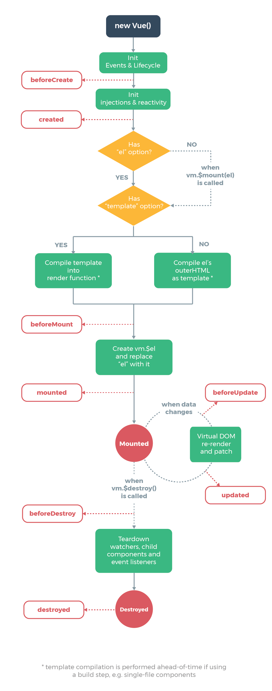
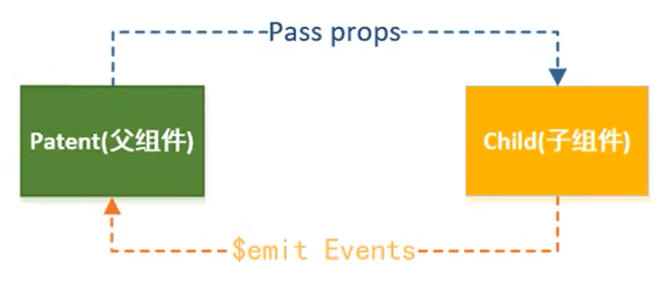

# Vue2

[Vue官网](https://vuejs.org/)

[参考教程 coderwhy](https://www.bilibili.com/video/BV15741177Eh/)

## 什么是 Vue

Vue (发音为 /vjuː/，类似 view) 是一款用于构建用户界面的 **渐进式** JavaScript 框架（渐进式意味着你可以将 Vue 作为应用的一部分嵌入其中，带来更丰富的交互体验）。它基于标准 HTML、CSS 和 JavaScript 构建，并提供了一套 **声明式的、组件化的** 编程模型，帮助你高效地开发用户界面

与其他重量级框架不同的是，Vue 采用 **自底向上增量开**发 的设计。Vue 的核心库只关注视图层，并且非常容易学习，非常容易与其它库或已有项目整合。另一方面，Vue 完全有能力驱动采用单文件组件和 Vue 生态系统支持的库开发的复杂单页应用

Vue.js 的目标是通过尽可能简单的 API 实现 **响应的数据绑定和组合的视图组件**

Vue 的两个核心功能：
- **声明式渲染**：Vue 基于标准 HTML 拓展了一套模板语法，使得我们可以声明式地描述最终输出的 HTML 和 JavaScript 状态之间的关系
- **响应性**：Vue 会自动跟踪 JavaScript 状态并在其发生变化时响应式地更新 DOM

### Vue 与其他框架的对比

[Vue与其他框架的对比](http://caibaojian.com/vue/guide/comparison.html)

### Vue 常见的高级功能

- 解耦视图和数据
- 可复用的组件
- 前端路由技术
- 状态管理
- 虚拟 DOM

## 安装

一般有三种方式：

1. CDN 引入，本地测试或学习一般不用，因为经常需要去服务器请求，浪费时间

```js
// 开发环境版本，包含了有帮助的命令行警告
<script src="https://cdn.jsdelivr.net/npm/vue/dist/vue.js"></script>
// 生产环境版本，优化了尺寸和速度
<script src="https://cdn.jsdelivr.net/npm/vue"></script>
```

2. 本地下载和引入

- 开发环境：https://vuejs.org/js/vue.js
- 生产环境：https://vuejs.org/js/vue.min.js

3. 通过 npm 安装：后续通过 webpack 和 CLI 的使用，经常会使用这种方式

## Hello Vue

```html
<div id="app">
  <h1>{{message}}</h1>
  <h2>{{message}}, by EvanYou</h2>
  <h3>{{firstName + lastName}}</h3>
  <h3>{{firstName + ' ' + lastName}}</h3>
  <h3>{{firstName}} {{lasrName}}</h3>
</div>
```

```js
const app = new Vue({
    // 挂载要管理的元素
    el: "#app",
    // 定义数据
    data: {
        message: "Hello Vue",
        firstName: 'Jojo',
        lastName: 'Wan'
    }
})
```

创建 Vue 对象时传入了一些 option `{ }`，其中包含
- `el`：该属性决定了这个 Vue 对象挂载到哪一个元素
- `data`：该属性中通常会存储一些数据，可以是自己定义的，也可以是从服务器中获取的
- ……，还有许多其他的 options，具体参考官网

原生 JS 方式属于命令式编程范式，不能做到数据和页面的完全分离；而 Vue 等框架采用的是声明式编程范式，可以做到完全分离，在改变数据时完全不需要改动页面

在浏览器 console 中可以直接 `app.message = "today is a good day"` 修改 message 的值，页面也会同步修改

响应式编程：改变 JS 中的 message，HTML 中的数据也会进行响应发生变化

插值语法中，不仅仅可以直接写变量，也可以写简单的表达式

```html
<!-- 还可以有更复杂的操作，比如展示列表 -->

<ul v-for="movie in movies">
    {{movie}}
</ul>
```

```html
<!-- case 3：简单计数器 -->

<body>
    <div id="app">
      <h1>{{message}}</h1>
      <h2>当前计数：{{counter}}</h2>
      <!-- 注意这里的函数不需要加括号 -->
      <button v-on:click="increment">+</button>
      <!-- @click 就是 v-on:click 的简写，语法糖 -->
      <button @click="decrement">-</button>
    </div>
    <script>
      const app = new Vue({
        el: "#app",
        data: {
          message: "Hello Vue",
          counter: 0,
        },
        methods: {
          increment: function () {
            console.log("当前计数 + 1");
            // 这里利用了 Vue 中的代理 proxy，后面会讲到
            this.counter++;
          },
          decrement: function () {
            console.log("当前计数 - 1");
            this.counter--;
          },
        },
      });
    </script>
</body>
```

### v-once

元素和组件只渲染一次，不会随着数据的改变而改变

```html
<div id="app">
  <h2>{{message}}</h2>
  <!-- 更改 message 的值，这里的 显示的内容不会改变 -->
  <h2 v-once>{{message}}</h2> 
</div>
```

### v-html

对 HTML 进行解析，并且显示对应内容

后面跟一个 string，对 string 进行 HTML 解析并渲染

```html
<div id="app">
  <h2>{{link}}</h2>
  <h2 v-html="link"></h2>
</div>

<!-- link="<a href="http://www.baidu.com">百度一下</a>" -->
```

### v-pre

用于跳过这个元素和它子元素的编译过程，用于显示原本的内容。比如，就想显示大括号和里面的内容

```html
<div id="app">
  <!-- 显示 Hello World -->
  <h2>{{message}}</h2>
  <!-- 显示 {{message}} -->
  <h2 v-pre>{{message}}</h2> 
</div>

<!-- message: 'Hello World' -->
```

## Vue 中的 MVVM

MVVM，Model-View-ViewModel，是一种软件架构模式。有助于将图形用户界面的开发和业务逻辑或后端逻辑（数据模型）的开发分离开来

- Model：代表真实状态内容的领域模型（面向对象），或指代表内容的数据访问层（以数据为中心）
- View：就像在 MVC 和 MVP 模型中的一样，视图层就是用户在屏幕上看到的结构、布局和外观 UI
- ViewModel：暴露公共属性和命令的视图的抽象。MVVM 没有 MVC 的控制器，也没有 MVP 的 presenter，有的是一个绑定器，用来在视图和数据之间进行通信


## Vue 的生命周期



### Vue 的生命周期函数

- beforeCreate()
- created()：一般在这里面放一些网络请求
- beforeMount()
- mounted()
- beforeUpdate()
- updated()
- beforeDestroy()
- destroyed() 
  
## 基础语法

### v-bind

用于绑定一个或多个属性值，或者向另一个组件传递 props 值

多用在图片的 src、超链接的 href、动态绑定类和样式等等

也可以使用语法糖 `<a :href="link">`

```html
<div id="app">
  <a v-bind:href="link">Vue官网</a>
  
</div>

<!-- link 和 logoUrl 都写在 data 里 -->
```

#### 动态绑定 class

- 可以通过 **对象/数组** 来动态绑定（其中数组形式用处较少）
- 动态绑定 class，和普通的 class 声明不冲突
- 如果 class 值过于复杂，可以写在 methods 或者 computed 中

```html
<!DOCTYPE html>
<html lang="en">
  <head><script src="../js/vue.js"></script></head>

  <style>
    .active {
      color: coral
    }
    .line {
      text-decoration: line-through;
    }
  </style>

  <body>
    <div id="app">
      <!-- 这里可以绑定一个对象，从而可以动态控制样式 -->
      <h1 :class="{active: isActive, line: isLine}">你好啊</h1>
      <button @click="change">改变样式</button>
    </div>

    <script>
      const vm = new Vue({
        el: "#app",
        data: {
          isActive: true,
          isLine: true
        },
        methods: {
          change: function() {
            this.isActive = !this.isActive
          }
        }
      });
    </script>
  </body>
</html>
```

上面可以改写成如下格式：将复杂部分单独放到一个方法中

```html
<h1 :class="getClass()">你好啊</h1>
```

```js
// vm.methods 中添加一个函数
getClass: function() {
  return {active: this.isActive, line: this.isLine}
}
```

#### 一个案例：点击 li 中的元素变颜色

```html
<!DOCTYPE html>
<html lang="en">
  <head><meta charset="UTF-8" /><title>Document</title><script src="../js/vue.js"></script></head>
  <style>
    .active {
      color: coral
    }
  </style>

  <body>
    <div id="app">
      <ul>
        <li v-for="(movie, idx) in movies" 
            :class="{'active': curIdx === idx}" 
            @click="change(idx)">
            {{movie}}
        </li>
      </ul>
    </div>

    <script>
      const vm = new Vue({
        el: "#app",
        data: {
          movies: [
            'Interstellar',
            'Seven',
            'Frozen'
          ],
          // 重点就在于这个变量，用来监听当前是第几个元素
          curIdx: 0
        },
        methods: {
          change: function(index) {
            this.curIdx = index
          }
        }
      });
    </script>
  </body>
</html>
```

#### 动态绑定 style

`v-bind:style` or `:style`

```html
<!-- <div :style="{属性名：属性值，属性名：属性值}"></div> -->

<!-- 两种方式都可以，比较习惯驼峰 -->
<!-- '50px' 必须加上单引号，否则会被当做一个变量，就会报错 -->
<div :style="{fontSize: '50px'}">hello world</div>
<div :style="{'font-size': '50px'}">hello world</div>

<!-- 绑定一个变量，然后在 vm.data 中定义 finalSize: '50px' -->
<div :style="{fontSize: finalSize}">Hello world</div>
```

### 计算属性

某些情况下我们需要将数据进行转化后再显示，或者需要将多个数据结合起来进行显示，那么就需要用到计算属性

```js
// 在 HTML 中只要直接插入 {{fullName}} 就可以了，不需要加括号（语法糖）  

const vm = new Vue({
  el: "#app",
  data: {
    firstName: 'Lucy',
    lastName: 'Lee'
  },
  computed: {
    // 既然是计算“属性”，那么起名时尽量不要带动词
    fullName: function() {
      return this.firstName + ' ' + this.lastName
    }
  }
  methods: {}
});
```

计算属性的完整写法中是有 getter 和 setter 的，但是一般不希望别人更改所以都会省略 setter，然后再简写成上面的形式

```js
computed: {
  fullName: {
    set: function() {},
    get: function() {
      return this.firstName + ' ' + this.lastName 
    }
  }
}
```

#### 计算属性的缓存

`computed` 比 `methods` 好的地方在于：当基本属性值没有发生变化时，多次调用计算值只需要计算一次，Vue 内部已经做好了缓存

而 `methods` 则是调用几次，就计算几次。在调用次数多且计算逻辑复杂的情况下就很消耗性能

```js
// {{fullName}}
// {{fullName}}
// {{fullName}}
// {{getFullName()}}
// {{getFullName()}}
// {{getFullName()}}

const vm = new Vue({
  el: "#app",
  data: {
    firstName: 'Lucy',
    lastName: 'Lee'
  },
  computed: {
    fullName: function() {
      console.log('---computed---')
      return this.firstName + ' ' + this.lastName
    }
  },
  methods: {
    getFullName() {
      console.log('---methods---')
      return this.firstName + ' ' + this.lastName
    }
  }
});

// computed
// methods
// methods
// methods
```

### v-on

在 Vue 中使用 `v-on` 来绑定事件监听器，可以简写为 `@`

#### v-on 中的参数

当 `@click` 需要调用函数时，需要注意
- 如果该方法不需要额外参数，那么方法后面的 `()` 可以不添加
- 如果方法本身有一个参数，且在传参时没有传任何东西，也没有写 `()`，那么会默认将原生事件 `event` 参数传递进去
- 如果需要同时传入 **其他参数和 event** 时，可以通过 `$event` 传入事件

```html
<body>
  <div id="app">
    <button @click="btn1Click">按钮1</button>  <!-- btn1Click -->
    <button @click="btn2Click('jojo')">按钮2</button> <!-- jojo -->
    <button @click="btn2Click()">按钮3</button> <!-- undefined -->
    <button @click="btn2Click">按钮4</button> <!-- PointerEvent{} -->
    <button @click="btn3Click">按钮5</button> <!-- PointerEvent{} undefined -->
    <button @click="btn3Click('jojo', $event)">按钮6</button> <!-- jojo PointerEvent{} -->
  </div>

  <script>
    const vm = new Vue({
      el: "#app",
      data: {},
      methods: {
        btn1Click() {
          console.log('btn1Click')
        },
        btn2Click(name) {
          console.log(name);
        }
      },
    });
  </script>
</body>
```

#### v-on 修饰符

在某些情况下，拿到 event 的目的是进行一些事件处理，Vue 提供了一些修饰符来帮组我们方便地处理一些事件

以下是一些常用的修饰符：
- `.stop`：调用 event.stopPropagation() 停止冒泡 
- `.prevent`：调用 event.preventDefault()
- `.{keyCode | keyAlias}`：当事件是由特定键触发时才进行回调
- `.native`：监听组件根元素的原生事件
- `.once`：只触发一次回调

```html
<button @click.stop="btnClick">按钮</button>

<!-- 也可以连着写 -->
<button @click.stop.prevent="btnClick">按钮</button>

<!-- 只有当按下 enter 键的时候才会执行回调函数 -->
<input type="text" @keyup.enter="keyupClick" />
<input type="text" @keyup.13="keyupClick" />
```

### v-if, v-else-if, v-else

逻辑与正常 if 判断一样，可以根据表达式的值在 DOM 中渲染或销毁元素或组件

当判断条件为 false 时，对应的元素以及其子元素不会渲染，也就是根本不会有对应的标签出现在 DOM 中

```html
<h1 v-if="isShow">isShow 为 true 时，显示这里</h1>
<h2 v-else>isShow 为 false 时，显示这里</h2>
```

```html
<p v-if="score>=90">优秀</p>
<p v-else-if="score>=75">良好</p>
<p v-else-if="score>=60">及格</p>
<p v-else>不及格</p>
```

### v-show

同样可以控制节点的显示和隐藏

- `v-show` 控制的是节点的 `display` 属性，隐藏时就是给节点添加 `display: none;`
- `v-if` 则是直接在 DOM 树中删除节点，根本不会渲染

> **如果需要频繁切换 显示/隐藏，那么使用 `v-show` 性能更佳**

### v-for

#### 遍历数组

```html
<!-- 不使用索引值 -->
<ul>
  <li v-for="name in names">"{{name}}</li>
</ul>
```

```html
<!-- 使用索引值 -->
<ul>
  <li v-for="(name, idx) in names">{{idx+1}}. {{name}}</li>
</ul>
```

#### 遍历对象

```html
<!-- 如果只获取一个值，那么拿到的是 value 值 -->
<ul>
  <!-- 拿到的是 jojo 18 female -->
  <li v-for="item in infos">"{{item}}</li>  
</ul>

<!-- 
  infos: {
    name: 'jojo',
    age: 18,
    sex: 'female'
  }
 -->
```

```html
<!-- 获取 key 和 value，(value, key) 注意后面的是 key -->
<ul>
  <li v-for="(value, key) in infos">{{key}}: {{value}}</li>  
</ul>
```

```html
<!-- 获取 key 和 value 和 index， 不常用 -->
<ul>
  <li v-for="(value, key, idx) in infos">{{idx+1}}. {{key}}: {{value}}</li>  
</ul>
```

> **官方推荐使用 `v-for` 时，给对应的元素或者组件添加一个 `:key` 属性**
>
> **根据 Diff 算法，主要是为了更高效地更新虚拟 DOM**

### Diff 算法 :star:

*TODO*

### 数组中哪些方法是响应式的

- push()
- pop()
- shift()
- unshift()
- splice()
- sort()
- reverse()

通过索引值改变数组中的元素 不是响应式的（注：Vue3 中已经支持了）

可以使用 `Vue.set(修改的对象，修改的元素，修改后的值)` 来进行响应式修改

### v-model

实现 **表单** 元素和数据的双向绑定，也可以用于 `textarea` 元素 

```html
<input type="text" v-model="message">
{{message}}

<!-- 改变 app.message 的值页面也会跟着改变；
同理如果改变输入框中的值，下面显示的 message 也会改变 -->
```

**原理**：其实就是一个语法糖，本质就是下面两个操作
- `v-bind` 绑定一个 `value` 属性
- `v-on` 给当前元素绑定 `input` 事件

```html
<input type="text" v-model="message">

<!-- 等同于 -->

<input type="text" :value="message" @input="message = $event.target.value">
```

```html
<!-- v-model 结合 radio 使用 -->
<!-- 用了 v-model 就不要用 name 来进行单选框的互斥选择了 -->
<input type="radio" value="男" v-model="sex">男
<input type="radio" value="女" v-model="sex">女
<h4>您选择的是： {{sex}}</h4>
```

```html
<!-- v-model 结合 checkbox 多选框 -->
<input type="checkbox" value="篮球" v-model="hobbies">篮球
<input type="checkbox" value="足球" v-model="hobbies">足球
<input type="checkbox" value="网球" v-model="hobbies">网球
<h3>您选择的是：{{hobbies}}</h3>

<!-- vm.data.hobbies: [] -->
```

```html
<!-- v-model 结合 select 单选，不常用 -->
<select name="fruit" v-model="fruit">
  <option value="西瓜">西瓜</option>
  <option value="荔枝">荔枝</option>
  <option value="草莓">草莓</option>
</select>
<h3>您选择的水果是：{{fruit}}</h3>

<!-- v-model 结合 select 多选，不常用 -->
<select name="fruit" v-model="fruit">
  <option value="西瓜">西瓜</option>
  <option value="荔枝">荔枝</option>
  <option value="草莓">草莓</option>
</select>
<h3>您选择的水果是：{{fruit}}</h3>
```

#### 值绑定

[官网中的描述和示例](https://cn.vuejs.org/guide/essentials/forms.html#value-bindings)

对于单选按钮，复选框和选择器选项，`v-model` 绑定的值通常是静态的字符串 (或者对复选框是布尔值)。但有时我们可能希望 **将该值绑定到当前组件实例上的动态数据** 。这可以通过使用 `v-bind` 来实现。

```html
<label v-for="hobby in originHobbies" :for="hobby">
  <input type="checkbox" :value="hobby" v-model="hobbies">{{hobby}}
</label>

<!-- vm.data.originHobbies = ['篮球'， '足球'， '网球'] -->
```

#### v-model 修饰符

- `.lazy` 在每次 change 事件（比如敲回车、失去焦点等）后更新数据，不再随时更新
- `.number` 将用户输入自动转换为数字，而不是默认的字符串
  - 如果该值无法被 `parseFloat()` 处理，那么将返回原始值
  - 会在输入框有 `type="number"` 时自动启用
- `.trim` 去掉用户输入内容两端的空格

## 组件化

组件允许我们将 UI 划分为独立的、可重用的部分，并且可以对每个部分进行单独的思考。在实际应用中，组件常常被组织成层层嵌套的树状结构。

Vue 实现了自己的组件模型，使我们可以在每个组件内封装自定义内容与逻辑

### 组件的使用

- 创建组件构造器 `Vue.extend()`
- 注册组件 `Vue.component()`
- 使用组件（在 Vue 实例的作用范围内）

```html
<body>
  <!-- 注意自定义组件一定要挂载在 一个 Vue 实例下面，也就是 app 这个 div下面 -->
  <div id="app">
    <!-- 重复使用组件 -->
    <mycpn></mycpn>
    <mycpn></mycpn>
  </div>
  <script>
    // 创建组件构造器
    // 这种方式现在基本上不使用了，有更方便的语法糖；但是这种方式是基础
    const ve = Vue.extend({
      // ` `包裹起来的是模板字符串，也就是可以重复使用的部分
      template: `
        <div>
          <h2>我是标题</h2>
          <p>我是内容1111</p>
          <p>我是内容2222</p>
        </div>`
    })
    // 注册组件
    Vue.component('mycpn', ve)
    const vm = new Vue({
      el: "#app",
      data: {},
    });
  </script>
</body>
```

### 全局组件和局部组件

- 按照上面的方法在 `Vue.component()` 注册的是全局组件
- 在某个 Vue 实例中使用 `components` 注册的就是局部组件，只能在该实例关联的元素下面使用

```js
const vm = new Vue({
  el: '#app',
  data:{},
  components: {
    mycpn: ve // 局部组件
  }
});
```

### 父组件和子组件

```html
<body>
  <div id="app">
    <cpn2></cpn2>
  </div>
  <script>
    // 子组件
    const cpn1 = Vue.extend({
      template: `
        <div>
          <h2>我是标题1111</h2>
          <p>我是内容1111</p>
        </div>`
    })
    // 父组件
    const cpn2 = Vue.extend({
      template: `
        <div>
          <h2>我是标题2222</h2>
          <p>我是内容222</p>
          <cpn1></cpn1>
        </div>`,
        // 在父组件内部注册子组件，只能在 cpn2 内使用
        components: {
          cpn1: cpn1
        }
    })
    
    // root组件
    const vm = new Vue({
      el: "#app",
      data: {},
      components: {
        cpn2: cpn2
      }
    });
  </script>
</body>
```

> **注意：** 子组件不能以标签的形式写在 Vue 实例里

```html
<!-- 这样是不会生效的，因为根本找不到 child-cpn 的注册信息
    除非在 vm 中注册，或者另外注册一个全局组件 -->
<parent-cpn></parent-cpn>
<child-cpn></child-cpn>

<!-- 这种写法也是不会生效的 -->
<parent-cpn>
  <child-cpn></child-cpn>
</parent-cpn>
```

因为当子组件注册到父组件的 components 中时，Vue 会编译好父组件的模块

该模块的内容已经决定了父组件将要渲染的 HTML（相当于父组件中已经有了子组件中的内容了）

那么子标签就是只能在父组件中被识别的（存在组件编译作用域）

### 注册组件的语法糖写法

省略了 `Vue.extend()` 的步骤，都放在一个对象中的 `template` 中

其实底层源码还是放在了 `Vue.extend()` 里面

```html
<body>
  <div id="app">
    <cpn1></cpn1>
    <cpn2></cpn2>
  </div>
  <script>
    // 1. 全局组件
    Vue.component('cpn1', {
      template: 
        `<div>
          <h2>我是全局</h2>
          <p>我是内容1111</p>
        </div>`
    })
    const vm = new Vue({
      el: "#app",
      data: {},
      // 2. 局部组件
      components: {
        cpn2: {
          template: 
          `<div>
            <h2>我是局部</h2>
            <p>我是内容2222</p>
          </div>`
        }
      }
    });
  </script>
</body>
```

### 组件模板的抽离写法

```html
<body>
  <!-- 模板内容写在这里面 -->
  <template id="cpn"></template>

  <script>
    // 全局组件
    Vue.component('cpn', {
      template: '#cpn'
    })

    const vm = new Vue({
      el: "#app",
      data: {},
      // 局部组件
      components: {
        cpn: {
          // 这里直接写 template: cpn 也可以
          template: '#cpn'
        }
      }
    });
  </script>
</body>
```

```html
<!-- 方法二：将模板内容放在 script 标签里，不常用 -->
<body>
  <script type=text/x-template id="cpn">
    <!-- 模板内容 -->
  </script>
</body>
```

### 组件中的数据存放问题

组件是一个单独功能模块的封装，这个模块有属于自己的模板，也应该有属于自己的 data

**在组件中是不能直接访问 Vue 实例中的 data 的。** 

就算能访问，我们也不能把所有的数据都放在 Vue 实例里，那么当组件数量变大之后，Vue 实例中的内容将会变得非常臃肿

每个组件中都可以存放自己的 data 和 methods 等（源码中组件的 prototype 是指向 Vue 的）

> **template 中的 data() 必须是一个函数，返回一个对象**

```html
<div>
  <cpn></cpn>
</div>

<template id="cpn">
  <h3>{{title}}</h3>
  <p>我是模板内容</p>
</template>

<script>
  Vue.component('cpn', {
    template: "#cpn",
    data() {
      return {
        title: 'template data'
      }
    }
  })
</script>
```

#### 为什么组件中的 data() 必须是一个函数

假设此时有一个计数器组件，我们多次复用计数器

如果组件中的 data 是一个对象的话，那么相当于 n 个计数器共用一个对象，那么当某一个计数器中的 counter 发生变化时，其他计数器的值也会发生变化。

而如果用函数 `data(return{counter: 0})`，那么就是每个计数器会返回自己的对象，内存地址不同，彼此不会影响

具体可参考视频 P58

### 父子组件通信 -- 父传子

在开发中，会需要将数据从上层传递到下层。比如一个页面通过向服务器发送请求得到数据之后，就需要向下传递到子组件中的 list 来进行展示，而不是子组件再次发送一次请求

- **通过 `props` 向子组件传递数据**
- **通过事件 `$emit` 向父组件发送消息**



```html
<div id="app">
  <cpn :csingers="singers"></cpn>
</div>
<template id="cpn">
  <div>
    <h3>{{title}}</h3>
    <ul>
      <li v-for="singer in csingers">{{singer}}</li>
    </ul>
  </div>
</template>
```

```js
// 子组件
const cpn = {
  // 这里必须是一个函数
  data() {
    return {
      title: '父子组件通信'
    }
  },
  template: '#cpn',
  // 父 -> 子：子组件拿到父组件的数据
  props: ['csingers']
}

// root 组件
const vm = new Vue({
  el: "#app",
  data: { singers: ['陶喆', '周杰伦', '蔡依林'] },
  // 注册组件
  components: {cpn}
});
```

#### props 数据验证

props 选项可以是数组，也可以是对象。当我们需要对 props 进行类型等数据验证时，就需要用对象了

数据验证支持的数据类型包括：String，Number，Boolean，Array，Object，Date，Function，Symbol……同时也支持自定义类型

```js
props: {
  // 1. 限制数据类型
  csingers: Array,
  cmessage: [String, Number]
  
  // 2. 提供默认值
  csingers: {
    type: Array,
    default: ['陶喆']
  }

  // 3. 设置必须传递某属性
  csingers: {
    type: Array,
    required: true
    // default: ['陶喆'], 现在的版本这样写会报错
    // 当是 Array/Object 类型时，默认值必须使用一个函数返回
    default() {
      return ['陶喆']
    }
  }

  // 4. 自定义验证函数
  cmessage: {
    validator(val) {
      // 必须匹配下面三个中的某一个
      return ['success', 'warning', 'danger'].indexOf(val) !== -1
    }
  }
}

// 5. 验证自定义类型
Person(firstName, lastName) {
  this.firstName = firstName
  this.lastName = lastName
}
props: {
  author: Person
}
```

#### props 中的驼峰标识

props 中定义的变量名 **最好不要使用驼峰标识**，因为 HTML 是不识别驼峰的，会自动将驼峰编译为全小写，那么就会出现找不到的情况

如果使用了驼峰标识命名，那么在 HTML 中绑定时就需要使用 `-` 连接

但是自己的模板中是可以使用驼峰的

```html
<div>
  <!-- 这里如果写为 cSingers 的话会报错 -->
  <cpn :c-singers="singers"></cpn>
</div>

<template>
  <div>
    <!-- 这里是可以识别到驼峰的 -->
    <h3>{{cSingers}}</h3>
  </div>
</template>

<script>
  props: { cSingers: {} }
</script>
```

### 父子组件通信 -- 子传父

```html
<!-- 父组件模板 -->
<div id="app">
  <!-- 在这里接收子组件传递过来的事件，并用 v-on 绑定给父组件 -->
  <!-- 现在这里不要写驼峰，以后使用脚手架时就可以用驼峰了 -->
  <cpn @item-click="btnClick"></cpn>
</div>

<!-- 子组件模板 -->
<template id="cpn">
  <div>
    <button v-for="item in catagories" @click="itemClick(item)">
      {{item.name}}
    </button>
  </div>
</template>
```

```js
// 子组件
const cpn = {
  template: "#cpn",
  data() {
    return {
      catagories: [
        { id: 1, name: "手机数码" },
        { id: 2, name: "潮流家电" },
        { id: 3, name: "电脑办公" },
      ],
    };
  },
  methods: {
    itemClick(item) {
      // 子 -> 父，子组件向父组件传递一个名为 item-click 的事件
      // 一定要记得这里要先传入一个字符串
      this.$emit("item-click", item);
    },
  },
};

// root 组件
const vm = new Vue({
  el: "#app",
  components: { cpn },
  methods: {
    btnClick(item) { console.log("收到子组件信息", item); },
  },
});
```

### 父子组件访问方式

有时候我们需要父组件直接访问子组件，或者是子组件访问父组件，那么就是上一节传数据的方式了

- **父访问子：**`$children` or `$refs` 
- **子访问父：**`$parent`

#### 父访问子

~~`this.$children` 是一个数组类型，它包含所有子组件对象~~ （一般不用，Vue3中已经废弃了），当有多个组件时需要通过 index 来获取相应的组件，一旦组件顺序发生变化维护就会很麻烦

`this.$refs` 是一个对象属性。**使用时需要在相应的组件标签内加上 `ref="属性值"` 才可以拿到该组件**，通过 `this.$refs.属性值` 就可以获得相应的组件了

```html
<div id="app">
  <cpn ref="btn"></cpn>
  <button @click="btnClick">按钮</button>
</div>
<template id="cpn">
  <div><p>我是子组件</p></div>
</template>
```

```js
const cpn = {
  template: '#cpn',
  data() {
    return {
      name: '子组件名字'
    }
  },
}

const vm = new Vue({
  el: '#app',
  methods: {
    btnClick() {
      console.log(this.$refs.btn.name);
    }
  },
  components: {cpn},
});
```

#### 子访问父（用得非常少）

会增加子组件和父组件之间的耦合性，不利于子组件的独立使用，所以一般 **不推荐** 用 子访问父

#### 访问根组件

`this.$root` 也就是 Vue 实例

### 编译作用域

```html
<div id="app">
  <cpn v-show="isShow"></cpn>
</div>
<template id="cpn">
  <!-- 如果这里是 <div v-show="isShow"> 就是子组件中的 isShow 起效了 -->
  <div>
    <h3>我是子组件</h3>
  </div>
</template>
```

```js
const cpn = {
  template: "#cpn",
  data() {
    return {
      isShow: true  // 这里的 isShow 不起效
    }
  }
};
const vm = new Vue({
  el: "#app",
  data: {
    isShow: false // 这里的 isShow 起效，所以页面上并不显示子组件
  },
  components: { cpn },
});
```

简而言之，就是写在哪儿就去哪个作用域里找

### 插槽 slot

生活中很多地方都有插槽，比如 USB插槽，插线板中的电源插槽，插槽的目的就是让设备具有 **更多拓展性**

组件的插槽也是为了让组件更加具有扩展性，让使用者可以决定组件内部的一些内容到底展示什么 `<slot></slot>`

- 抽取共性：放到组件中
- 预留不同：放到插槽中

```html
<div>
  <cpn><button>你点我啊</button></cpn>
  <cpn><a href="#">送你离开千里之外</a></cpn>
  <cpn><span>啥也没有</span></cpn>
</div>

<template id="cpn">
  <div>
    <h4>我是子组件</h4>
    <slot></slot>
  </div>
</template>
```


当有某个插槽会重复多次使用时，可以设置 **插槽中的默认值**。那么当组件中不另外添加时，就显示默认插槽中的内容

```html
<div>
  <cpn></cpn>
  <cpn><a href="#">送你离开千里之外</a></cpn>
  <cpn><span>啥也没有</span></cpn>
  <cpn></cpn>
  <cpn></cpn>
  <cpn></cpn>
</div>

<template id="cpn">
  <div>
    <h4>我是子组件</h4>
    <slot><button>你点我啊</button></slot>
  </div>
</template>
```

#### 具名插槽

利用 `name` 给插槽取名，就可以在多个插槽中只修改某一个

```html
<div id="app">
  <cpn>
    <!-- 只修改 name 为 center 的 slot -->
    <button slot="center">你点我啊</button>
  </cpn>
</div>
<template id="cpn">
  <div>
    <h3>我是子组件</h3>
    <slot name="left">左边</slot>
    <slot name="center">中间</slot>
    <slot name="right">右边</slot>
  </div>
</template>
```

#### 作用域插槽

父组件替换插槽的标签，但是内容由子组件来提供

### 非父子组件通信

#### provide / reject

当父子组件之间距离的层级很多时，如果继续使用 props 来进行组件通信就会很麻烦，那么就可以通过以下方式进行组件通信，而且不需要知道彼此进行通信的是谁
- provide：父传子
- reject：子传父

在 Vue3 使用 CompositionAPI 之后，就要写到 setup() 中了

```js
export default {
  // provide: {
  //     name: 'lucy',
  //     age: 18
  provide() { // 如果需要通过 this 来进行数据获取，必须要写成函数再 return 的形式
  // }
  data(){ },
    return {
      name: this.name
    }
  }
}

// 子组件
export default {
  inject: ["name", "age"] // 使用
}
```

#### 事件总线

Vue3 中已经移除了 `$on` `$off` `$once` 方法，如果想要在 Vue3 中使用全局事件总线，需要借助第三方库，比如 [mitt](https://github.com/developit/mitt) 或者 [tiny-emitter](https://github.com/scottcorgan/tiny-emitter)

### 组件的生命周期


创建 -> 挂载 -> 更新 -> 卸载

如果我们想在组件的某个阶段进行一些操作，就需要知道组件当前处在哪个过程

Vue 提供了组件的生命周期函数，通过对生命周期函数的回调，就可以知道组件处在哪个阶段


#### 生命周期函数

一些 **钩子函数（回调函数）**，在某个时间会被 Vue 源码内部进行回调

#### created()

常用，经常会在其中进行：
1. 发送网络请求
2. 事件监听
3. this.$watch()

### $refs

某些情况下，我们在组件中想要 **直接获取到元素对象或者子组件实例**，但是在 Vue 中不推荐直接进行原生 DOM 操作，这个时候我们就可以给元素或者组件绑定一个 ref 的 attribute 属性

```html
<button ref="btn" class="btn">按钮</button>

<my-cpn ref="cpn">自定义组件</my-cpn>
```

```js
methods: {
  change() {
    console.log(this.$refs.btn)  // 就可以拿到上面的 button 元素
    console.log(this.$refs.cpn) // 拿到的是组件实例（一个 Proxy） 
    console.log(this.$refs.cpn.$el) // 就可以拿到组件中的根节点 div 了
    this.$refs.cpn.fn() // 父组件可以通过这种方式主动调用子组件的方法
  }
}
```

### 动态组件

```html
<!-- is后面的组件要么是全局注册的组件，要么是局部注册的组件 -->
<component is="home"></component>
<!-- 动态切换，使用 v-bind 绑定 is -->
<component :is="tabs[currentIndex]"></component>
```

### keep-alive

- include (String | RegExp | Array)：只有名称匹配的组件才会被缓存
- exclude：名称匹配的组件 不会 被缓存
- max：最多可以缓存多少组件实例，一旦达到这个数字，那么缓存组件中最近没有被访问的实例会被销毁

**首先会匹配组件自身的 name 属性**

```html
<!-- a,b 之间不要随便加空格，否则可能无法匹配 -->
<keep-alive include="a,b">
<!-- <keep-alive include="/a|b/">正则匹配</keep-alive>
<keep-alive include="['a', 'b']">数组匹配</keep-alive> -->
  <component :is="view">字符串匹配</component>
</keep-alive>
```

#### 缓存组件的生命周期

对于开启了 keep-alive 被缓存的组件来说，再次进入时不会执行 `created` 或者 `unmounted` 函数，如果我们想要监听相关事件，需要用到以下两个函数

- activated
- deactivated

### 异步组件

如果需要对组件进行分包处理，那么就需要用到异步组件，Vue 官方提供 `defineAsyncComponent`

该方法接受两种类型的参数
1. 工厂函数，并返回一个 Promise
2. 对象类型，对异步函数进行配置

```js
// 方式一
import { defineAsyncComponent } from 'vue'

const AsyncCategory = defineAsyncComponent(() => { import("./views/Category.vue") })

export default {
  components: {
    Category: AsyncCategory
  }
}
```

```js
// 方式二，了解即可
const AsyncCategory = defineAsyncComponent({
  // 工厂函数
  loader: () => import("./views/Category.vue"),
  // 加载过程中显示的组件
  loadingComponent: Loading,
  // 加载失败时现实的组件
  errorComponent: Error,
  // 在显示 loadingComponent 之前的延迟，默认 200ms
  delay: 2000,
  // 如果提供了 timeout，并且加载组建的时间超过了设定值，将显示错误组件，默认值 Infinity，即永不超时
  // timeout: 0,
  // 组件是否可挂起，默认值 true
  suspensible: true
})
```

### 组件中的 v-model

在组件中使用 v-model 和在 input 上使用 v-model，不同的只是属性的名称和事件触发的名称而已

```html
<cpn v-model="message"></cpn>
<!-- 等价于 -->
<cpn :modelValue="message" @update:modelValue="message = $event"></cpn>
```

```html
<!-- v-model 本质 -->
<template>
  <div>
    <input :value="modelValue" @input="inputChange">
  </div>
</template>

<script>
  export default {
    props: ["modelValue"],
    emits: ["update:modelValue"],
    methods: {
      inputChange(event) {
        this.$emit("update:modelValue", event.target.value)
      }
    }
  }
</script>
```

# Vue3

## 虚拟 DOM

### TODO: 虚拟 DOM 的好处

1. 便于跨平台操作
2. 提高性能

## 计算属性

### 计算属性的缓存

通常在需要计算的属性时，尽可能使用计算属性，不使用函数。**因为计算属性会基于它的依赖关系进行缓存**

- 在数据不发生变化时，计算属性是不需要重新计算的
- 如果依赖的数据发生变化，则会重新计算

## 监听器 watch

`watch` 默认有两个参数 `newValue` 和 `oldValue` 

```js
watch: {
  // message 是要监听的属性，必须要写成方法的形式
  message(newVal, oldVal) {
    console.log("message数据发生了变化：", newVal, oldVal)
  }，
  info(newVal, oldVal) {
    // 如果是对象类型，那么拿到的是一个代理对象 Proxy
    // 如果不想获取代理对象、获取原生对象，则如下
    console.log({ ...newVal })
    console.log(Vue.toRaw(newVal))
  }
}
```

### 配置选项

- 使用 `deep` 进行对象内部的深度监听，当对象内部的某个属性发生变化时也可以监听到
- 私用 `immediate` 当一开始就会执行一次监听，无论后面数据是否变化都会执行一次

### watch 语法糖

`info(){ }` 其实是一个语法糖，完整写法如下

```js
watch: {
  info: {
    handler(newVal, oldVal) {
      console.log(newVal, oldVal)
    },
    deep: true,
    immediate: true
  },
  // 也可以只监听某个属性
  'info.name': function(newVal, oldVal){
    console.log(newVal, oldVal)
  }
}
```

## v-model 原理

`v-model` 其实是一个语法糖，实际上是以下两个操作
- `v-bind` 绑定 `value`
- `v-on` 监听 `input`，函数会获取最新的值赋值到绑定的属性中

### v-model 绑定单选框

绑定到属性中的值是 true/false

### v-model 绑定复选框

绑定到属性中的值是一个 Array

> **注意：** 多选框中，必须明确绑定一个 value 值，否则拿不到绑定的值

## 组件化开发

### 全局组件和局部组件

```js
// 根组件
const App = {}
const app = Vue.createApp(App)

// 定义组件内容
const productItem = {
  template: "#product"
}

// 注册全局组件
app.component("product-item", productItem)

// 挂载 app
app.mount("#app")
```

```html
<!-- 定义组件内容 -->
<template id="product">
  <h2>Hello Vue</h2>
  <p>这是一个全局组件</p>
</template>

<!-- 使用组件 -->
<product-item></product-item>
<product-item></product-item>
<product-item></product-item>
```

每个组件都有自己的逻辑，都有自己的 `data` `methods` 等等 optionAPI

想要在哪个范围内使用 **局部组件** 就在那个组件下添加 `components` API 进行局部组件注册

```js
// 局部组件
const productItem = {
    template: "#product",
    data() {return { }}
}

// 注册局部组件，该组件只能在 App 中使用
const App = {
  components: {
    // "product-item": productItem 两种写法都可以
    ProductItem: productItem
  }
}

const app = Vue.createApp(App)
```

## 组件通信

- 父传子 `props`
- 子传父 `$emit`

### 父传子

父组件中绑定属性，传递到子组件中

```js
props: ['lucy', '28']
```

props 数组的缺点：
- 不能对类型进行验证
- 不能设置默认值


props 常见 类型验证：String, Number, Boolean, Object（有注意事项）, Array, Date, Function, Symbol

```js
// 必须掌握 
props: {
  name: {
    type: String, // 类型验证
    default: 'lucy' // 默认值
  }
  age: Number,
  // 注意：如果类型是对象（数组也是一个对象），那么默认值必须要是一个函数，函数中返回对象
  friends: {
    type: Object,
    default() {
      return { name: 'wbk' }
    }
  }
}
```

除了一些绑定在 props 中的属性之外，还可以添加非 props 属性，这些非 props 属性会被默认绑定在组件的根元素上

如果不希望组件的根元素继承这些属性，可以在组件中设置 `inheritAttrs: false`

然后可以通过 `$attrs` 来访问所有的非 props 属性

```html
<div>
  我是 NotPropAttribute 属性
  <h2 :class="$attrs.class"></h2>
</div>
```

如果有多个根元素，那么必须显式绑定，否则会报警告

```html
<div class="otherRoot" v-bind="$attrs"></div>
```

### 子传父

`this.$emit('事件名称', 需要传递的参数)`

```html
<!-- 子组件 -->
<button @click="btnClick(5)"></button>

<!-- 最好在这里先提前注册一下 emits，注册好所有的自定义事件，方便后续开发，
     而且 VSCode 也会根据 emits 中的内容来进行相应的代码提示 -->
emits: ["add"],
<!-- emits 也可以写成对象格式组件时可能会用到，对象格式可以方便进行数据验证（Vue3 新增，不常用，封装组件时可以用到，了解即可） -->
emits: {
  <!-- 表示不需要验证 -->
  add: null,
  validator: function(count) {
    if (count <= 10)  return ture;
    <!-- false 时也可以发送事件，但是会报 warning -->
    else return false 
  }
}
methods: {
    btnClick() {
      this.$emit("add", count)
    }
}

<!-- 父组件 -->
<!-- 这里绑定的事件就是子组件中定义的事件名称 -->
<subCpn @add="addFn"></subCpn>

addFn(count) {
  this.count += count
}
```

## 使用单文件进行 Vue 组件开发

将每个组件抽离为单独的 `.vue` 文件

- 代码高亮
- ES6/CJS 的模块化能力
- 组件作用域的 CSS
- 使用预处理器构建更丰富的组件：TS，Babel，Less，Sass 等

### 如何支持 SFC

SFC（Single File Component）

- 使用 Vue CLI 创建项目，默认配置好所有的配置选项，可以直接在其中使用 .vue 文件（**常用**）
- 使用 webpack/vite/rollup 等打包工具进行打包处理搭建环境

## Vue CLI

脚手架
- Command Line Interface 命令行界面
- 通过 CLI 进行项目配置从而创建项目
- 内置了 webpack 相关配置，不需要从零开始

# 创建 Vue 项目的两种方式

`vue create ProjectName` 需要提前安装 vue-cli，内部基于 webpack

`npm init vue@latest` + `npm install` 添加依赖。创建之后的项目内部是基于 vite 的 