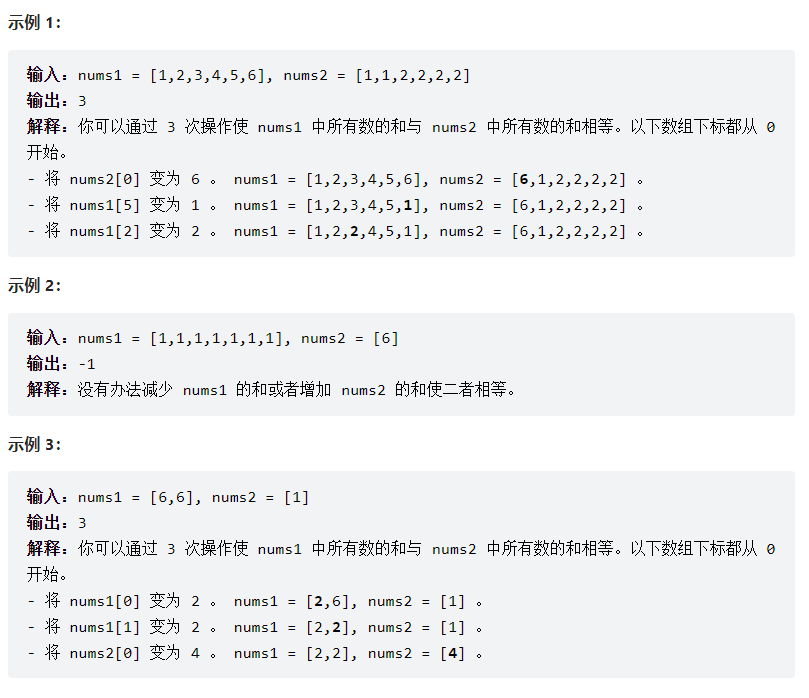

## 1775. 通过最少操作次数使数组的和相等

[No.1775 原题链接](https://leetcode.cn/problems/equal-sum-arrays-with-minimum-number-of-operations/)

给你两个长度可能不等的整数数组 `nums1` 和 `nums2` 。两个数组中的所有值都在 1 到 6 之间（包含 1 和 6）

每次操作中，你可以选择 任意 数组中的任意一个整数，将它变成 1 到 6 之间 任意 的值（包含 1 和 6）

请你返回使 `nums1` 中所有数的和与 `nums2` 中所有数的和相等的最少操作次数。如果无法使两个数组的和相等，请返回 -1 

提示：
- 1 <= nums1.length, nums2.length <= 10^5^
- 1 <= nums1[i], nums2[i] <= 6

