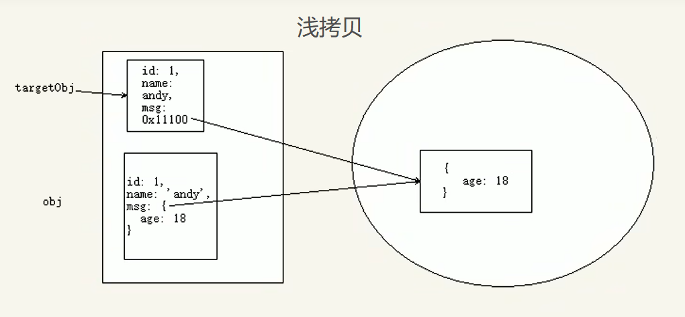
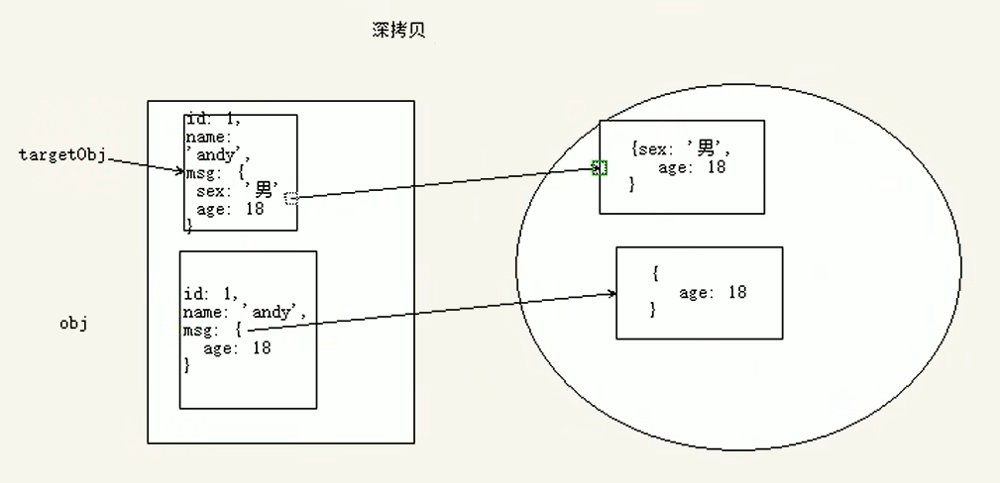

# jQuery


jQuery 是一个快速、简洁的 JavaScript 库，其设计的宗旨是 write Less , Do More.即倡导写更少的代码，做更多的事情

jQuery 出现的目的是加快前端人员的开发速度，我们可以非常方便的调用和使用它，从而提高开发效率

j 就是 JavaScript；Query 查询；意思就是查询 JS，把 JS 中的 DOM 操作做了封装，我们可以快速的查询使用里面的功能

jQuery 封装了 JavaScript 常用的功能代码，优化了 DOM 操作、事件处理、动画设计和 Ajax 交互

学习 jQuery 本质∶就是学习调用这些函数（方法）

**jQuery 的优点**

- 轻量级。核心文件才几十 KB，不会影响页面加载速度
- 跨浏览器兼容。基本兼容了现在主流的浏览器
- 链式编程、隐式迭代
- 对事件、样式、动画支持，人大简化了 DOM 操作
- 支持插件扩展开发。有着丰富的第三方的插件，例：树形菜单、日期控件、轮播图等
- 免费、开源

## 下载与使用

[jQuery 官网](https://jquery.com)

1x 2x 版本官网不再更新，3x 是官方主要更新维护的版本

将下载好的 JS 脚本引入 HTML 即可

### 入口函数

```js
$(function() {
    // 此处是页面 DOM 加载完成的入口
})
```
或者
```js
$(document).ready(function() {
    // 此处是页面 DOM 加载完成的入口
})
```

- 等 DOM 结构渲染完毕即可执行内部代码，不必等到所有外部资源加载完成，jQuery 帮我们完成了封装
- 相当于原生 JS 中的 `DOMContentLoaded`
- 不同于原生 JS 中的 `load` 事件是等页面文档、外部的 JS 文件、css 文件、图片加载完毕才执行内部代码
- 更推荐使用第一种方式

### 顶级对象 `$` 

`$` 是 jQuery 的别称，在代码中可以使用 jQuery 代替 `$`，但一般为了方便，通常都直接使用 `$`

`$` 是 jQuery 的顶级对象，相当于原生 JavaScript 中的 `window`。把元素利用 `$` 包装成 jQuery 对象，就可以调用 jQuery 的方法

## jQuery 对象和 DOM 对象

原生 JS 获取的对象就是 DOM 对象，jQuery 方法获取的就是 jQuery 对象

jQuery 对象本质：通过 `$` 把 DOM 元素进行了包装，返回的形式是伪数组。`$('div')` 就是一个 jQuery 对象

jQuery 对象只能使用 jQuery 方法，DOM 对象则使用原生的 JS 属性和方法；DOM 对象不能使用 jQuery 里面的 `hide` 等方法，jQuery 对象也不能使用原生 JS 的属性和方法

DOM 对象与 jQuery 对象之间可以相互转换

DOM 对象转为 jQuery 对象

```js
$('div')
```

jQuery 对象是一种伪数组的形式，可通过索引转换为 DOM 对象

```js
// $('DOM对象')[index]
$('div')[0] 

// or

// $('DOM对象').get(index)
$('div').get(0)
```

## 常用 API

[jQuery API Documentation](https://api.jquery.com/)

### 选择器

原生 JS 获取元素方式很多，很杂，而且兼容性情况不一致，因此 jQuery 给我们做了封装，使获取元素统一标准

`$('选择器')`

以下表格中列出的选择器均为部分

[jQuery全部选择器](https://api.jquery.com/category/selectors/)

#### 基础选择器

| 名称 | 用法 | 描述 |
| :---: | :---: | :---: |
| ID 选择器 | `$('#id')` | 获取指定 ID 的元素 |
| 全选选择器 | `$('*')` | 匹配所有元素 |
| 类选择器 | `$('.class')` | 获取同一类 class 的元素 |
| 标签选择器 | `$('div')` | 获取同一类标签的所有元素 |
| 并集选择器 | `$('div,p,li')` | 选取多个元素 | 
| 交集选择器 | `$('li.current')` | 交集元素 |

#### 层级选择器

| 名称 | 用法 | 描述 |
| :---: | :---: | :---: |
| 子代选择器 | `$('ul>li')` | 获取亲儿子层级的元素；注意，并不会获取孙子层级的元素 |
| 后代选择器 | `$('ul li')	` | 获取 ul 下的所有 li 元素，包括孙子等 |

#### 筛选选择器

| 语法 | 用法 | 描述 |
| :---: | :---: | :---: |
| :first | `$('li:first')` | 获取第一个 li 元素 |
| :last | `$('li:last')` | 获取最后一个 li 元素 |
| :eq(index) | `$('li:eq(2)')` | 获取到的 li 元素中，选择索引号为 2 的元素，索引号 index 从 0 开始 |
| :odd | `$('li:odd')` | 获取到的 li 元素中，选择索引号为奇数的元素 |
| :even | `$('li:even')` | 获取到的 li 元素中，选择索引号为偶数的元素 | 

#### 筛选方法

| 语法 | 用法 | 描述 |
| :---: | :---: | :---: |
| **parent()**| `$('li').parent()` | 查找最近的父级 |
| **children(selector)** | `$('ul').children('li')` | 相当于 `$('ul>li')`，最近一级(亲儿子) |
| **find(selector)** | `$('ul').find('li')` | 相当于 `$('ul li')`，后代选择器 |
| **siblings(selector)** | `$('.first').siblings('li')` | 查找兄弟节点，不包括自己本身 |
| **eq(index)** | `$('li').eq(2)` | 相当于 `$('li:eq(2)')`，index从 0 开始 | 
| nextAll([expr]) | `$('.first').nextAll()` | 查找当前元素之后所有的同辈元素 | 
| prevAll([expr]) | `$('.last').prevAll()` |查找当前元素之前所有的同辈元素 | 
| hasClass(class) | `$('div').hasClass('protected')` | 检查当前的元素是否含有某个特定的类，如果有，则返回 true | 
| parents() | `$('div').parents('.one')` | 获取元素所有父级，然后指定其中一个父级 | 

### 样式操作

jQuery 可以使用 CSS 方法来修改简单元素样式； 也可以操作类，修改多个样式

1. 参数只写属性名，则是返回属性值  `$(this).css('color')`
2. 参数是属性名和属性值，是设置一组样式  `$('div').css('属性', '值')`，值如果是数字可以不加单位和引号
3. 参数可以使对向行驶，方便设置多组样式。属性名和属性值用冒号隔开，属性名可以不用加引号  `$(this).css({'color':'pink','font-size':'20px'})`

#### 隐式迭代 :star:

遍历内部 DOM 元素（伪数组形式存储）的过程就叫做 **隐式迭代**。 简单理解：给匹配到的所有元素进行循环遍历，执行相应的方法，而不用我们再进行循环，简化我们的操作，方便我们调用

```html
<div>
    <div>1</div>
    <div>2</div>
    <div>3</div>
</div>
<script>
    $('div div').css('color', 'red');
</script>
```

#### 设置类样式方法

作用等同于以前的 `classList`，可以操作类样式。

注意： 操作类里面的参数不要加 `.`

1. 添加类 `$('div').addClass('current')`
2. 移除类 `$('div').removeClass('current')`
3. 切换类 `$('div').toggleClass('current')`

#### 类操作和 className 的区别

- 原生 JS 中 `className` 会覆盖元素原先里面的类名
- jQuery 里面类操作只是对指定类进行操作，不影响原来的类名

### jQuery 效果

#### 显示/隐藏效果

1. **显示效果**  `show([speed, [easing], [fn]])`
   1. `speed`：三种预定速度之一的字符串（`'slow'`, `'normal'`, `'fast'`）或表示动画时长的毫秒数值(如：1000)
   2. `easing`：用来指定切换效果，默认是 `'swing'`，可用参数 `'linear'`
   3. `fn`：回调函数，在动画完成时执行的函数，每个元素执行一次
   4. 参数都可以省略，无动画直接显示
2. **隐藏效果** `hide([speed, [easing], [fn]])`
3. **切换语法** `toggle([speed, [easing], [fn]])`

参数规则同上

**建议**：一般不带参数，直接显示隐藏即可

#### 滑动效果

1. **下滑效果** `slideDown([speed, [easing], [fn]])`
2. **上滑效果** `slideUp([speed, [easing], [fn]])`
3. **切换** `slideToggle([speed, [easing], [fn]])`

参数规则同上

#### 事件切换

`hover([over,] out)`

- `over`：鼠标移到元素上要触发的函数，相当于 `mouseenter` 
- `out`：鼠标移出元素要触发的函数，相当于 `mouseleave`
- **如果只写一个函数，则鼠标经过和离开都会触发它**

```js
// tab 页在鼠标经过向下滑动弹出，鼠标离开向上滑动消失
$('.nav>li').hover(function() {
    $(this).children('ul').slideDown(500)
}, function() {
    $(this).children('ul').slideUp(500)
})

// 或者

$('.nav>li').hover(function() {
    $(this).children('ul').slideToggle()
})
```

#### 动画队列极其停止排队方法

1. **动画或效果队列**：动画或者效果一旦触发就会执行，如果多次触发，就造成多个动画或者效果排队执行
2. **停止排队** `stop`：用于停止动画或效果
   1. 写在动画或效果的 **前面**

```js
// 这样在切换 tab 时就会先将前一个动画停止再执行下一个
$('.nav>li').hover(function() {
    $(this).children('ul').stop().slideToggle()
})
```

#### 淡入淡出效果

1. **淡入** `fadeIn([speed, [easing], [fn]])`
2. **淡出** `fadeOut([speed, [easing], [fn]])`
3. **切换** `fadeToggle([speed, [easing], [fn]])`
4. **渐进方式调整到指定的不透明度** `fadeTo([speed, opacity, [easing], [fn]])`
   1. `opacity` 必须写，取值 0-1 之间
   2. `speed` 必须

```js
// 图片高亮突出显示
$('.wrap li').hover(function () {
    $(this).siblings().stop().fadeTo(400, .5);
}, function () {
    $(this).siblings().stop().fadeTo(400, 1);
});
```

#### 自定义动画

`animate(params,[speed],[easing],[fn])`

1. `params`: 想要更改的样式属性，**以对象形式传递，必须写**。属性名可以不用带引号，如果是复合属性则需要采取驼峰命名法 `borderLeft`。其余参数都可以省略
2. `speed`：三种预定速度之一的字符串（`'slow'`, `'normal'`, `'fast'`）或表示动画时长的毫秒数值(如：1000)
3. `easing`：用来指定切换效果，默认是 `'swing'`，可用参数 `'linear'`
4. `fn`：回调函数，在动画完成时执行的函数，每个元素执行一次

```js
$('button').click(function() {
    $('div').animate({
        left: 500,
        top: 500,
        opacity: .5,
        width: 400,
        height: 400
    })
})
```

#### 仿王者荣耀手风琴案例


```js
$(function() {
    $('.king li').mouseenter(function() {
        // 1. 当前 li 宽度变为 224，同时里面的小图片淡出，大图片淡入
        $(this).stop().animate({
            width: 224
        }).find('.small').stop().fadeOut().siblings('.big').stop().fadeIn()
        // 2. 其余兄弟 li 宽度变为 69，小图片淡入，大图片淡出
        $(this).siblings(li).stop().animate({
            width: 69
        }).find('.small').stop().fadeIn().siblings('.big').stop().fadeOut()
    })
})
```

### 属性操作

#### 设置或获取元素固有属性值

所谓元素固有属性就是元素本身自带的属性，比如 `<a>` 元素里面的 `href`，比如 `<input>` 元素里面的 `type`

- 获取属性 `prop('属性名')`
- 设置属性 `prop('属性名', '属性值')`

```js
// 只要复选框发生改变，那么就会打印 checked 这个属性的值
$('input').change(function() {
    console.log($(this).prop('checked'))
})
```

#### 设置或获取元素自定义属性值

用户自己给元素添加的属性，我们称为自定义属性，比如给 `div` 添加 `index='1'`

- 获取属性 `attr('属性名')` 类似原生 `getAttribute()`
- 设置属性 `attr('属性名', '属性值')` 类似原生 `setAttribute()`

同时，还可以读取 HTML5 的自定义属性

```js
// 获取 data-index 属性
$('div').attr('data-index')
```

#### 数据缓存

`data()` 方法可以在指定的元素上存取数据，并不会修改 DOM 元素结构，数据存放在元素的内存中。一旦页面刷新，之前存放的数据都将被移除

- 获取数据 `data('key')` 
- 添加数据 `data('key', 'value')`

也可以读取 HTML5 的自定义属性

```js
// 获取 data-index 属性，不用 data- 开头，而且返回的是数字型；注意和 attr() 区分
$('div').data('index')
```

#### 购物车全选案例

```javascript
// 上下两个全选按钮属性为 checkall
// 每个小复选框的属性为 j-checkbox
$(function() {
    // 选中全选之后，所有小复选框和上下两个全选框全部选中
    $('.checkall').change(function() {
        $('.j-checkbox, .checkall').prop('checked', $(this).prop('checked'))
    })
    // 如果小复选框被选中的个数等于复选框个数，那么就选中全选按钮
    $('.j-checkbox').change(function() {
        // :checked 筛选选择器
        if ($('.j-checkout:checked').length === $('.j-checkout').length) {
            $('.checkall').prop('checked', true)
        } else {
            $('.checkall').prop('checked', false)
        }
    })
})
```

### 文本属性值

主要针对元素的内容和表单的值操作

#### 普通元素内容

相当于 `innerHTML`

- `html()` 获取元素的内容
- `html('设置的值')` 设置元素的内容

#### 普通元素文本内容

相当于 `innerText`

- `text()` 获取元素的文本内容
- `text('设置的值')` 设置元素的文本内容

#### 表单的值

相当于 `value`

- `val()` 获取表单的值
- `val('设置的值')` 设置表单的值

### 元素操作

#### 遍历元素

jQuery 隐式迭代是对同一类元素做了同样的操作。 如果想要 **给同一类元素做不同操作**，就需要用到遍历

1. `$('div').each()`

```js
$('div').each(function(index, domElem) {
    
})
```

- `each()` 方法遍历匹配的每一个元素，主要用 DOM 处理
- 里面的回调函数有 2 个参数：index 是每个元素的索引号；domElem 是每个 DOM 元素对象，不是 jQuery 对象。两个参数都可以自定义变量名 
- 要想使用 jQuery 方法，需要给这个 DOM 元素先转换为 jQuery 对象：`$(domElem)`


1. `$.each()`

```js
$.each(object，function (index, element) { })
```

- `$.each()` 方法可用于遍历任何对象。主要用于数据处理，比如数组，对象
- 里面的函数有 2 个参数 index 是每个元素的索引号；element 遍历内容

其中，object 对象可以是 DOM 对象，数组，一般对象等

- 当 object 为 DOM 对象

```js
$.each($('li'), function(i, domElem) {
    $(domElem); // 转换为 jQuery 对象
})
```

- 当 object 为数组

```js
$.each(arr, function(index, value) {
    // arr 为原数组
    // index 为当前索引
    // value 为当前数组值
})
```

- 当 object 为一般对象

```js
$.each(obj, function(key, value) {
    console.log(key, value);
    // obj: 对象
    // key: 对象的键
    // value: 对象的值
})
```

#### 创建元素

`$('<li></li>')` 动态地创建了一个 li 

#### 添加元素

1. 内部添加：
   1. `element.append('添加的内容')` 把内容放入匹配元素内部最后面，类似原生 `appendChild` 
   2. `element.prepend('添加的内容') 把内容放入匹配元素内部最前面
2. 外部添加
   1.  `element.after('添加的内容')` 把内容放入目标元素后面
   2.  `element.before('添加的内容')` 把内容放入目标元素前面

**内部添加元素，生成之后，它们是父子关系**

**外部添加元素，生成之后，它们是兄弟关系**

#### 删除元素

1. `element.remove()` 删除匹配的元素 **本身**
2. `element.empty()` 删除匹配的元素集合中 **所有的子节点**
   1. 不可以加任何参数
   2. 也会删掉元素中的 text
3. `element.html('')` 清空匹配内容，相当于用 html() 设置内容为空

### 尺寸 位置操作

#### 尺寸

| 语法 | 说明 |
| :---: | :---: |
| `width()` / `height()` | 获取元素宽度和高度值 width / height |
| `innerWidth()` / `innerHeight()` | 获取元素宽度和高度值 width / height + padding |
| `outerWidth()` / `outerHeight()` | 获取元素宽度和高度值 width / height + padding + border |
| `outerWidth(true)` / `outerHeight(true)` | 获取元素宽度和高度值 width / height + padding + border + margin |

- 以上方法若参数为空，则是获取相应值，返回的是数字型
- 输入参数为数字，则是修改响应值
- 可以不写单位

#### 位置

1. **`offset()` 设置或获取元素偏移**
   1. 该方法设置或返回被选元素相对于 **文档** 的偏移坐标，跟父级没有关系
   2. 两个属性：left top `offset().left/top`
   3. 可以设置元素的偏移 `$('div').offset({top: 10, left: 30})`
2. **`position()` 获取元素偏移**
   1. 返回被选元素相对于 **带有定位的父级** 的偏移坐标，如果父级都没有定位，则以文档为准
   2. 两个属性：left top
   3. 只能用来获取，不能设置
3. **scrollTop() / scrollLeft() 设置或获取元素被卷去的头部/左侧**
   1. 不带参数是获取，参数为不带单位的数字则是设置被卷曲的头部/左侧

```js
// 返回顶部功能
$('.back').click(function () {
    $('body, html').stop().animate({
        scrollTop: 0
    });
});

// 注意：不能是文档 document 或浏览器，而是 html 和 body 等 DOM 元素  做动画
```

## jQuery 事件

### 事件注册

`element.事件(function() { })`

```js
$('.div').click(function() {
    console.log('有人扒拉我')
})
```

其他事件和原生 JS 基本一致

### 事件处理

#### on() 绑定事件

`on()` 方法在元素上绑定一个或多个事件的事件处理函数

`element.on(events, [selector,] fn)`

- `events`：一个或多个用空格分隔的事件类型，如 `click` `keydown`
- `selector`：元素的子元素选择器
- `fn`：回调函数

可以绑定多个事件，也可以进行 **事件委派**，还可以**给动态元素绑定事件**

```js
// 绑定多个事件
 $('div').on({
    mouseover: function(){},
    mouseout: function(){},
    click: function(){}
});

// 如果事件处理程序相同
$('div').on('mouseover mouseout', function() {
    $(this).toggleClass('current');
}); 
```

事件委派的定义就是，把原来加给子元素身上的事件绑定在父元素身上，就是把事件委派给父元素。这样就不要给多个子元素多次绑定事件了

```js
// 事件委派
$('ul').on('click', 'li', function() {
    alert('hello world!');
});
```

**动态创建的元素（暂时还没创建未来即将创建），click 无法绑定，可以用 on 绑定**

```js
// 给动态元素绑定事件
$('div').on('click', 'p', function(){
    alert('给动态生成的元素绑定事件')
});

$('div').append($('<p>我是动态创建的p</p>'));
```

#### off() 解绑事件

`off()` 方法可以移除通过 `on()` 方法添加的事件处理程序

```js
// 解绑p元素所有事件处理程序
$('p').off()

// 解绑p元素上面的点击事件
$('p').off( 'click') 

// 解绑事件委托
$('ul').off('click', 'li')
```

如果有的事件只想触发一次， 可以使用 `one()` 来绑定事件

#### trigger() 自动触发事件

有些事件希望自动触发, 比如轮播图自动播放功能跟点击右侧按钮一致。可以利用定时器自动触发右侧按钮点击事件，不必鼠标点击触发

- 简写模式 `element.click()`

- 自动触发模式 `element.trigger('type')`

```js
$('p').on('click', function () {
    alert('hi~')
}); 

// 此时自动触发点击事件，不需要鼠标点击
$('p').trigger('click'); 
```

- `element.triggerHandler('type')` **不会触发元素的默认行为**，和前两种进行区别
 
### 事件对象

事件被触发，就会有事件对象的产生

`element.on(events, [selector,] function(event) { })`

- `event.preventDefault()` 或者 `return false` 阻止默认行为 
- `event.stopPropagation()` 阻止冒泡 

## jQuery 其他方法

### 拷贝对象

如果想要把某个对象拷贝（合并）给另外一个对象使用，此时可以使用 `$.extend()` 方法

```js
$.extend([deep, ]target, object1[, objectN])
```

- `deep`：如果设为 true 为深拷贝，不写默认为浅拷贝
- `target`：要拷贝的目标对象（拷贝到的、被覆盖的那个） to
- `object1`：被拷贝到第一个对象的对象（被拷贝的那个） from  
- `objectN`：被拷贝到第 N 个对象的对象

浅拷贝是把被拷贝的对象 **复杂数据类型中的地址** 拷贝给目标对象，修改目标对象会影响被拷贝对象。对于简单数据类型属性，则不会拷贝地址

深拷贝，前面加 true， 完全克隆（拷贝的对象,而不是地址），修改目标对象不会影响被拷贝对象。

```js
// case 1 浅拷贝

var target = {
    id: 1,
    name: 'wbk',
    msg: {
        sex: 'male'
    }
}
var obj = {
    id: 2,
    name: 'jojo',
    msg: {
        age: 2
    }
}

$.extend(target, obj)
console.log(target) // obj.msg 会覆盖 target.obj

target.msg.age = 20
console.log(obj)    

// 因为是浅拷贝，所以更改 target 的复杂属性 msg 中的值，obj 也会一起变化
```





### 多库共存

 jQuery 使用 $ 作为标示符，随着 jQuery 的流行，其他 JS 库也会用这 $ 作为标识符， 这样一起使用会引起冲突。那么就需要一个解决方案，让 jQuery 和其他的 JS 库不存在冲突，可以同时存在，这就叫做多库共存

 jQuery 提供的解决方案如下

 1. 把 `$` 统一改为 `jQuery`。即写成 `jQuery('div')` 等
 2. jQuery 变量规定新的名称 `$.noConflict()`

```js
var jq = $.noConflict()
jq('div').click(function() {
    console.log('我没冲突了')
})
```

### 插件

#### jQuery 插件

jQuery 功能比较有限，想要更复杂的特效效果，可以借助于 jQuery 插件完成

注意: 这些插件也是依赖于 jQuery 来完成的，所以必须要先引入 jQuery 文件，因此也称为 jQuery 插件

常用插件网站

- [jQuery 插件库](http://www.jq22.com/)
- [jQuery 之家](http://www.htmleaf.com/)

插件使用步骤

1. 引入相关文件（jQuery 文件和插件文件）
2. 复制相关 html css js（调用插件）

插件演示

- 瀑布流
- **图片懒加载**：图片是用延迟加载可以提高网页下载速度，也能帮助减轻服务器负载。
  - 当我们页面滑动到可视区域再显示图片
  - 使用 jQuery 插件库 EasyLazyload （注意此时的 JS 引用和 JS 调用必须写到 DOM 元素（图片）最后面
- 全屏滚动 fullpage.js
  - [github 网址](https://github.com/alvarotrigo/fullPage.js)
  - [中文翻译网站](http://www.dowebok.com/demo/2014/77/)

#### Bootstrap JS 插件

Bootstrap 框架也是依赖于 jQuery 开发的，因此里面的 JS 插件使用 ，也必须引入 jQuery 文件

- [Bootstrap 中文网](https://www.bootcss.com)
- [Bootstrap JS 中文网](https://v3.bootcss.com/javascript)