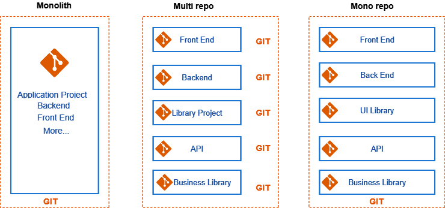
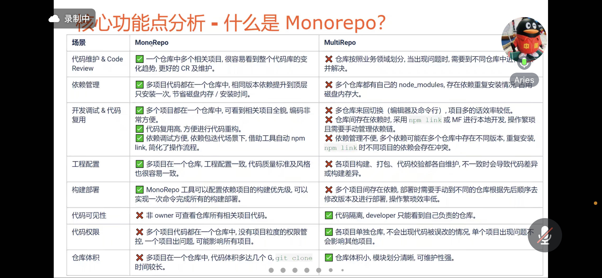
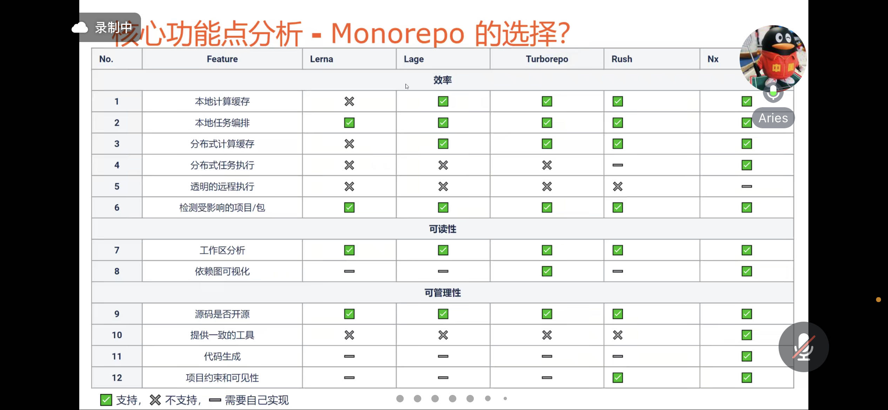

*TODO*

> 学成在线案例还没做

1. - [x] 如何理解 JS 是单线程的？既然是单线程的那如何实现异步操作呢？
2. JS 渲染顺序
3. hook (React)
4. 虚拟dom
5. SEO(next.js nuxt.js)
   1. 自定义SEO优化
6. Vue和React的区别
7. 微数据结构化   schema.org
8.  axios原理源码
9.  html5的新特性（web worker的作用，应用场景
10. 语义化的好处
11. canvas的常用api
12. - [x] 重绘回流，对事件响应机制的影响
13. - [x] localStorage和sessionStorage
14. - [x] flex布局
15. grid 布局，和 flex 的区别
16. rem和em的区别
17. - [x] 原型链
18. 闭包
19. js不同类型的存储方式
20. call apply 和bind的区别
21. js判断类型的方式（typeof  instanceof  Object.prototype.toString.call()可以判断所有的数据类型
22. 深拷贝浅拷贝，object.assign和扩展运算法是深拷贝还是浅拷贝，两者区别
23. 如何判断环引用
24. - [x] ES6新特性
25. computed和watch的区别
    1.  computed 首次加载就能计算
26. vue生命周期
    1.  父子组件中 created 和 mounted 的生命周期
27. - [x] 0.1 + 0.2为什么不等于0.3
28. - [x] let const var的区别
29. 箭头函数和普通函数的区别
30. 箭头函数中this的指向问题
31. 网页性能优化
32. SPA
33. 前端路由
34. 脱离文档流
35. cookie session token 原理
36. 事件冒泡和捕获
37. e.target e.currentTarget区别
38. 如何实现跨域，为什么要有跨域，跨域问题怎么解决（如何使用代理）
39. TCP 为什么需要三次握手、四次挥手
40. 类选择器和伪类的区别和优先级，各种选择器的优先级
41. 如何开启动画加速
42. - [x] 变量提升
    1.  严格意义上说 let 也存在变量提升，怎么说（从底层看，词法环境/变量环境 + 执行上下文，暂时性死区）
43. **JS 运行机制，eventloop**
    1. - [x] 宏任务微任务
    2. - [x] 事件循环
    3. - [x] 遇到 fetch setInterval setTimeout 怎么办
    4. - [x] 遇到 async await promise 怎么办
44. JS中数组长度为什么能任意变化（如何扩容
45. html中js和css的加载顺序会阻塞页面渲染吗
46. websocket的好处，如何建立连接，心跳机制怎么做，错误如何处理
47. websocket和轮询的区别
48. [运行npm run xxx时发生了什么](https://mp.weixin.qq.com/s?__biz=Mzk0NTI2NDgxNQ==&mid=2247485707&idx=1&sn=6534a8bf944b6600167fa24d6e109d29&chksm=c31948cbf46ec1dd9eb96ee9dbb62fac23ed6a5416d162e2be77c55d0e7fd46c4efdaf8baf40&scene=132#wechat_redirect) 
49. new 一个对象的过程
50. stringify的用法 
51. 白屏原因 & 优化 
52. `<button></button>` 和 `<input type="button">` 的区别
53. Function instanceof Object 和 Object instanceof  Function 的结果分别是什么，为什么
54. 性能优化要有数据支撑
    1.  FP/FCP/TTI/首屏时间/白屏时间/白屏率
    2.  手段：懒加载，防抖节流，图片压缩，webpack 分包，页面渲染……
    3.  组件化，模块化（都是工程化的东西，都是为了提高开发效率）
55. reduce() 去重
56. promise 中 catch() 和 finally() 执行的问题（尤其是 promise 嵌套情况下）
57. HTML 中可以异步执行的两个属性（defer 和 async）有什么区别
    1.  async 脚本立即执行
    2.  defer 会等到 html 解析完之后、DOMContentLoaded 之前才会执行脚本
58. sass 和 less 配置 loader 要注意什么
    1. webpack 只认识 js 不认识 css
    2. sass 之前要保证 webpack 识别了 css
    3. cssloader 要放在 sass less 之前
59. href 和 src 的区别
60. Vue 的核心问题就是 **数据劫持 和 模板编译**
61. 垃圾回收的意义
    1.  循环引用什么意思？现代浏览器中循环引用为什么不会出问题了？（V8 没有引用计数了，都是标记清除法了）
    2.  强引用和弱引用对垃圾回收的影响有什么
62. pnpm + monorepo 性能优化可能有用
1.  promise是为了解决什么问题，好处和坏处是什么
    1.  promise 内部怎么实现的
    2.  generator 原理是什么
2.  浏览器输入地址到页面渲染发生了什么
3.  什么是对称加密，什么是非对称加密，为什么 HTTPS 要有两种加密方式
    1.  刚才说到 GPU 进程，为什么要用 GPU 进程绘制呢
4.  HTTP2 为什么可以并发多个请求，HTTP1 有什么问题
    1.  HTTP2 如何实现多路复用，复用的是什么（复用的是 tcp 连接）
5.  `z-index` 的计算规则是什么
6.  性能优化怎么做，采集了哪些指标
    1.  PV UV 多少
    2.  怎么计算首屏加载时间，它的加载事件与 Lighthouse 中哪些指标想关
7.   SDK 架构怎么设计的，插件架构怎么实现的
8.   如何进行故障排查呢
9.  遇到过哪些浏览器安全问题 CSRF XSS
10. 如何生成 CSRF token
11. 浏览器缓存
12. 恢复对 samesite cookie 的强制开启
13. bilibili 蒙版弹幕，如何实时生成蒙版
14. 前端监控怎么做
15. 常用的设计模式、项目中有么有用到过
16. 举例说明数据驱动开发，
17. 了解下 PWA IndexedDB websql

## VUE 面试题

> Vue2 和 3.x 的区别

Vue2 虽然实现了低耦合，但是因为采用的是 Options API 的方式，即数据处理都在 data，computed 里，方法都在 methods 中，所以聚合性不是很强

Vue3 中采用 Composition API，可以提供给我们更多的可能性自己封装自己的方法

> Vue 中的 filter 在项目中的应用（自己想的）

[参考视频](https://www.bilibili.com/video/BV1uK4y1x7pa/?spm_id_from=333.999.0.0&vd_source=c727c2934b167656e7856cce64cc7eb5)

获取日志的方式不同，可以给每条日志加上 tag 标识获取方式

然后在查询时，就可以使用 filter 来过滤不同方式获取的日志，从而进行不同的操作

也可以使用 1234 来表示不同的获取方式，然后利用 filter 来根据不同的数字显示不同的中文，只需要在使用插值语法时加入过滤器就可以了

同样，也可以根据，不同的状态设置不同的样式，只需要在绑定样式 `:class` 时添加过滤器就可以了

> 1. v-for 中为什么需要 key
> 2. key 为什么不能用 index
> 3. 如果用了 index 会有什么问题（比如在插入删除数组元素时），会出现删除不想删除的元素的问题

> v-if v-show 区别

1. 用法上的区别
   1. `v-show` 不支持 template
   2. `v-show` 不可以和 `v-else` 一起用
2. 本质区别
   1. `v-show` 无论是否需要显示到浏览器上，它的 DOM 实际都是存在的，只是用过 `display` 属性来进行切换
   2. `v-if` 为 false 时，对应的原生节点压根不会被渲染到 DOM 中
3. 使用场景
   1. 如果需要频繁切换显示和隐藏，那么使用 `v-show`，防止引起频繁重排消耗性能
   2. 如果不会频繁切换，那么可以使用 `v-if` 

> 为什么要有虚拟 DOM

- 虚拟 DOM 方便跨平台：PC、移动端、桌面端、VR…
- 提高性能

> $set $setup 如何使用的

> histroy 和 hash 有什么区别

> pinia 和 vuex 有什么区别

> 如何使用发布订阅模式实现双向绑定的

> 发布订阅模式和观察者模式有什么区别


## 解答

**重点！！！**
```html
<!-- 涉及闭包，异步任务，任务队列，宏任务微任务，event loop， var 的作用域提升 -->
<script type='text/javascript'>
      window.onload = function() {
         // var存在作用域提升。如果这里用let定义i，那么就会出现 not defined 的错误了。但是仍然会输出0 1 2 3 4
         for(var i = 0; i < 5; i ++){

            
             setTimeout(function(){
                  console.log(i++);
              }, 4000)
            }
         console.log(i);
       }
 </script>
 <!-- 结果输出 5 5 6 7 8 9 -->
```
```html
 <!-- 如果想要输出5 0 1 2 3 4 那么要如何修改呢 -->
 <!-- 涉及立即执行函数 -->
 <script type="text/javascript">
   for(var i = 0; i < 5; i ++) {
      (function(x) {
         setTimeout(function() {
            console.log(x++)
         }, 4000)
      })(i)
   }
   console.log(i);
</script>
```

### 23. Promise async await

> https://www.bilibili.com/video/BV1WP4y187Tu?spm_id_from=333.337.search-card.all.click&vd_source=c727c2934b167656e7856cce64cc7eb5

### 27. var let const 的区别

|     | 重复定义 | 修改值 | 声明提升 | 块级作用域 | 循环 |
| :-: | :-:  |  :-: | :-: | :-: | :-: |
| var  | 可以 | 可以 | 会 | 严格来说不支持<br/>（function可以） | 可以<br/>（注意闭包问题） |
| let  | 不可以 | 可以 | 不会 | 支持 | 可以 | 
| const  | 不可以 | 不可以（除了数组和对象） | 不会 | 支持 | 不可以 | 

### 53. JSON.stringify() 的用法

> https://www.bilibili.com/video/BV16N4y1G7gv?spm_id_from=333.1007.tianma.1-1-1.click&vd_source=c727c2934b167656e7856cce64cc7eb5
>

## 什么是 monorepo

[MultiRepo vs Monorepo](https://jconsoftwares.com/blog/article/18)

- 在一个仓库里维护多个 package
- 可统一构建
- 跨 package 调试
- 依赖管理
- 版本发布
- 搭配工具统一生成 CHANGELOG
- ...







## 遇到过最有挑战性的问题是什么，你是怎么解决的？

- localstorage里面利用true/false判断会永远判断为true，需要转换为用1/0来判断。
在localstorage中存储的boolean数据都变成了字符串了，才导致的。
所以"true"=true及"false"==false,“true”==false显示都为false。


- 从后端拿到数据后，但是不能正确显示，表单中数据不存在（浏览器设置了自动翻译）
[你碰到过那些有趣的 bug ?](https://www.zhihu.com/question/49864093/answer/2618721557)

## 优化点

- 大文件上传
- 打包时间优化
- 界面优化
- 首屏加载速度优化，懒加载
- 缓存速度
- 权限设计
- 通用组件封装
- 虚拟列表
- CSS 加速（合并 CSS 文件，抽取公共样式，相应插件去除多余空格空行等，硬件加速……
- 防抖节流
- webpack 配置
- 减少 http 请求
- 异步组件（页面分包）

## 反问环节

- 业务内容（项目情况、框架）
- 团队规模
- 加班强度（正式 or 外包？转正率）
- 试用期多久，薪资福利如何计算
- 五险一金比例
- 薪资组成（年终奖，是否确定，还有没有其他福利）
- 绩效考核 考勤
- 年假怎么算，法定节假日怎么算（哺乳假，育儿假，独生子女假…）

## 技能点

1. 熟练掌握 Javascript/TypeScript/HTML/CSS 并掌握原理，了解 W3C 标准和ES 规范。有富文本编辑器开发客制化经验的优先.
2. 熟练掌握vue 或 React前端框架及其原理，有丰富的项目经验，有前端性能优化经验。
3. 熟悉主流的前端控件库，如Ant Design, ElementUl, Bootstrap等，有二次开发、封装、优化的经验。
4. 熟悉常用的数据可视化库，Echarts，Antv等，有实际项目经验。
5. 对编码规范，算法和数据结构，代码质量，性能优化有较高的理解和应用实践。
6. 熟悉前端工程化与模块化，并有项目经验，熟悉常用构建工具，如webpack和Gulp等。
7. 有组件开发经验，具备组件抽象能力。有优良的用户交互设计理念和设计经验，有一定的审美能力。
8. 工作态度认真踏实，有积极学习的心态，具有较强的责任心和耐心，有良好的沟通理解能力及团队合作精神，具备较强的抗压能力。